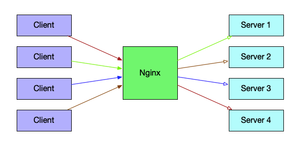
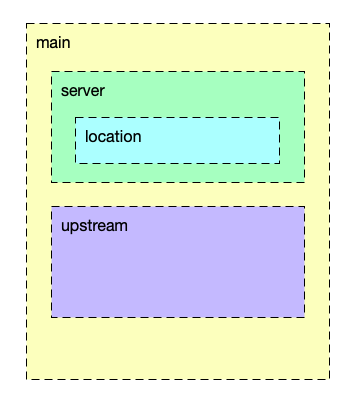

## Nginx介绍

Nginx是一款轻量级的Web服务器，由于它占有系统资源少、处理并发能力强，因此Nginx的使用率越来越高，甚至超过了传统老牌的Web服务器Apache httpd。

## Nginx几种工作模式

### Web服务器

### 反向代理

多个客户端给服务器发送请求，Nginx收到请求后，按照一定的规则将请求转发给后端负责处理具体业务的服务器，此时Nginx扮演了反向代理的角色。

### 负载均衡

* 提供后端健康检查的功能

## 配置文件介绍

Nginx 最主要的配置文件为 nginx.conf ，在启动时可以通过命令`nginx -c`指定要采用的配置文件，默认使用的配置文件时nginx安装路径下的`/config/nginx.conf`。Nginx的配置文件一般包括四个部分：

* main 全局设置，这里的设置会影响后续所有的配置
* server 主要用于虚拟主机配置，包括主机域名、IP和端口等
* upstream 上游服务器设置，主要包括反向代理、负载均衡相关配置
* location 匹配URL路径的设置

## 常用配置项说明

### main 全局配置

全局配置是一些与具体业务功能无关的参数，通常与性能或功能有关。

* worker_processes 2 ： 指定worker角色工作的进程个数
* worker_connections 2048 ：设置每个worker进程能并发处理的最大连接数
* Use epoll：nginx提供了集中事件模型，包括epoll、select等，在linux系统中一般采用epoll模型能够提供非常好的性能

### http服务相关的配置

### server虚拟主机相关配置

* listen ：虚拟机主的监听端口，默认为80，端口号小于1024时需要以root用户启动。
* server_name ： 服务器名称，例如 [www.edulinks.cn](https://www.edulinks.cn)

### upstream配置

### location配置

在http服务中，可以针对某些特定的URL指定一系列配置项

* root：定义根目录的位置
* index：定义默认访问的文件名 

## 参考资料

1. [[Nginx 服务器安装及配置文件详解](https://www.cnblogs.com/bluestorm/p/4574688.html)](https://www.cnblogs.com/bluestorm/p/4574688.html)