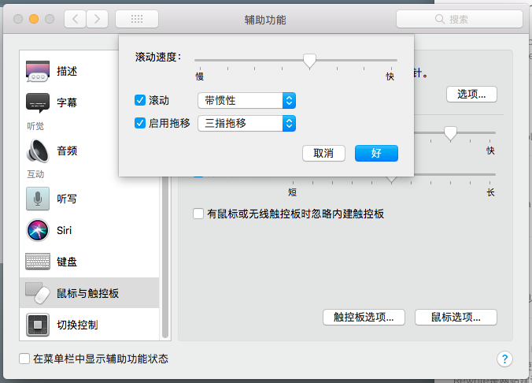

> 最早开始使用Mac电脑是从2011年开始，从Leopard一直到现在的Catalina，macOS系统经历了非常重大的变化，但是自己的一些使用习惯一直延续下来。从2011年到今天，大概发生了三四次系统故障不得不重新安装或者因为跟换硬盘造成的系统重装，为了方便每次系统安装后的配置工作，整理了一份自己系统配置的清单，一方面便于自己回顾查看，另一方面也送给有需要的朋友。

## 系统配置

* 快捷键的调整：互换了Spotlight和输入法切换的快捷键

* 手势的调整：单指双按手势、三指拖拽的支持。其中三指拖拽的配置据我所知从EI Caption开始就转移到了辅助功能里面，如下图

  

* 安装 Command Line Tools

* 设置桌面图片定时随机切换

* 安装`Command Line Tools`，一般打开Termianl，然后在命令行中输入一些诸如`git`之类的命令，就会弹出安装的提示框，或者也可以安装Xcode后在菜单中选择安装

## 浏览器配置

* 打开开发菜单，在`偏好设置`的`高级`标签中，最下方那个复选框钩上就可以了

## Termianl 配置

\## Profile文件及加载顺序

对于Linux和Unix系统来说，用户配置文件一般有以下几个：

\* /etc/profile 全局profile文件，对所有用户生效

\* ~/.bash_profile 或 ~/.profile。.bash_profile 是Linux下的，.profile是Unix中有的。

\* ~/.bashrc 。这个文件保存用户的一些个性化配置。

Bash登陆的时候，首先加载全局的 profile，接着判断用户目录下的 .bash_profile，最后可以在 .bash_profile 中调用 .bashrc。

\## 配置

\```sh

\#设置历史命令记录数

export HISTSIZE=1000

\#记录历史文件大小

export HISTFILESIZE=450

\#指定不同终端执行的命令都存储在同一个文件中

export HISTFILE=~/.bash_sessions/all_my_history

\```

将这些配置写在```~/.bashrc```中，然后在终端的偏好设置中加入启动命令。

\```sh

source ~/.bashrc

\```

\### 设置颜色

编辑`~/.bash_profile`，G表示输出颜色、h表示大小用易读的格式现实、F表示在文件夹后加`/`等。

\```sh

export PS1="\[\033[36m\]\u\[\033[m\]@\[\033[32m\]\h:\[\033[33;1m\]\w\[\033[m\]\$ "

export CLICOLOR=1

export LSCOLORS=ExFxBxDxCxegedabagacad

alias ls='ls -lGFh'

\```

参考资料：

\1. [mac 中 history 命令使用与配置](https://blog.csdn.net/testcs_dn/article/details/79970635)

\2. [Simple Tricks to Improve the Terminal Appearance in Mac OS X](http://osxdaily.com/2013/02/05/improve-terminal-appearance-mac-os-x/)

\3. [~/.profile ~/.bashrc和~./bash_profile的理解以及zsh的使用](https://www.jianshu.com/p/b39fd35e2360)

\4. [MY MAC OSX BASH PROFILE](https://natelandau.com/my-mac-osx-bash_profile/)

\5. [Shortcuts to move faster in Bash command line](http://teohm.com/blog/shortcuts-to-move-faster-in-bash-command-line/)

## 必备软件

* 微信 WeChat，国民级的软件，不装不行呀
* 印象笔记，之前用的是Evernote，因为国内版本支持Markdown切换过来了，还是用Evernote账号登陆
* WPS Office，这次远程办公期间，发现WPS Office已经足够满足日常的办公需要，关键还是免费的
* Docker
* The Unarchiver，在App Store中解压缩的软件非常多，不知道是不是因为这类工具开发容易的原因，但是最好用、最好看的我觉得非The Unarchiver莫属了，关键还免费
* Google Chrome，虽然Safari已经足够好用了，但某些时候还是要看齐下Chrome

## 参考资料

1. []()