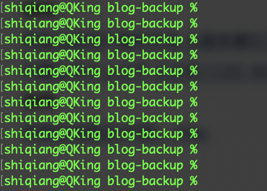

### zsh 成为默认 shell

淘汰掉我的旧MBP换新后，欢天喜地打开Terminal，感觉有点不对，提示符什么时候变成了 `%`。

查询了一些资料发现，原来在2019年WWDC期间，苹果推出了macOS Catalina，并且将zsh设置为操作系统默认shell。因为之前我的笔记本都是从EI Captin一路升级上来的，所以没体会到shell的变化，最近新换了笔记本后，才发现默认shell的变化。

苹果在其官网上，也提供了如何更改默认 Shell 的[操作步骤](https://support.apple.com/zh-cn/HT208050)。

## bash

## zsh

## Fish

### 参考资料

1. [在 Mac 上将 zsh 用作默认 Shell](https://support.apple.com/zh-cn/HT208050)
2. [zsh取代bash 成为macOS Catalina的默认shell](https://www.cnbeta.com/articles/tech/853837.htm)
3. [Fish shell 入门教程](http://www.ruanyifeng.com/blog/2017/05/fish_shell.html)

