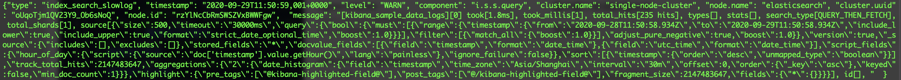

Elasticsearch 在7.1.1，只允许对于索引设置慢日志阈值。


## Elasticsearch 慢查询日志配置方法

Elasticsearch提供了慢日志来捕获并记录那些超过指定时间阈值的查询和索引请求。默认慢日志不开启，开启需要定义具体动作（query、fetch或index），期望的事件记录等级（WARN、DEBUG等），以及时间阈值。

```json
PUT /kibana_sample_data_logs/_settings
{
    "index.search.slowlog.threshold.query.warn" : "0s",   
    "index.search.slowlog.threshold.fetch.debug": "0ms",  
    "index.indexing.slowlog.threshold.index.info": "0s"
}
```

也可以在 `elasticsearch.yml` 文件里定义这些阈值，没有阈值设置的索引会自动继承在静态配置文件里配置的参数。

设置阈值后，可以通过API动态切换日志级别。

```json
PUT /_cluster/settings
{
    "transient" : {
        "logger.index.search.slowlog" : "TRACE",        
        "logger.index.indexing.slowlog" : "TRACE"      
    }
}
```

具体日志的样例如下



| 字段         | 值                           | 描述             |
| ------------ | ---------------------------- | ---------------- |
| type         | Index_search_slowlog         | 表示慢索引的类型 |
| timestamp    | 2020-09-29T11:50:45,935+0000 | 日志记录的时间   |
| level        | WARN                         | 日志级别         |
| component    | i.s.s.query                  |                  |
| cluster.name | single-node-cluster          | 集群名称         |
| node.name    | elasticsearch                | 节点名称         |
| cluster.uuid | oUqoTjm1QV23Y9_Ob6sNoQ       | 集群的uuid       |
| node.id      | rzYlNcCbRmSWSZVxBWWFgw       | 节点的uuid       |
| message      |                              | 查询相关的信息   |

> 默认情况下，ES会记录_source 中前1000个字符到慢日志中。可以用index.search.slowlog.source进行修改。设置为false或0完全跳过日志记录源，设置为true会记录整个源（无论有多大）。

## 参考资料

1. [ES慢查询收集总结](http://www.fblinux.com/?p=1334)
2. 