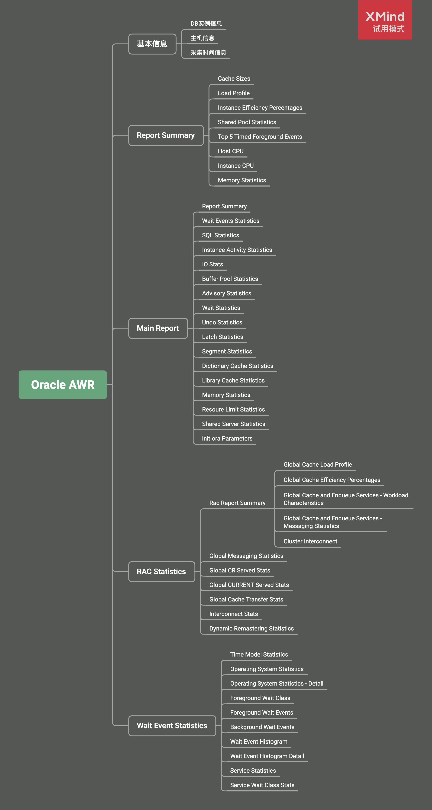
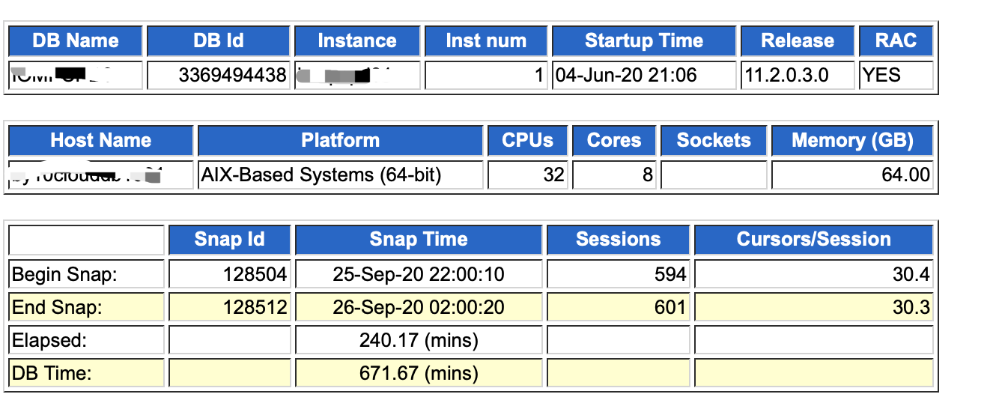
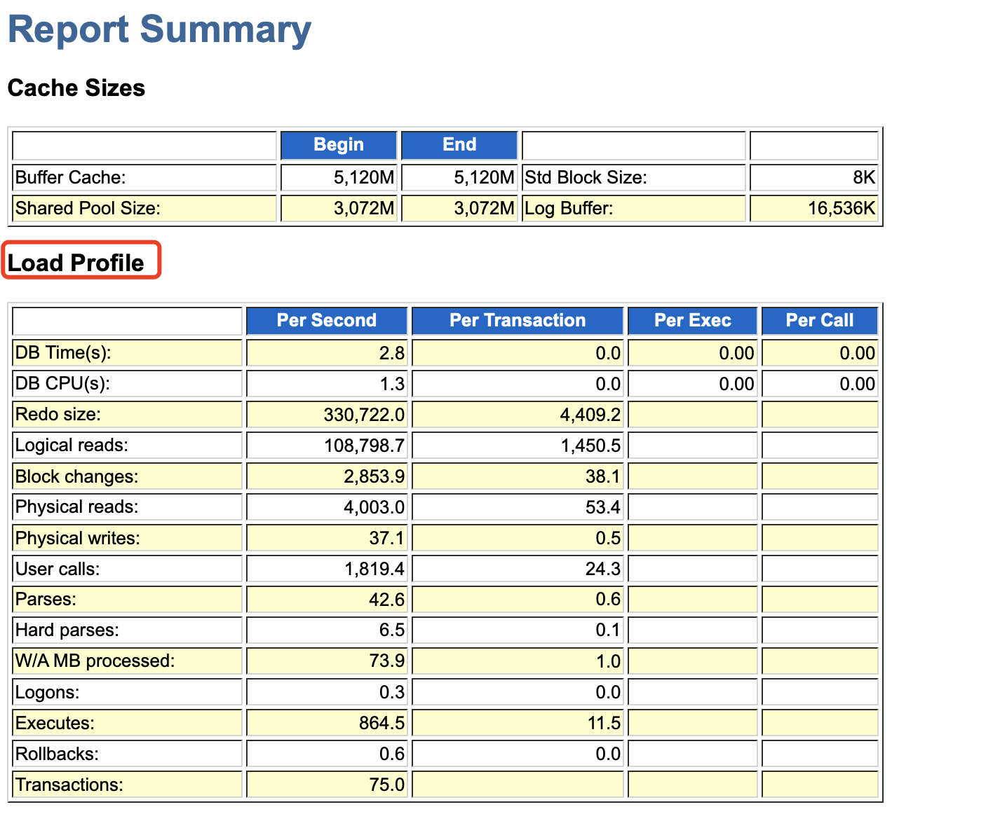
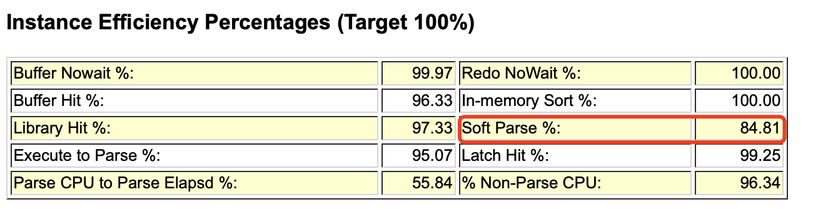

[TOC]

> 本文面向没有太多 Oracle 基础知识，但是需要通过 AWR 报告来分析数据库性能或排查问题人员，通过对 AWR 报告的简介，了解其包含的主要信息，然后对一些能够帮助我们分析定位问题的章节做一点稍微详细的介绍。通过阅读本文，期望使读者能够快速抓住阅读 AWR 报告的重点，为分析判断数据库性能是否有问题提供帮助。
>
> 本文示例报告基于 Oracle 11.2.0.3.0 版本生成。

## AWR报告简介

AWR是Oracle 10g版本推出的特性，全称叫做 `Automatic Workload Repository 全自动负载信息库` 。Oracle启动后，会有后台进程定时采集并保存系统快照信息，也可以手工创建快照。AWR通过对比两个时间点的快照信息，生成该时间段的AWR报告，帮助DBA或开发人员了解 Oracle 数据库的运行情况。Oracle 还提供了 ASH、ADDM等工具，本文不进行探讨。

## AWR报告结构

AWR报告基本分为四部分：

* 基本信息部分，包括了DB实例、主机的信息以及报告采集时间段的信息。
* Main Report部分，第一部分Report Summary被单独放在了基本信息后面，其他的信息则放在整个报告较后的位置，个人觉得最重要的部分是SQL Statistcs。
* RAC statistics部分，包括RAC相关的统计信息。
* Wait Event Statistics部分，。

## 基本信息

报告一开始部分为基本信息，显示了DB实例、主机信息。DB Time 指标可以用来判断数据库是否繁忙，如果 Elapsed 时间乘以CPU个数小于DB Time 表示数据库比较繁忙。

## Report Summary

Report Summary 分为8个部分，最主要的是 Load Profile。

Load Profile 主要用来显示当前系统的一些指示性能的总体参数，部分介绍如下：

* Redo Size ：用来显示平均每秒的日志大小和平均每个事务的日志大小，有时候可以结合 Transactions 每秒事务数，**分析当前事务的繁忙程度**。
* 

Instance Efficiency Percentages 是一些命中率指标。Buffer Hit、Library Hit 等表示SGA ( System global area )的命中率。Soft Parse 指标表示共享池的软解析率，如果小于90%，就说明存在未绑定变量的情况。

## Main Report

* 操作系统系统负载情况
* 数据库负载情况
* 慢SQL的情况
* Top 5 Timed Foregroud Events
* SQL Statistics从几个维度列举了系统执行比较慢的SQL，可以点击，然后拿SQL去调优，调优SQL可以用执行计划看看
* Top 10 Foreground Events by Total Wait Time，等待事件是衡量数据库优化情况的重要指标，通过观察Event和%DB time两列就可以直观看出当前数据库的主要等待事件
  如图可以看出系统面试的主要是CPU被占用太多了和锁等待

## AWR生成方式

## 总结

## 参考资料

1. [oracle11G AWR使用及分析](https://www.cnblogs.com/david-zhang-index/archive/2012/08/21/2649252.html)
2. [等待事件：db file scattered read(离散读）](https://blog.csdn.net/haojiubujian920416/article/details/81506982)
3. [【深度长文】循序渐进解读Oracle AWR性能分析报告](https://mp.weixin.qq.com/s/48pYtwLO1YpFnUtpMojbfQ)
4. [Oracle AWR报告生成和性能分析](https://www.cnblogs.com/mzq123/p/10741208.html)

