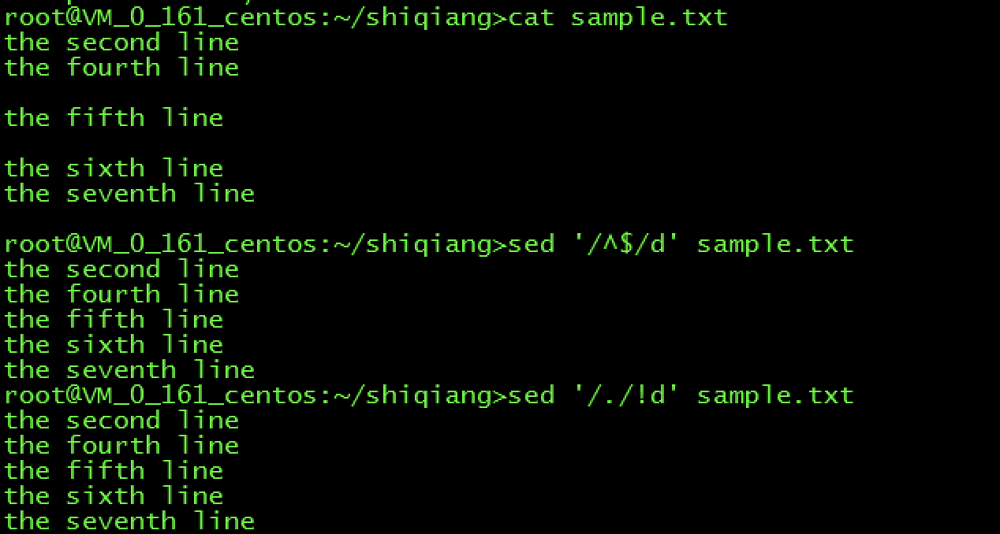
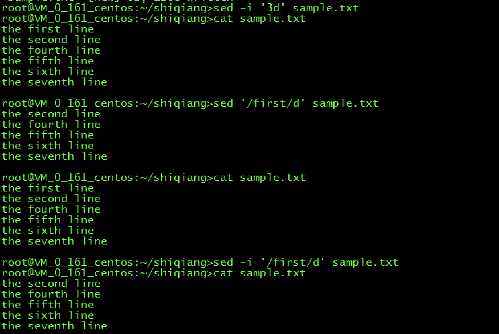

## SED 介绍

`sed`（Stream Editor）意为流编辑器，是Unix常见的命令行程序。是Bell实验室的 [Lee ](http://en.wikipedia.org/wiki/Lee_E._McMahon)[E.McMahon](http://en.wikipedia.org/wiki/Lee_E._McMahon) 在1973年到1974年之间开发完成，目前可以在大多数操作系统中使用。

 `sed` 的出现是作为 `grep` 的一个继任者，因为 `grep` 只能简单的进行查找和替换，但是考虑还可能会有删除等各种需求，McMahon 开发了一个更具通用性的工具。`sed` 著名的语法规则包括使用 `/` 进行模式匹配，以及 `s///` 来进行替代。与同期存在的工具 `ed` 一起，`sed` 的语法影响了后来发展的 ECMAScript 和 Perl。GNU `sed` 添加了很多特性，包括著名的 in-place editing。

## 语法

看一下 `sed` 的基本语法：

```sh
sed [-nefri] 'command' [file ...]
sed '{[/]<n>|<string>|<regex>[/]}d' <fileName>
sed '{[/]<adr1>[,<adr2>][/]d' <fileName>
```

> The sed utility reads the specified files, or the standard input if no files are specified, modifying the input as specified by a list of commands. The input is then written to the standard output.

`sed` 从文件或者标准输入中获取内容，然后按照命令列表对内容进行修改，最后再将结果发送给标准输出。

一些常用选项的含义：

* `-n` 使用安静(silent)模式。在一般 sed 的用法中，所有来自 STDIN的资料一般都会被列出到萤幕上。但如果加上 -n 参数后，则只有经过sed 特殊处理的那一行(或者动作)才会被列出来。
* `-e` 直接在指令列模式上进行 `sed` 的动作编辑。
* `-f` 直接将 `sed` 的动作写在一个文件内，通过 `-f` 参数执行文件内的动作。
* `-i` 直接修改读取的文件的内容，而不是打印到标准输出。

一些常用的命令：

* `a` 新增
* `d` 删除
* `s` 替换
* `p` 打印

## 删除文件的内容

通过 `d` 参数加匹配规则，我们可以方便的删除文件中的内容。

```sh
$ sed '3d' fileName.txt   #删除第3行，并将修改打到标准输出
$ sed -i '3d' fileName.txt #删除第3行，并在文件内生效，后面的命令不再加这个参数

# 删除最后一行
$ sed '$d' fileName.txt

# 删除7-9行
$ sed '7,9d' fileName.txt

# 删除所有空行
$ sed '/^$/d' fileName.txt 
$ sed '/./!d' fileName.txt

# 删除匹配到字符串的行
$ sed '/awk/d' fileName.txt 

# 删除两个匹配之间所有的行
$ sed '/patternA/,/patternB/d' fileName.txt

# 删除匹配的行到第 n(5) 行之间的内容，同理也可以反过来，删除某一行到匹配行之间的内容
$ sed '/pattern/,5d' fileName.txt

# 删除符合多个条件的行
$ sed '/patternA/d;/patternB/d' fileName.txt
```







## 替换文件的内容

如果只是想修改某一行的部分内容，可以使用 `g` 参数，具体示例如下。

```sh
$ sed 's/^/ABC /' fileName.txt #在每一行增加ABC

$ sed 's/patternA/String/' fileName.txt #将匹配的内容替换为指定的字符串
```

虽然容器、云基础设施非常普遍的今天，在企业做运维场景下我们直接使用 `sed` 命令的机会逐渐变少。但 `sed`就像单兵作战时的秘密武器，如果我们能够熟练的掌握，就能够做到手中有粮遇事不慌，借此机会在老板面前展示一番，那么你的前途就大大的了。

## 参考资料：

1. [sed delte file lines](http://en.kioskea.net/faq/1451-sed-delete-one-or-more-lines-from-a-file)
2. [SED入门](https://www.cnblogs.com/cocowool/p/3294306.html)
3. [sed 删除文本中的内容](https://www.cnblogs.com/crazymagic/p/11147988.html)

