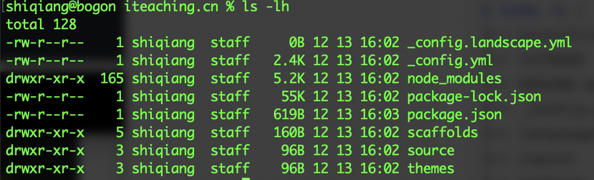

## 准备开发环境
* 确认安装了 `node`

* 确认安装了 hexo `hexo -version`

* 新建一个空目录 ，进入目录执行初始化 `hexo init` 。如果初始化速度比较慢，可以尝试改成国内的源 `npm config set registry https://registry.npm.taobao.org`。成功后可以看到如下的文件：

  

* 在本地浏览编辑博客 `hexo server` 或者 `hexo s` ，命令执行成功后可以看到通过 http://localhost:4000 端口访问的提示。 

## Hexo目录结构
hexo的目录结构及各自的作用如下。
```sh
$ tree -L 1
.
├── _config.yml         //总体配置文件
├── node_modules        //Node依赖的包
├── package-lock.json   //
├── package.json        //
├── scaffolds           //Hexo Markdown加载时的关键字
├── source              //Markdown源文件目录
└── themes              //主题文件夹目录，默认主题为landscape

```

## 主题目录结构
```sh
$ cd themes/landscape
$ tree -L 1
├── Gruntfile.js
├── LICENSE
├── README.md
├── _config.yml
├── languages
├── layout
├── package.json
├── scripts
└── source
```

## EJS介绍


## 使用SASS编译CSS


## 参考的主题
1. [Alfasio](https://hexo-theme-griddy.aflasio.art/post/mira/)
2. [ProcreateFolio](https://folio.procreate.art/showcase)
3. [Jerry Qu](https://imququ.com)，参考了列表部分的样式
4. x
5. x


## 参考资料
1. [制作第一个hexo主题](https://segmentfault.com/a/1190000013536171)
2. [Hexo主题开发](https://www.cnblogs.com/yyhh/p/11058985.html)
3. [开发hexo主题(一)](https://www.jianshu.com/p/c80de4bacdeb)
4. [从零开始制作 Hexo 主题](https://www.cnblogs.com/mmzuo-798/p/10451385.html)
5. 