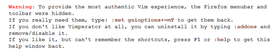

> **First there was a Navigator, then there was an Explorer. Later it was time for a Konqueror. Now it's time for an Imperator, the VIMperator :)**

如果你是Firefox的用户，如果你不熟悉Vim，那么当你第一次面对下面的Firefox时，你的感觉会和我一样。

工具栏也没有了、地址栏也没有了、状态栏也没有了、左右的边框都没有了、天啊，这还是Firefox吗

到了官方站点，看到了提示：

不过任凭 `Ctrl–q`，还是`Ctrl–z`都没有能够让我回到熟悉的FF界面，难道是火星

接着往下看，终于找到：

通过设置，终于找回了亲切的菜单栏和地址栏。

感谢主页的这些关键说明
[http://vimperator.mozdev.org/index.html](http://vimperator.mozdev.org/index.html)

首先来看看他的Features吧：
* Vim-like keybindings (h,j,k,l,gg,G,0,$,ZZ,<C-f>,etc.)
* Ex commands (:quit, :open www.foo.com, ...)
* Tab completion available for all commands with support for 'longest' matching when set in 'wildmode'
* Hit-a-hint like navigation of links (start with 'f' to follow a link)
* Advanced completion of bookmark and history URLs (searching also in title, not only URL)
* Vim-like statusline with a wget-like progress bar
* Minimal GUI (easily hide useless menubar and toolbar with :set guioptions=)
* Ability to :source JavaScript files, and to use a ~/.vimperatorrc file with syntax highlighting if you install vimperator.vim
* Easy quick searches (:open foo will search for "foo" in google, :open ebay terminator will search for "terminator" on ebay) with support for Firefox keyword bookmarks and search engines
* Count supported for many commands (3<C-o> will go back 3 pages)
* Beep on errors
* Marks support (ma to set mark 'a' on a webpage, 'a to go there)
* QuickMarks support (quickly go to previously marked web pages with go{a-zA-Z0-9})
* :map and :command support (and feedkeys() for script writers)
* :time support for profiling
* Move the text cursor and select text with vim keys and a visual mode.
* External editor support
* Macros to replay key strokes
* AutoCommands to execute action on certain events
* A comprehensive help file, explaining all commands, mappings and settings.

通读过这个之后大概对于vimperator的功能也有了了解，真的是很强大的工具，用的熟练的话完全可以让旁人看傻的，这么酷的插件，我必须学会使用。

1. 恢复地址栏、菜单栏、书签栏
`Set:guioptions+=mTb`
或者
`Set:go+=mTb`
都可以达到打开以上项目的功能，m就是菜单、T就是地址栏、b就是书签栏，这三个参数可以单独使用；

2. Vimperator有两种状态，普通状态和命令行状态，我们可以通过：进入命令行状态，通过Esc返回到普通状态。

3. 获得帮助。要想跟快速的学会Vimperator就必须学会使用：help，你还可以通过使用：help option 来获得针对特定选项的帮助，或者通过使用：viusage或者：exusage来获得快捷键的帮助；

4. 脱离鼠标。
or how I learned to stop worrying and love the 80+ buttons I already have.
这一段没太仔细看，大意是有了Vimperator，你就可以不再用鼠标了。

5. 滚动窗口。
像Fterm一样：
j / k    以行为单位滚动窗口；
h / l    左右滚动窗口；
<space>/<C-b>    翻页；
<C-d>/<C-u>    翻1/2页；

6. 历史和标签。
<C-o> / <C-i>    在当前的标签内实现前进和后退；
gt / <C-n>    移动至下一个标签；
gT / <C-p>    移动至前一个标签；
g0 / g$        移动至第一个标签；
d        关闭当前活动标签；

利用：tabopen实现在新标签中打开网页，也可以使用快捷键t；
利用：open在当前页中打开网址，也可以使用快捷键o；

7. 获得提示和打开网页。
看起来我们已经能够使用Vimperator正常上网了，等等，我们如何打开网页中的链接、如何查看网页中的提示呢？是不是我们还需要带尾巴的小朋友的帮助。

我们可以利用vimperator提供的提示功能，按下；并且按a就可以看到页面中的链接都会在黄色背景下出现白色数字，输入数字后就能够跳到相应链接，据说也可以输入文字，然后搜索到相应的链接，不过这个对于中文的支持仿佛没有那么好。

还有一个快捷的方式f和F。利用小写的f，可以在当前的标签中打开选中的链接，利用大写的F可以在新的标签中打开选中的链接。

8. 保存设置。
如果你想将你自定义的命令保存下来，你可以使用命令：mkv command，这个操作会生成一个简单的文本文件$HOME/.vimperatorrc。

9. 寻找出口。
Vimperator提供vim的经典推出方法。
：xall        保存当前会话并退出；
：qall    不保存当前会话并推出；
ZZ        同：xall
ZQ        同：qall

10. 够了，我不要用。

如果你真的受不了这样，那么：addons，然后乖乖的用你的带尾巴的小朋友把vimperator卸载吧。

