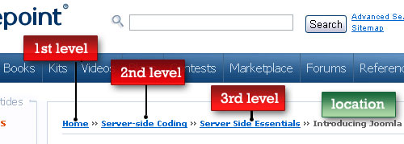

如何在页面中合理的使用面包屑路径
网页设计中的面包屑路径：样例及最佳实践

翻译：cocowool [cocowool@gmail.com](mailto:cocowool@gmail.com)
原文：[Jacob Gube](http://www.smashingmagazine.com/2009/03/17/breadcrumbs-in-web-design-examples-and-best-practices-2/)

在我们的站点中都有很多的页面，利用面包屑路径能够极大的增强用户寻找路径的能力。从易用性上来讲，面包屑路径减少了用户回到更高级目录时所需要的操作，并且增强了网站各个单元的可寻性。面包屑路径还可以提供有效地视觉帮助来知道用户了解自己目前所处与网站中的等级，让他们能够更容易的找到他们的开始页。

## **什么是面包屑路径？**

Breadcrumb (Breadcrumb trail)，中文成为“面包屑路径”是应用于网站或者网络程序上的，帮助用户找到自身位置的二级导航标记。他起源于Hansel and Gretel的传说，孩子们为了能够找到回家的路，将面包屑撒在路上，并顺着找到了家。和传说中一致，面包屑路径在现实中也帮助我们找到自己的起始页。

Delicious的路径。

在存在大量的分级内容的网站上我们经常能够看到面包屑路径的使用，在一些引导性的网络应用上也能够见到，他们的作用就像一个进度条，指引着用户当前的进度。面包屑路径最简单的形式是水平排列的文字链接，之间用大于号隔开，每个链接表示与这个级别相关的页面链接。

## **何时使用面包屑路径？**

大型网站，特别是那种页面按照层级结构组织的网站比较适合使用面包屑路径。一个最好的例子就是商务网站，拥有大量的商品分门别类的存放着。

在那种没有逻辑的层级关系或者分组的单级网站上不适合使用面包屑路径。一个决定是否使用面包屑路径的很好的办法是规划一个站点地图或者表示网站导航结构的图表，然后再来决定面包屑路径是否能够改善用户在栏目内和不同栏目间的导航体验。

面包屑路径往往是一个网站的额外的特点，他不应该取代菜单导航，而且往往应该作为菜单导航的一种辅助和补充。它是一种次级的、很舒服的特性，帮助用户确定自己的位置，并且作为菜单导航的一个有效补充。

## **面包屑路径的类型：**

面包屑路径主要有三种形式。

基于位置的面包屑：

位置面包屑是静态的，显示了当前页面在网站中所处的等级。链接中的每一项都能够导向一个更高一级的页面，这种形势特别适合有很多级别的网站（大于2级）；

基于属性的面包屑：

属性面包屑给出了当前页面所属类别的信息，下图的面包屑更接近与一个混合形式的面包屑，路径中包含了对结果的筛选条件描述；

路径：路径形式的面包屑是动态的路径，经常用来指引用户进行某种操作，比如“注册”流程，他动态的显示用户完成注册所需要的过程；

## **使用面包屑路径的好处**

方便用户：面包屑路径的目的就是为用户提供一种辅助的导航方式，在具有多层级的网站上浏览时，面包屑路径可以帮助用户更容易的找到想要的位置；

减少返回高级别页面的点击次数：用户不需要通过多次点击“返回”来到自己之前的位置，而只需要在面包屑路径上点击一次；

不会占用过多的空间（hog screen space）：面包屑路径多数采用普通的水平排布的文字链接，所以不会占用过多的页面空间，恰当的运用，能够带来足够的好处。

减少跳出率（bounce rates）：面包屑路径能够诱初次访问页面的用户在完成初始页的浏览后浏览其他页面。例如，通过搜索引擎来到的用户，看完文章后，很容易点击上一级页面的导航来了解更多的相关内容，这样就减少了站点整体的跳出率。

## **使用中的错误**

在不必要的地方使用：

上图的导航就会让用户感到迷惑，太多的导航了而且排布的非常集中，有点重复；
用面包屑路径作为主导航：

面包屑路径只是一种导航的辅助手段，任何时候都不应该取代导航菜单。上图中就是一个例子，由于只使用了面包屑路径，当用户想跳转到站点的其他栏目时，很难容易的到达。

当页面含有多重栏目时，使用面包屑路径：面包屑路径具有线性的结构，如果你的页面不能够很清楚的分类，那就很难用面包屑路径来表示，这其实是在网站设计初期，要为站点制定明确的组织结构。

## **在设计中应该考虑的问题**

使用什么符号来分隔？最常用的分隔符是大于号（>），表示“父目录>子目录”，其他的符号还包括：箭头、右引号(>>)、斜线(/)。

应该设计成多大？

面包屑路径只是一个辅助的导航工具，所以谁都不希望他占据巨大的页面空间，他应该尽量的小，但是要能够方便访问，向用户传达出这种辅助的设计意图。一个原则就是，用户浏览页面时，不能第一眼就被面包屑路径所吸引。

应该放在什么地方？面包屑路径通常放置在页面的中上部，如果是水平导航，一般放在主菜单的下边。