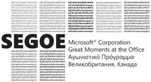
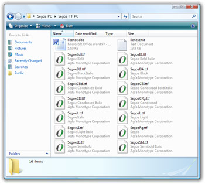

作为微软的官方品牌字体，Segoe Font是一种非常优雅的字体，小到海报大到Logo，Segoe字体应用在微软品牌宣传的各种领域，最著名的就是在Vista中的应用。你很难在网络上下载到这个字体，如果不管通过何种渠道得到了她，你应该珍惜她。她就像Helvetica一样好用，借助ClearType技术，她在小字体时甚至表现的更加清晰。如果你想自己做一个Microsoft的Logo，那么你必须使用她才行。

这个网址 http://www.istartedsomething.com/20070531/download-segoe-collection/ 曾在2007年5月31日的时候，很敏感的找到了意外在微软站点上发布的Segoe全套字体的下载，作者发布了字体的共享，不过不幸的，很快微软的A-Team(版权维护部门
Microsoft Legal Council)找上门来，作者也随即撤下了下载。作者表示A-Team一点也不幽默。(The A-Team has struck again.They're no fun.)

Segoe系列的字体至少包含了27种，不仅包括ClearType类型，也包括PostScript、For Mac等各种字体。

在微软的官方网页上，http://www.microsoft.com/typography/fonts/family.aspx?FID=331

他们指出Segoe Family有下面几种字体：

* Segoe UI；
* Segoe UI Bold；
* Segoe UI Bold Italic；
* Segoe UI Italic；
* Segoe Light；
* Segoe UI Semibold；
* Segoe UI Symbol；

xp系统中默认是没有这些字体的，如果安装了Office 2007，会增加，segoeui.ttf、segoeuib.ttf、segoeuii.ttf、segoeuiz.ttf这四个字体。由于没有Vista系统，笔者并未实际考察Vista种具体都包括有哪些字体。

目前网络上能够搜索到的字体也大多是这四种，至于传说中的27种字体，不知什么时候才能有幸一见。

补充说明：

看了大家的评论后我又仔细看了以下微软页面上的版权说明，微软的字体好像都是有Ascender Corpration代理的，页面上的链接也都指向了AC的网站。
我们想获得或者使用字体有两种方式：

1、购买或者下载Segoe UI Font。个人使用、在工作站中的专业或商业使用；
但是很不幸，满怀着希望进去以后却发现了令人伤心的结果。
Unfortunately Microsoft has not made the font you selected available for download at this time.

2、Segoe UI 字体许可。提供给企业、网络开发人员、为硬件、软件的分发或者服务安装提供使用许可；

想要获得许可的话，必须要填写一份表单，估计AC的人会和你联系吧，不过暂时我不许要为许可支付费用...

参考资料

1. [Microsoft Font Family](http://www.microsoft.com/typography/fonts/family.aspx?FID=331)

