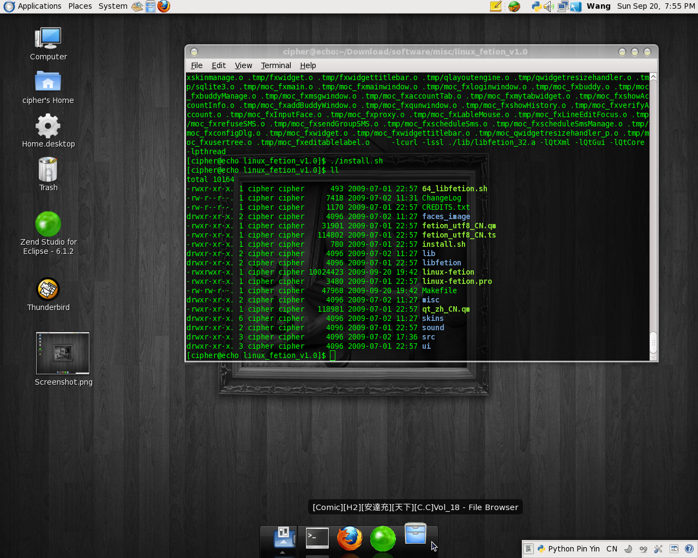

最近，重新安装了一次系统，为了以后不再做无谓的重复查询的工作，特将本次安装及配置的过程记录下来，做为自己以后的一个参考，亦可以为想要安装 Fedora 桌面的同学的一个参考，有任何不对或者可以节省安装时间的方法，都可以在这里讨论。

## 一、安装系统

这个很简单，我使用的是Fedora Live cd KDE 的版本，其实是喜欢和习惯gnome的，只是手边上没有现成的。系统安装完成后，稍微体验了一下KDE的dolphine和Konquer，还是不是很习惯，需要上gnome

yum groupinstall 'GNOME Desktop Environment'

安装完成后，Logout 然后重新登录进来就能看到熟悉的 gnome 界面了，只不过，这样安装的 gnome 很多默认的软件还是和直接的 gnome 不太一样，比如Office 套件就保留了 Koffice，游戏也有很多是K下的，这个影响不大，暂且不表。

## 二、配置权限和网络连接及其他

(1)、配置权限
需要为经常使用的用户配置权限，需要修改 /etc/sudoers ，添加：

```sh
cipher  				ALL=(ALL)       ALL
cipher          ALL=(ALL)       NOPASSWD: ALL
```

这样，用户 cipher 就获得了 sudo 权限而且不需要输入每次都输入密码。

(2)、配置RPM Fusion

因为专利许可证的原因，Fedora 软件仓库不包含 MP3, DVD和视频播放及解码库支持。正因为如此，你必须从第三方软件仓库中安装那些软件。RPM Fusion 是 Fedora 和 Red Hat 企业版的软件仓库，是由 Dribble, Freshrpms 和 RPM Fusion 合并而来的。各种各样的应用程序包含在这个软件仓库中，比如MP3、未加密的 DVD 、Mplayer, VLX, Xine 等多媒体应用程序使用的解码库，以及闭源的 Nvidia 和 ATI 显卡驱动，RPM Fusion 包含以下两个主要的软件仓库：
* 一个被命名为“自由”，主要是开源软件（开源软件的含义通过 Fedora授权指引定义），但因为美国专利保护法案又不能包含在 Fedora 中。
* 另一个被命名为“非自由”，主要是非自由软件，就是其它所有那些不能非自由软件，包括公开源代码的软件，但是有“非商业使用”之类的限制。

```sh
$ sudo rpm -ivh http://download1.rpmfusion.org/free/fedora/rpmfusion-free-release-stable.noarch.rpm
$ sudo rpm -ivh http://download1.rpmfusion.org/nonfree/fedora/rpmfusion-nonfree-release-stable.noarch.rpm
```

安装presto插件：sudo yum install yum-presto
安装镜像自动选择插件：sudo yum install yum-fastestmirror

## 三、安装常用软件

(0)、输入法 -- SCIM

Fedora 11 下默认了 ibus 作为输入法，但是我在将系统语言切换为英文后，又经过 yum remove ibus， yum install ibus 反反复复的几次，始终无法终端中切换出中文来，所以最后又投入了我所熟悉的 scim 的怀抱。

`yum install scim*`

(1)、Firefox

Firefox 的安装很简单：    yum install firefox，只是之后需要安装一些插件，下面这些插件，能够在我日后使用 Firefox 进行上网冲浪的时候提供更好的帮助。

Firefox Addons
1、Vimperator
2、Firebug
3、YSlow
4、DownThem All
5、xmarks
6、Greasemonkey
7、Httpfox
8、FireGesture
9、All in one gestures
10、Easy Drag and go

Flash插件的安装，下载最新的Flash 10 的插件进行安装：flash-plugin-10.0.15.3-release.i386.rpm

(2)、QQ

qq 的安装需要从官方下载 Linux 的安装包：http://im.qq.com/qq/linux/download.shtml，完成后执行：
rpm -ivh linuxqq-v1.0.2-beta1.i386.rpm
Linux版的QQ自发布到现在一直都没有更新过，不知道是不是现在这个版本就是为了挡当时北航学生的提问的，有了以后就不思更新了。

(3)、邮件客户端 Thunderbird

邮件客户端选用了 Thunderbird，系统自带的 Evolution 虽然也可以用，但是你终究会发现有些功能他无法支持的那一天，下载地址为：http://www.mozillamessaging.com/en-US/thunderbird/
完成后对包进行解压缩：tar -xvzf thunderbird-2.0.0.23.tar.gz
解压完成后：cd thunderbird
执行：./thunderbird 的时候提示：./thunderbird-bin: error while loading shared libraries: libstdc++.so.5: cannot open shared object file: No such file or directory

看来是一些基础的库不存在，按照提示：    sudo yum install libstdc++.so.5 完成后，通过：./thunderbird 就可以打开邮件客户端，进行用户名和POP、SMTP服务器配置后就可以使用进行邮件的发送。

我们可以为其建立桌面的快捷方式
命令行方式为：    ln -s   ~/Download/software/misc/thunderbird/thunderbird ./thunderbird
图形界面的方式为点击右键->Create Launcher->选择相应的位置和图标，这样建立的好处是没有那个快捷键。

(4)、VPN连接

因为单位有的时候需要 VPN 连接，所以安装了 pptp 方式的VPN连接：yum install NetworkManager-pptp
安装完成后要重新启动才可以进行VPN连接的设置，否则不会生效，这个问题的原因暂时不明。

(5)、飞信

Linux下的飞信，我使用了 Libfeition 提供的安装包，下载地址：http://www.libfetion.cn/Linux_demoapp_download.html
在安装之前，需要下面的这些包来确保接下来的安装正常进行：
sudo yum install qt4 qt4-devel libcurl libcurl-devel kernel-devel automake gcc-c++ glibc glibc-devel openssl-devel
具体的安装有说明，这里就不赘述了，很容易，这样我们就能享受飞信的服务了。

(6)、Office

使用系统自带的Office套件。

(7)、MSN客户端

这种方式安装的系统中没有自带pidgin，所以需要自己手工安装：sudo yum install pidgin

到目前位置，这个系统就基本上能满足我们日常的办公和沟通需要了。

## 四、影音娱乐以及系统美化

(1)、视频播放器 Mplayer

首先安装DVD的解码库支持：sudo yum install libdvdread libdvdnav lsdvd
接下来安装livdvdcss支持：
sudo rpm -Uvh http://rpm.livna.org/livna-release.rpm
sudo yum install libdvdcss
安装其他视频文件格式支持：sudo yum install ffmpeg ffmpeg-libs gstreamer-ffmpeg libmatroska xvidcore
安装播放器：sudo yum install mplayer smplayer

~~进行了编译安装mplayer的尝试，不过最后编译完成后，皮肤没有安装好，最后还是采用了简单粗暴的 yum 方法~~
~~首先查看官方的安装说明：http://www.mplayerhq.hu/DOCS/HTML/en/softreq.html~~
~~大部分的软件包都可以通过 yum 来进行安装，有些需要单独安装，包括：~~
~~lame    http://lame.sourceforge.net/download.php,    然后按照 INSTALL 中的提示进行编译安装就可以了。~~

(2)、音频播放器 Rhythmbox

默认的Feodra 11 KDE中并没有提供 rhythmbox，需要我们独立安装
安装命令：sudo yum install gstreamer rhythmbox
安装MP3格式支持：sudo yum install gstreamer-plugins-good gstreamer-plugins-bad gstreamer-plugins-ugly
这样就可以使用 Rhythmbox 来欣赏 Mp3 音乐了。

当然除此之外，还有诸如 Amarok，Songbird 等非常好的音频播放器，基本上都可以通过 yum 安装，当然前提是需要已经添加了 RPM Fusion。

(3)、Compiz-Fusion

Compiz Fusion， 非常酷的3d立方体桌面，在很多截图和视频中你应该看到过了，Fedora 10 自带 Compiz-Fusion ，但不包含它所有的特性。你可以通过运行 系统 -> 首选项-> 感官 -> 桌面特效找到它。
如果需要所有的特效，需要先检查系统是否支持 direct 渲染：glxinfo | grep direct
如果结果是yes我们就可以直接安装 Compiz-Fusion：sudo yum install ccsm emerald-themes compizconfig-backend-gconf fusion-icon-gtk emerald compiz-fusion compiz-fusion-gnome libcompizconfig compiz-gnome compiz-bcop compiz compizconfig-python compiz-fusion-extras compiz-fusion-extras-gnome

(4)、安装 avant-window-navigator

这个类似于Mac的Dock，可以将底部的 Panel删除掉，而且可以自动隐藏，用起来十分方便。

完成后，将3和4两个加入到系统启动里。
启动进程的添加，可以从菜单里找到 SESSION 进行添加，也可以编辑 /etc/rc.local，也可以编辑 ~/.config/ ，方法很多，就看个人爱好了。

(5)、安装 gnome-do

这个工具可以让我们快速搜索菜单中的工具，而无须使用鼠标去点击，能够提高工作的效率，很实用。
sudo yum install gnome-do gonme-do-plugins*

最后，附上现在的桌面和主题。




参考资料：
1、[Fedora11 安装配置指南中文版](http://www.ownlinux.cn/2009/06/14/fedora-11-install-configure.html)
2、[Mpalyer](http://www.mplayerhq.hu/DOCS/HTML/en/rtc.html)
3、[Lame Install](http://audacity.sourceforge.net/help/faq?s=install&item=lame-mp3)
4、[Mplayer Compile Error](http://fixunix.com/slackware/513045-did-you-compiled-mplayer-1-0rc2-slack-12-1-a.html)
5、[Mplayer Slack Build](http://slackbuilds.org/repository/12.1/multimedia/mplayer/)
6、[Sun Virtual Box](http://www.virtualbox.org/manual/UserManual.html#hostossupport)
7、[Yum 补充用法](http://hi.baidu.com/yonggangli/blog/item/30087eed2f0970d0b21cb158.html)
8、[Linux下编译安装飞信](http://hi.baidu.com/yxdark/blog/item/98d5ed1fe484f616413417db.html)


