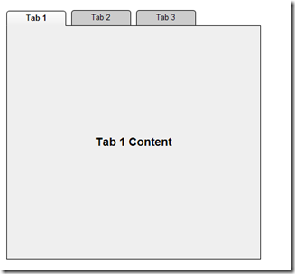
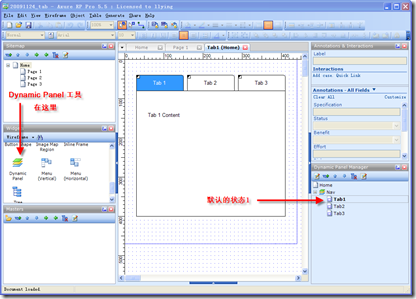
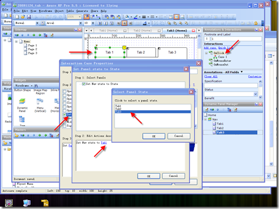
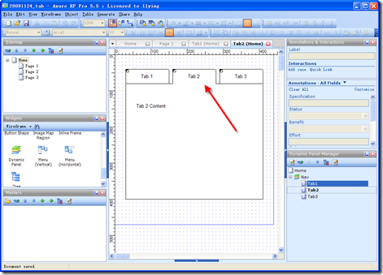

axure 作为一款原型工具，能够帮助我们快速的设计原型，从而将产品人员的想法快速准确的传递给技术人员。
我们希望的最终效果如下图：

Technorati 标签:[axure](http://technorati.com/tags/axure),[原型](http://technorati.com/tags/%e5%8e%9f%e5%9e%8b),[tab](http://technorati.com/tags/tab),[切换](http://technorati.com/tags/%e5%88%87%e6%8d%a2)
最简单的一种办法就是通过 Dynamic Panels 来实现。
首先创建一个空白的 Dynamic Panel，然后在 State 1 中开始绘制我们需要的样式。

下面就是最关键的一步，让这些元素都动起来。
首先选中一个 Tab，然后单击右侧的 OnClick，在弹出的窗口中选中 Set panel state to state。选中对应的状态，确定就 OK 了。
然后，可以将设计好的元素全部 拷贝 到其他两个状态中，并且修改 Tab 的样式，来适应当前的状态。如下图：

这样就完成了 Tab 效果的切换，如果希望鼠标移到 Tab 上时能够有相应的响应效果，我们可以右键 –> Edit Button Shape –> Edit Roll Over Style 中进行样式的编辑。
其实 Axure 这款软件的易用性比较不错，上手很快，特别是如果掌握一些 DW 或者 MS Visual 系列工具使用经验的用户。
PS：虽然 axure 几乎能够做出各种各样的效果来，但我一直对于做出复杂效果的投入是否值得心存疑虑，原型作为一个中间过渡的产品，其价值就在于传递产品的设计和使用理念，而且在原型交接的过程中，一般都会有产品人员和技术人员面对面的沟通，这样一些很复杂的效果完全可以通过叙述来让技术人员明白，这样产品人员就可以节省时间来思考更多的关于产品本身的问题了。
参考资料：
1、[Axure Sample](http://www.axure.com/sampleProjects.aspx)

