Logo设计的好坏，关系着一个企业如何树立形象的问题。Logo设计本身就是一个困难的课题，有了著名的Logo，将它重新设计就是一项更加挑战的工作。如果处理不当，他会带来怎样的后果？文中列出了2009年重新设计过的著名Logo，在这里不评判他们的好坏，只是列在这里，供大家来参考。
1、Telcom
[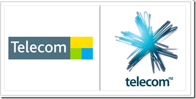](http://images.cnblogs.com/cnblogs_com/cocowool/WindowsLiveWriter/2009Logo_150A7/image_2.png)
2、Play Station 3
[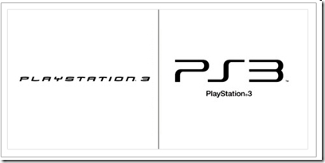](http://images.cnblogs.com/cnblogs_com/cocowool/WindowsLiveWriter/2009Logo_150A7/image_4.png)
3、Sunny Delight
[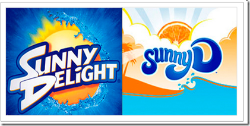](http://images.cnblogs.com/cnblogs_com/cocowool/WindowsLiveWriter/2009Logo_150A7/image_6.png)
4、Lays
[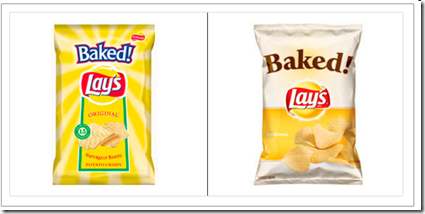](http://images.cnblogs.com/cnblogs_com/cocowool/WindowsLiveWriter/2009Logo_150A7/image_8.png)
5、Sony Ericsson
[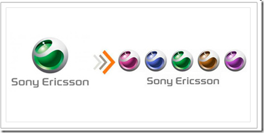](http://images.cnblogs.com/cnblogs_com/cocowool/WindowsLiveWriter/2009Logo_150A7/image_10.png)
6、Yale
[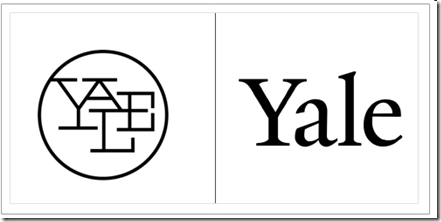](http://images.cnblogs.com/cnblogs_com/cocowool/WindowsLiveWriter/2009Logo_150A7/image_12.png)
7、Sprite
[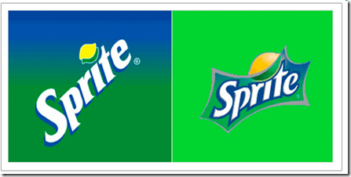](http://images.cnblogs.com/cnblogs_com/cocowool/WindowsLiveWriter/2009Logo_150A7/image_16.png)
8、Segd
[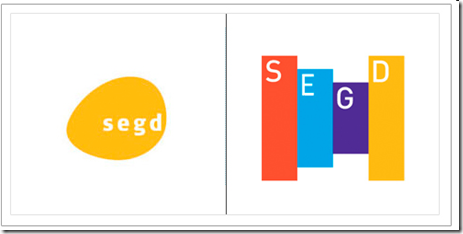](http://images.cnblogs.com/cnblogs_com/cocowool/WindowsLiveWriter/2009Logo_150A7/image_20.png)
9、Pfizer
[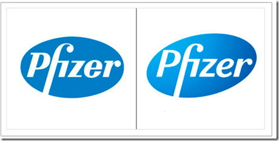](http://images.cnblogs.com/cnblogs_com/cocowool/WindowsLiveWriter/2009Logo_150A7/image_22.png)
10、Opera
[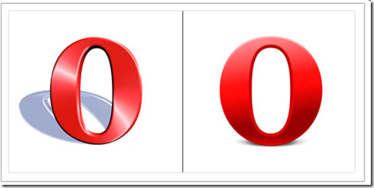](http://images.cnblogs.com/cnblogs_com/cocowool/WindowsLiveWriter/2009Logo_150A7/image_24.png)
11、OMCA
[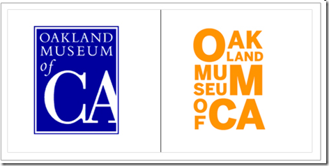](http://images.cnblogs.com/cnblogs_com/cocowool/WindowsLiveWriter/2009Logo_150A7/image_26.png)
12、MSN
[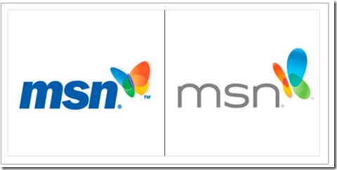](http://images.cnblogs.com/cnblogs_com/cocowool/WindowsLiveWriter/2009Logo_150A7/image_30.png)
13、Nicklodeon
[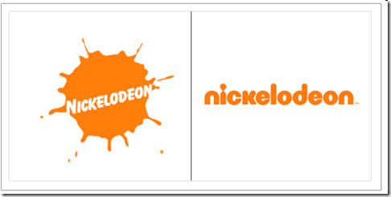](http://images.cnblogs.com/cnblogs_com/cocowool/WindowsLiveWriter/2009Logo_150A7/image_32.png)
14、Movistar
[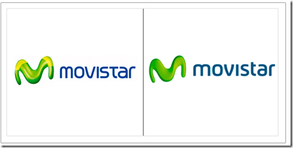](http://images.cnblogs.com/cnblogs_com/cocowool/WindowsLiveWriter/2009Logo_150A7/image_36.png)
15、Meiji
[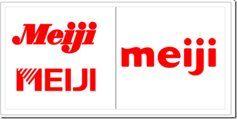](http://images.cnblogs.com/cnblogs_com/cocowool/WindowsLiveWriter/2009Logo_150A7/image_38.png)
16、Kraft Foods
[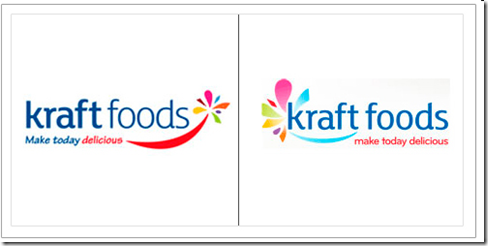](http://images.cnblogs.com/cnblogs_com/cocowool/WindowsLiveWriter/2009Logo_150A7/image_40.png)
17、Doctor WHO
[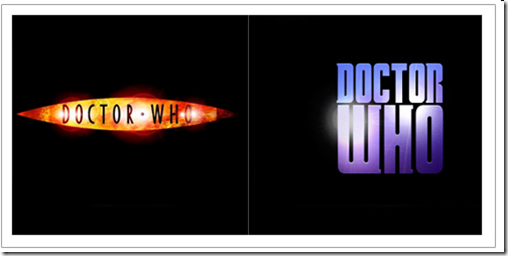](http://images.cnblogs.com/cnblogs_com/cocowool/WindowsLiveWriter/2009Logo_150A7/image_42.png)
18、Jack in the box
[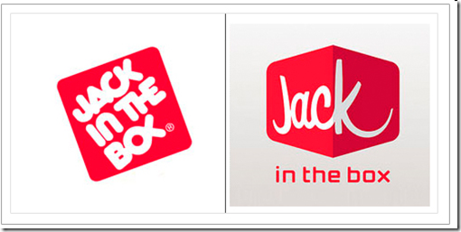](http://images.cnblogs.com/cnblogs_com/cocowool/WindowsLiveWriter/2009Logo_150A7/image_44.png)
19、France
[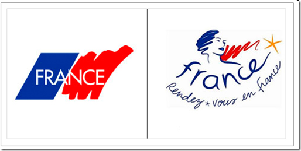](http://images.cnblogs.com/cnblogs_com/cocowool/WindowsLiveWriter/2009Logo_150A7/image_46.png)
20、Master Card
[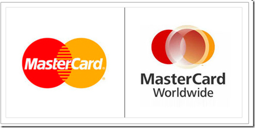](http://images.cnblogs.com/cnblogs_com/cocowool/WindowsLiveWriter/2009Logo_150A7/image_48.png)
21、Forth Worth Museum of Science and History
[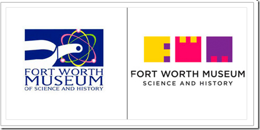](http://images.cnblogs.com/cnblogs_com/cocowool/WindowsLiveWriter/2009Logo_150A7/image_50.png)
22、Cadillac
[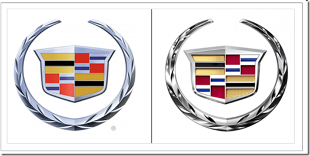](http://images.cnblogs.com/cnblogs_com/cocowool/WindowsLiveWriter/2009Logo_150A7/image_52.png)
23、Discovery Kids
[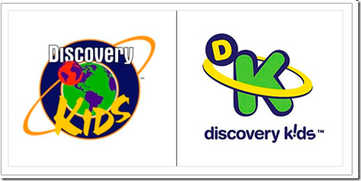](http://images.cnblogs.com/cnblogs_com/cocowool/WindowsLiveWriter/2009Logo_150A7/image_56.png)
24、Chicken Now
[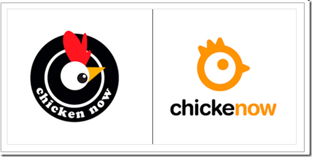](http://images.cnblogs.com/cnblogs_com/cocowool/WindowsLiveWriter/2009Logo_150A7/image_58.png)
25、City of Melbourne
[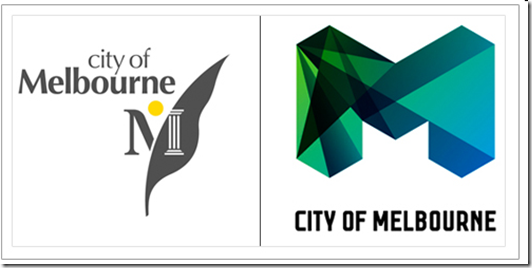](http://images.cnblogs.com/cnblogs_com/cocowool/WindowsLiveWriter/2009Logo_150A7/image_60.png)
26、Cheer
[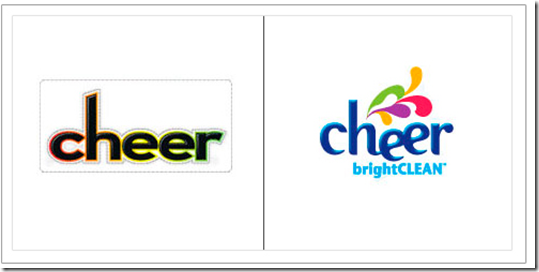](http://images.cnblogs.com/cnblogs_com/cocowool/WindowsLiveWriter/2009Logo_150A7/image_62.png)
27、Bavaria
[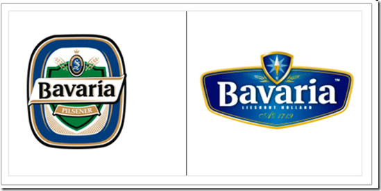](http://images.cnblogs.com/cnblogs_com/cocowool/WindowsLiveWriter/2009Logo_150A7/image_64.png)
28、Audi
[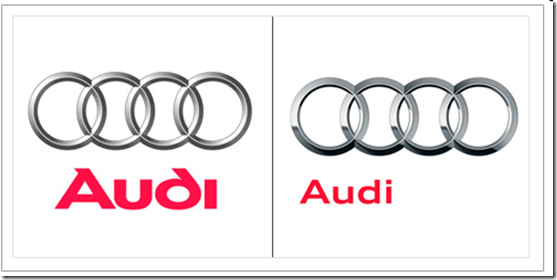](http://images.cnblogs.com/cnblogs_com/cocowool/WindowsLiveWriter/2009Logo_150A7/image_66.png)
29、AOL
[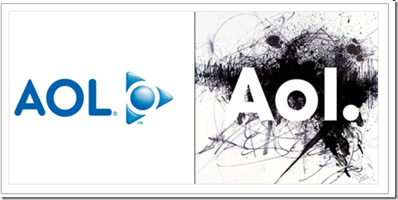](http://images.cnblogs.com/cnblogs_com/cocowool/WindowsLiveWriter/2009Logo_150A7/image_68.png)
30、Art Gallery of Alberta
[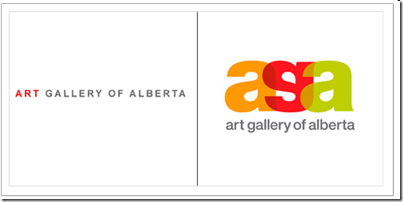](http://images.cnblogs.com/cnblogs_com/cocowool/WindowsLiveWriter/2009Logo_150A7/image_70.png)
31、Videocon
[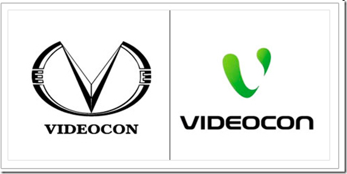](http://images.cnblogs.com/cnblogs_com/cocowool/WindowsLiveWriter/2009Logo_150A7/image_72.png)
32、Veggie Tales
[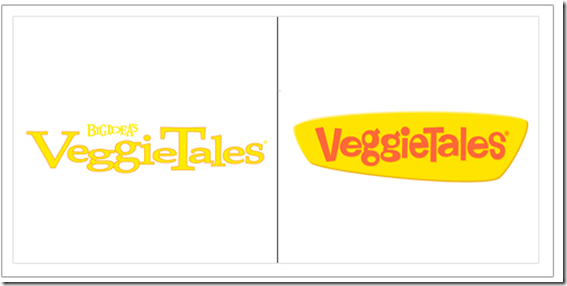](http://images.cnblogs.com/cnblogs_com/cocowool/WindowsLiveWriter/2009Logo_150A7/image_74.png)
33、Olympic Air
[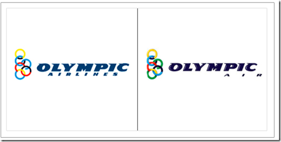](http://images.cnblogs.com/cnblogs_com/cocowool/WindowsLiveWriter/2009Logo_150A7/image_76.png)
34、Quick Time
[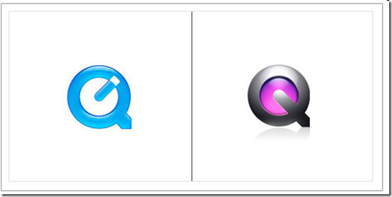](http://images.cnblogs.com/cnblogs_com/cocowool/WindowsLiveWriter/2009Logo_150A7/image_78.png)
35、Firefox
[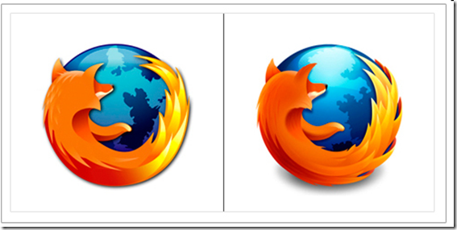](http://images.cnblogs.com/cnblogs_com/cocowool/WindowsLiveWriter/2009Logo_150A7/image_80.png)

最后，其实还有我们国内的新浪
[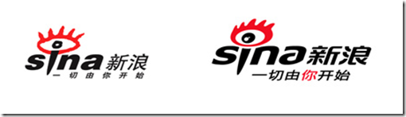](http://images.cnblogs.com/cnblogs_com/cocowool/WindowsLiveWriter/2009Logo_150A7/image_82.png)

