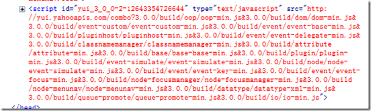

以下只是在YUI学习和使用中零碎的一些心得体会，未成体系，发出来，供批判。
1、利用 Font、Base、Grid CSS进行快速的网页布局。
对YUI一直很有好感，最近开始看了看YUI CSS GRID，发现这个理念非常好，非常有利于我们工作效率的提高，特别是熟悉了这套CSS之后，我们就不必每一个项目自己都去写一些CSS。其实，我想有心的朋友或多或少的都会收集一些自己常用的CSS，在不同的项目间使用，但是能够做到像YUI CSS这样有逻辑性、模块清楚的，恐怕还比较少见。
YUI CSS GRID 中，最重要的是三个概念：页宽 Page width，预设模板 Template Preset和嵌套布局 Nested Grid。合理的利用这三个手段，我们基本上可以满足日常页面的布局工作。
但是YUI CSS GRID在YUI3中已经不被推荐使用，我为此感到惋惜和不解。不过幸好，及时不被推荐，我们仍可在项目中使用他。
> 2、 IO的使用。
YUI3中封装的IO具备了强大的功能，不仅能够通过GET、POST方式提交数据。而且支持整个Form数据的提交，这个方法对于希望全站都是用Ajax来做的同学无疑提供了极大地便利。

但是，现在由于不是十分的熟悉YUI3的API，绑定IO事件的时候，都是在初始页面中进行的编码，这样必须能够了解到这个页面中可能会出现多少个Form，并分别把Form的提交事件绑定好。我在考虑，能否将JS代码写在每个表单中，通过IO将表单调入到当前页面，然后JS生效，再进行提交呢？ 这样对应的表单带着自己的JS，逻辑上就比较清楚。
Y.io("/foo/bar/some_widget", {
  method: 'GET',
  on: {
    complete: function(id, respdata) {
      thediv.innerHTML = respdata.responseText;
      initWidget();// this function is embedded in the responseText// and doesn't get evaluated. I.e. it doesn't exist.},
    failure: function(id, respdata) {
      alert('Feed failed to load!');
    }
  }
});

这里作者提供了一个解决的办法，但是提到了一个缺点，用户在被搜索引擎导向到这个页面后这些代码还是不能够执行。
那么有什么办法解决呢？
有一位[兄弟](http://starcatcher.ca/?p=636)提出利用一种真正的ajax的方法，将返回结果分成两部分，一部分是HTML的内容，一部分是javascript的脚本，返回后就直接执行javascript的方法。这样做也未尝不可，但是在写这个响应页面的时候，就要稍微注意结果的形式。
我就采用了一种比较笨的办法，将脚本放在一个容器中，加载到宿主页面以后，再通过 eval 执行一下，暂时这个问题就被这么丑陋的解决了。
但是有一个问题需要注意，就是通过ajax传递过来的js代码中不能含有注释，否则 eval 的时候会报错，这个是在 ie 下发现的错误。
3、YUI3还是不够稳定。
还是使用IO的时候，当通过POST方式提交数据时，第二次点击提交表单按钮，就会发出双份的数据，第三次，发送出去的数据就会变成三份。这个在YUI的论坛里有人反映了，是一个bug，已经解决，但是官方的那个build还没有更新。
在排查这个错误的时候因为不了解 YUI Loader 的工作原理，所以费了一些周折，同样不了解的同学可以去[这里](http://www.zhuoqun.net/html/y2008/1118.html)看一下，补充一下相关知识。我将 io-base.js 的最新版本下载下来，覆盖了本地文件之后，发现问题并没有解决，使用firebug查看，如下：

原来这些模块都还是通过combo调用的远程的，很奇怪的是为什么在firebug的网络中没有看到这个链接消耗的时间呢，难道他不消耗带宽？
至此，发现了原来将 YUI(combine:true) 配置去掉，就可以调用本地文件了。但同时丧失了 combo 的这个节省带宽的优势，本地有办法自己搭建一个 combo 么?

参考资料
1、[YUI3设计中的激进与妥协](http://ued.taobao.com/blog/2010/01/11/yui3%E8%AE%BE%E8%AE%A1%E4%B8%AD%E7%9A%84%E6%BF%80%E8%BF%9B%E5%92%8C%E5%A6%A5%E5%8D%8F/)
2、[Excute embedded javascript after ajax-call](http://blog.fredrikbostrom.net/2008/10/29/executing-embedded-javascript-after-ajax-call)
3、[Post-Ajax Javascripts Calls](http://starcatcher.ca/?p=636)
4、[YUI Library](http://yuilibrary.com/forum/viewtopic.php?f=92&t=2058&p=6793)
5、[YUI Loader 学习笔记](http://www.zhuoqun.net/html/y2008/1118.html)

