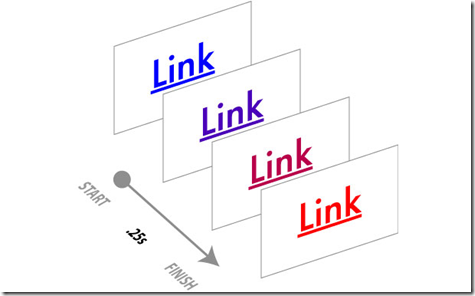

在CSS2的世界中，过渡常常是非常单薄的，要么是从一种颜色变成另一种颜色、要么是从不透明变到透明，总而言之就是由一种状态变到另外一种状态。这就导致了很多页面给人的感觉很突兀，没有一个平滑的过渡。

虽然我们可以使用DHTML或者诸如jQuery等其他第三方的库文件来完成过渡效果，但是为了完成一个简单的效果我们就需要大量的编码。

我们所需要的就是用一种简单的方法来实现这些过渡，因为我相信在今后的WEB应用中，平滑的过渡越来越成为一种标准的展现形式。

CSS3现在已经添加到了Webkit中，现在 Apple Safari 和 Google Chrome 都已经开始支持。再往前推几个月，那个时候人们还在争论是否将这些过渡写在CSS3中，一些人坚持认为过渡并不是一种样式属性，应当用脚本来进行处理。经过众多人的努力，样式不仅限于静态的样式，动态的样式也是非常需要的。于是过渡的样式终于开始写入CSS3的[官方文档](http://www.w3.org/TR/css3-transitions/)中。

废话少说，进入正题。

本文的例子需要支持CSS3的浏览器，所以你最好使用 Safari 或者 Chrome 来测试。

**过渡、状态和动作**
我们知道，CSS中都是通过伪类来实现页面中的一个元素与用户互动的。例如，用户鼠标的悬停和移动。下面列出了几个伪类：

**过渡包含哪些元素**
一个从蓝色变成红色的动态过渡包含哪些元素呢，我们先看一个实例：
> #css3tr a:link {
display:block;
height:30px;
line-height:30px;
width:100px;
border:5px solid #cccccc;
text-align:center;
-webkit-transition:width .25s ease-in-out, background-color .25s linear;
transitiona:width .25s ease-in-out, background-color .25s linear;
}
#css3tr a:hover {
color:red;
background-color:#e9e9e9;
width:200px;
-webkit-transition: width .25s ease-in-out, background-color .25s linear;
transition:width .25s ease-in-out, background-color .25s linear;
}

由此可见，transition 属性中包含了三个基本的属性：样式属性(CSS property)、持续时间(Duration)、计时函数(Timing Function)、延时(Delay)

看到这个图，大家对于这几个参数的作用应该了解了吧。很简单的几个参数设置，实现了我们之前需要用大量js脚本实现的效果，那么有什么理由不期待CSS3的到来呢。

可以应用过渡的元素：

过渡的时间和延时：

现在，就期待CSS3早日全面普及吧。

参考资料
1、[CSS Transitions 101](http://www.webdesignerdepot.com/2010/01/css-transitions-101/)
2、[CSS Transitions Module Level 3](http://www.w3.org/TR/css3-transitions/)

