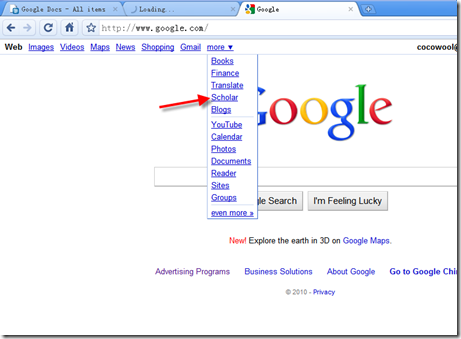
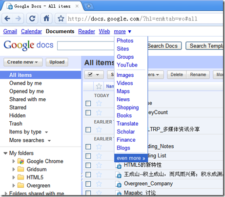

最近发现Google首页左上角那些功能链接都加上了下划线，即便是More点出来的下拉菜单也不例外。
下面用图说话：

但是其他应用中的链接仍然保持了原来的摸样，并没有下划线。

由此可见，虽然已经过了这么多年，我们通过各种技术手段可以对超链接进行各种形式的美化，但是带下划线的文字仍然是最常见、也让用户最容易理解的形式。我觉得这就像筷子，只要有华人的地方，就会有筷子的存在。而只要是有互联网的地方，就一定会有下划线的存在。

