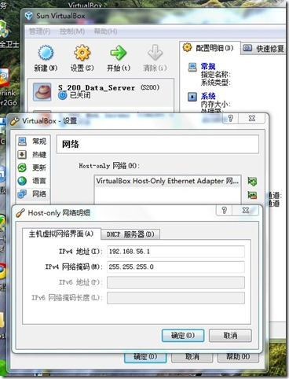
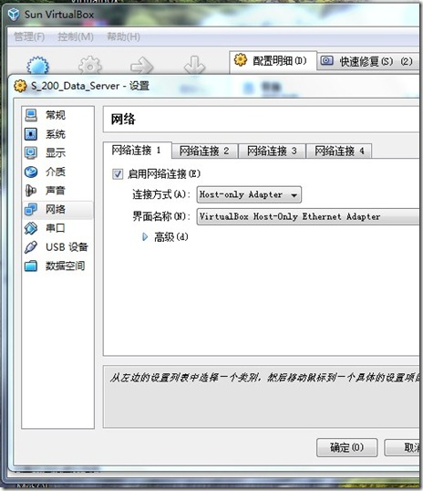
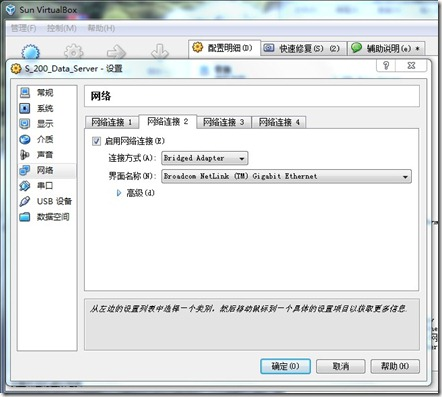

最近，经过一些研究，终于调通了VirtualBox虚拟机互连、主宿机互连、以及主宿机连接互联网。下面分享一下。

1、VirtualBox中的虚拟网卡。VirtualBox安装完成后，会在系统中装一块虚拟网卡，我们在管理->全局设定中可以看到。这块网卡是在 Host-Only 连接方式中，主宿机互访的桥梁。



2、主机访问虚拟机通过Host Only的方式实现。
主机访问虚拟机这个是最简单的。通过在网络连接1中选择 Host-only Adapter ，我们的虚拟机就可以获得一个内网的地址，主机可以直接访问这个地址。我们可以使用DHCP，也可以自己指定IP，多数情况下，都会指定一个固定的IP。



3、现在要想实现虚拟机上网，我们可以为虚拟机再添加一块网卡，通过Bridge方式，达到虚拟机上网的目的。




4、但是笔者在这样设置以后，测试 ping [www.baidu.com](http://www.baidu.com) 时，发现网络并没有通，仔细检查后发现，需要在我们的第二块网卡的配置上，指定他的网关。我在 /etc/sysconfig/network-scripts/ifcfg-eth1 中添加
```sh
GATEWAY=10.207.0.11
```
重启网络之后，就可以PING通了。

这样，我们既能访问虚拟机，又可以访问互联网，利用各种在线更新的工具，大大的方便了 Linux 的使用。
