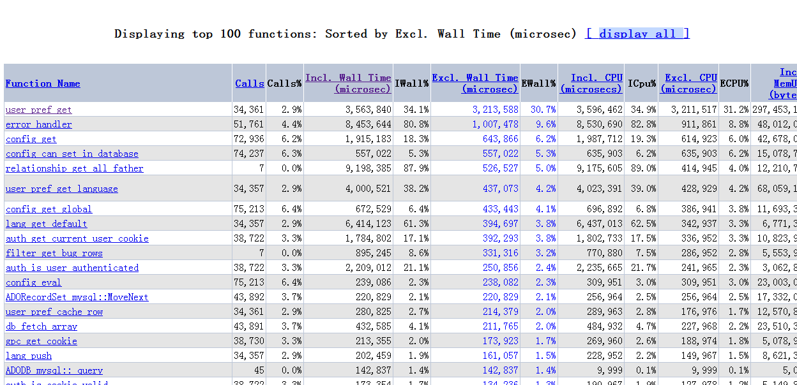
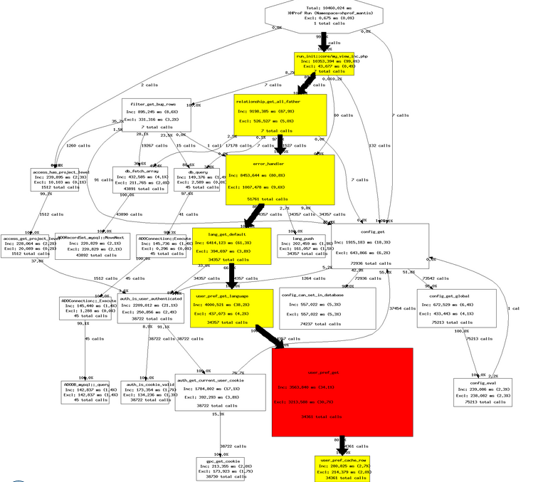
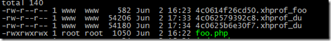

XHProf
这个软件本是Facebook内部的一个应用工具，2009年3月份开源，为PHP的性能监测提供了很好的工具。官方的介绍中提到：
> XHProf is a hierarchical profiler for PHP. It reports function-level call counts and[inclusive](http://mirror.facebook.net/#inclusive)and[exclusive](http://mirror.facebook.net/#exclusive)metrics such as wall (elapsed) time, CPU time and memory usage.
XHProf's light-weight nature and aggregation capabilities make it well suited for collecting "function-level" performance statistics from production environments.

可以先来看看 XHProf 提供的图形界面的截图

XHProf的一些特性：
1、**Flat Profile**. 提供函数级的汇总信息，比如调用次数、执行时间、内存使用、CPU占用等。

2、**Hierarchical Profile**。 对每个程序，进行了父级调用和子级调用的分解。

3、**Diff Reports(差异报告)。**有很多种情况，我们希望能够对比，比如新版本比旧版本提升了多少速度，两个版本的差距究竟在哪里。Diff Report 就是这样的工具，接收两个输入，并且分别给出各自的 Flat Profile 和 Hierarchical Profile 报告。
4、**Callgraph View(调用视图)。**性能监测的数据可以绘制成调用视图，方便我们查看。

5、**Memory Profile(内存监控)。**这个特性帮助我们了解PHP如何分配和释放内存。值得注意的是，XHProf并不是严格的监测内存的分配和释放动作，而是计算每个函数进入和退出时的内存状况，这是一个相对简单的实现方式，但是基本上也能够满足我们日常的监控需求。
6、**如何处理外部文件**。XHProf将 include,require,include_once,require_once进来的文件视作是一个 function。
XHProf目前只支持一个级别的函数追踪，但是貌似也没有特别大的影响。
**XHProf的安装配置**
xhprof的安装配置很简单，我们首先在 PECL 的网站上下载[源码包](http://pecl.php.net/package/xhprof)然后执行安装过程
> % cd <xhprof_source_directory>/extension/
% phpize
% ./configure --with-php-config=<path to php-config>
% make
% make install
% make test
**php.ini file**: You can update your php.ini file to automatically load your extension. Add the following to your php.ini file.
[xhprof]
extension=xhprof.so
;
; directory used by default implementation of the iXHProfRuns
; interface (namely, the XHProfRuns_Default class) for storing
; XHProf runs.
;
xhprof.output_dir=<directory_for_storing_xhprof_runs>

xhprof的使用也很简单，只要将需要监控的脚本放在 xhprof_enable() 和 xhprof_disable() 中间，就可以得到相应的结果，同时也提供了一些参数可以让我们设置是否监控 Memory, CPU 的使用，是否监控PHP内置的函数，从 0.9.2 之后，还可以设置跳过一些特定的函数。
XHProf 生成的数据，可以用 XHProf UI 来进行简单的显示。
XHProf使用也很简单，下面是一个官方的例子：
> <?php
function bar($x) {
if ($x > 0) {
bar($x - 1);
}
}
function foo() {
for ($idx = 0; $idx < 2; $idx++) {
bar($idx);
$x = strlen("abc");
}
}
xhprof_enable(XHPROF_FLAGS_CPU + XHPROF_FLAGS_MEMORY);
foo();
$xhprof_data = xhprof_disable();
//
// Saving the XHProf run
// using the default implementation of iXHProfRuns.
//
include_once "xhprof_lib/utils/xhprof_lib.php";
include_once "xhprof_lib/utils/xhprof_runs.php";
$xhprof_runs = new XHProfRuns_Default();
// Save the run under a namespace "xhprof_foo".
//
// **NOTE**:
// By default save_run() will automatically generate a unique
// run id for you. [You can override that behavior by passing
// a run id (optional arg) to the save_run() method instead.]
//
$run_id = $xhprof_runs->save_run($xhprof_data, "xhprof_foo");
echo "---------------\n".
"Assuming you have set up the http based UI for \n".
"XHProf at some address, you can view run at \n".
"[http://<xhprof-ui-address](http://%3Cxhprof-ui-address/)>/index.php?run=$run_id&source=xhprof_foo\n".
"---------------\n";
?>

我们可以持久化记录的数据，数据以文件的形式保存在指定的目录，如下图：
有了这个工具，我们可以根据其提供的数据，与相应的通知接口整合，在程序运行出现问题时，及时的发送通知信息。
xhprof画图使用的dot程序需要服务器上有libpng的环境支持，要想这部分能够正常绘图，需要安装graphviz-2.24.0、libpng才行，具体的在参考资料4中有说。

PHP性能监控，还有两个可用的工具，一个是 XDebug，另外一个是 ZendServer，我会在接下来继续进行介绍。
Technorati 标签:[profile](http://technorati.com/tags/profile),[监控](http://technorati.com/tags/%e7%9b%91%e6%8e%a7),[xhprof](http://technorati.com/tags/xhprof)
参考文档：
1、Speed UP your php with xhprof
2、[xhprof document](http://mirror.facebook.net/facebook/xhprof/doc.html#introduction)
3、[xhprof 中文文档](http://www.162cm.com/p/xhprofdoc.html#introduction)
4、[编译xhprof的一个小意外](http://www.cnxct.com/you-do-not-have-dot-image-generation-utility-installed/)

