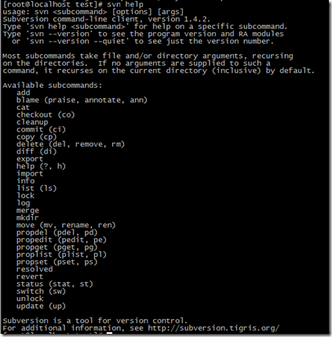
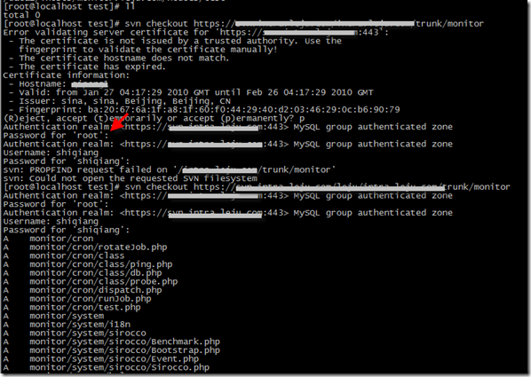
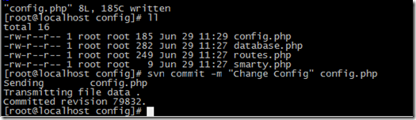

近期的一个项目不方便 Check 到本地，需要在测试服务器上进行编写和测试，所以就研究了一下如何在 Linux 命令行下使用 SVN。

首先 svn help 可以看到 svn 所支持的全部命令：



命令不多，如果用过Tortoise SVN的客户端，从字面上也不难理解这些命令所代表的含义。
**首先**我需要把我的项目 Checkout 出来。这个过程使用的命令是 svn checkout 或者 svn co



上图是执行的过程，在第一次提示输入密码时，会使用登录系统的用户名，回车，可以输入自己的用户名和密码，接下来整个下载过程就完成了。

**提交代码**

对代码进行修改后，需要提交代码到SVN中，这时要用到 svn commit / svn ci 命令。提交的时候，最好使用 –m 带上注释，这样今后查看的时候也比较方便。



**更新文件**

每次开始编码前，最好更新一下代码，看看其他人是否修改过代码。更新的命令为： svn update / svn up

可以切换到希望更新的目录，直接执行 svn update 而不必跟特定的文件或目录，也可以自己指定需要更新的文件或目录。

**查看日志**

这个功能在发现代码发生了变化，需要了解都有哪些变化的时候特别有用，前提是每一次的更新大家都写了注释。
使用命令 svn log :

```sh
[root@localhost config]# svn log config.php
------------------------------------------------------------------------
r79832 | shiqiang | 2010-06-29 11:16:35 +0800 (Tue, 29 Jun 2010) | 1 line
Change Config
------------------------------------------------------------------------
r76996 | shiqiang | 2010-06-22 13:51:33 +0800 (Tue, 22 Jun 2010) | 1 line
active $Id$s
```

基本上SVN的常用命令有这两个就可以开始工作了，但是SVN其实功能特别强大，在DIFF和Conflict处理方面，还没有研究过Linux下如何进行解决，另外还有Tag和Branch的功能。用好了SVN可以对于项目管理提供一个非常好的工具。

### 常见问题

**提交文件的时候遇到文件被锁，无法提交的错误**

错误提示：Server sent unexpected return value (423 Locked) in response to PUT request for "File Name"

解决办法：将相应的文件解锁，然后再进行提交。（这可以属于SVN高级应用的范畴，自己修改一个文件的时候，为了避免其他人同时修改，可以进行加锁操作）。

错误提示：svn: access to '/ainongye/!svn/bc/26/1/application/models/website_model.php' forbidden

这个错误是因为使用svn merge 回撤之前删掉的文件后提交引起的错误，可以参考资料3的方法进行解决。  

**将某个文件回撤到某个版本**

 我原来也以为 svn 中的 revert 命令是用来回撤历史版本的，后来才发现，原来这个命令只能回撤本地未提交的修改。要想真正的回撤本地的文件版本，需要使用 svn merge 命令

可以按照下面的步骤进行
```sh
$ svn merge --dry-run -r N:M http://my.repository.com/trunk [WCPATH]
```
首先检查一下本次命令会带来什么影响，并不实际执行，最后的一个参数是接受回撤变更的目录，如果留空表示当前目录
```sh
$ svn merge -r N:M http://my.repository.com/trunk [WCPATH]
```
实际将版本进行回撤
```sh
$ svn commit -m 'Reverted torevision N' [WCPATH]
```
将回撤后的版本进行提交

