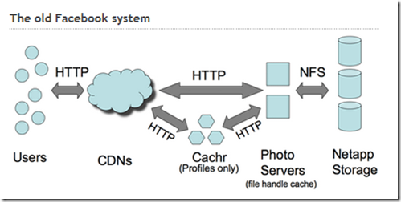
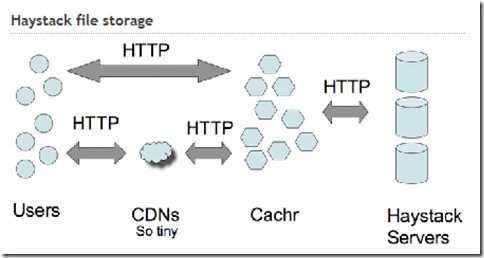

为了减少对昂贵的存储解决方案（诸如[NetApp](http://www.netapp.com/us/)和[Akamai](http://www.akamai.cn/enzs/)，我所在的单位用了一套NetApp，性能和稳定性都不错，价格当然也不菲），Facebook在2009年4月的时候推出了一套新的，名为Haystack的图片存储系统，来一个对每个月85亿次的图片上传（每天500G）。

[Jason Sobel](http://www.facebook.com/people/Jason-Sobel/1014953)，NetApp的前工程师主持了这次改造，基本的架构来自于2008年的[Stanford ACM presentation by Jason Sobel](http://www.flowgram.com/fg/2qi3k8eicrfgkv/)。新的架构让Facebook使用普通的服务器就能够支撑图片存储的需求，减少了对CDN的依赖。

Facebook有两种主要的图片存储类型，也是所有社交网站共同的特点：头像和相册。用户上传相册，以档案的形式存放，很少会删除，也不会立即读取。头像则是每个人都会拥有，并且有不同的尺寸。过去，Facebook极度依赖CDN来保护自己的服务器遭受大量的访问。

头像则使用了 Cachr ，一个使用 evhttp 和 memcached 后台的图片服务器，能够缓存那些被大量访问的图片。

**不需要POSIX**

Facebook的图片被世界各地的人们浏览，图片命名也包含了很多有用的信息。

> /[pvid]_[key]_[magic]_[size].jpg

传统的文件系统被POSIX标准通知，每个文件都需要有元数据和进入方法。这种文件系统是为了权限管理而设计的，但是Internet中的文件系统则不需要这么多额外的信息。

* File length
* DeviceID
* Storage block pointers
* File owner
* Group owner
* Access rights on each assignment: read, write execute
* Change time
* Modification time
* Last access time
* Reference counts

Haystack 存储10GB的数据只需要10Mb的元数据，这些原数据可以驻留在内存中，这样读取文件的时候就只需要一次磁盘寻道。Cachr仍然是第一道防线，快速的处理对于图片的请求。

参考资料：
1、[Facebook’s photo storage rewrite](http://www.niallkennedy.com/blog/2009/04/facebook-haystack.html)