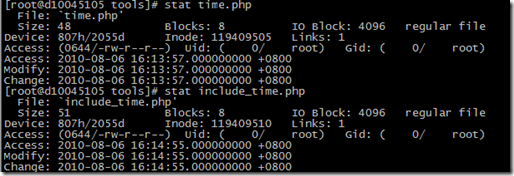
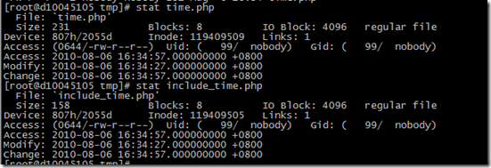

先看一下基本的时间。

现在服务器上建立一个文件 time.php
```sh
> [root@d10045105 tools]# touch time.php
[root@d10045105 tools]# stat time.php
File: `time.php'
Size: 0               Blocks: 0          IO Block: 4096   regular empty file
Device: 807h/2055d      Inode: 119408329   Links: 1
Access: (0644/-rw-r--r--)  Uid: (    0/    root)   Gid: (    0/    root)
Access: 2010-08-06 15:56:01.000000000 +0800
Modify: 2010-08-06 15:56:01.000000000 +0800
Change: 2010-08-06 15:56:01.000000000 +0800
[root@d10045105 tools]# date
Fri Aug  6 15:56:04 CST 2010
```

编辑文件 vim time.php
```sh
"time.php" 5L, 24C written
[root@d10045105 tools]# stat time.php
File: `time.php'
Size: 24              Blocks: 8          IO Block: 4096   regular file
Device: 807h/2055d      Inode: 119409505   Links: 1
Access: (0644/-rw-r--r--)  Uid: (    0/    root)   Gid: (    0/    root)
Access: 2010-08-06 15:56:59.000000000 +0800
Modify: 2010-08-06 15:56:59.000000000 +0800
Change: 2010-08-06 15:56:59.000000000 +0800
[root@d10045105 tools]# date
Fri Aug  6 15:57:02 CST 2010
```

通过URL进行访问 url/tools/time.php, 再查看 time 的时间
```sh
[root@d10045105 tools]# stat time.php
File: `time.php'
Size: 24              Blocks: 8          IO Block: 4096   regular file
Device: 807h/2055d      Inode: 119409505   Links: 1
Access: (0644/-rw-r--r--)  Uid: (    0/    root)   Gid: (    0/    root)
Access: 2010-08-06 15:58:27.000000000 +0800
Modify: 2010-08-06 15:56:59.000000000 +0800
Change: 2010-08-06 15:56:59.000000000 +0800
```

由此可见，通过Apache的访问会改变文件的Access Time。那么文件包含的情况呢？修改time.php，设置一个$time变量，使用 include_time.php 包含 time.php文件，使用相对路径。先看一下两个文件的时间。



通过URL访问后的时间


可以看到两个文件的进入时间是一样的。有些Apache配置了APC或者其他的缓存机制，这样再重新刷新页面时，文件的时间并不会改变。

测试一下VFS进行代码部署和同步时的时间问题，现在本地创建类似的两个文件
创建后，部署到服务器上。
先查看中转机中文件的状态：


同时看了一下，内网代码发布机上文件的时间


在没有进行URL请求的时候，查看一下244.21服务器上的文件时间



可以看到在，rsync代码到生产环境的时候，保留了文件的创建时间，同时变动了修改时间和访问时间。下面做一次url访问。时间发生了变化。


这时，重命名 time.php ，刷新页面，出现了白屏。日志错误为：


这时重新发布一下两个文件，部署时显示两个文件没有修改，都没有被部署。


但是这个时候，中转机上的文件时间发生了变化。


这个时候，前端机器上的文件时间没有更改，文件也没有部署到。


也就是说，代码部署机从SVN获取代码时，认为代码没有更新，就没有去获取代码，但是却通知了转发机发送文件，其使用的文件是代码部署机上存放的代码。下图可见


查看转发机种的发送日志，可以看到，多次部署的md5值保持不变，所以没有进行发送

