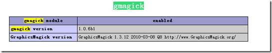
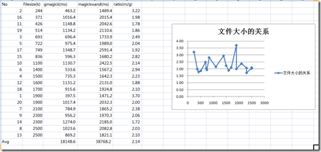

GraphicsMagick
当前稳定版本：[1.3.12](http://www.graphicsmagick.org/1.3/)(发布日期2010-03-08)
**简单介绍**：
GraphicsMagick号称图像处理领域的瑞士军刀。 短小精悍的代码却提供了一个鲁棒、高效的工具和库集合，来处理图像的读取、写入和操作，支持超过88中图像格式，包括重要的DPX、GIF、JPEG、JPEG-2000、PNG、PDF、PNM和TIFF。
通过使用OpenMP可是利用多线程进行图片处理，增强了通过扩展CPU提高处理能力。
GraphicsMagick可以再绝大多数的平台上使用，Linux、Mac、Windows都没有问题。
GraphicsMagick支持大图片的处理，并且已经做过GB级别的图像处理实验。GraphicsMagick能够动态的生成图片，特别适用于互联网的应用。可以用来处理调整尺寸、旋转、加亮、颜色调整、增加特效等方面。GaphicsMagick不仅支持命令行的模式，同时也支持C、C++、Perl、PHP、Tcl、Ruby等的调用。事实上，GraphicsMagick是从[ImageMagick](http://www.imagemagick.org/)5.5.2 分支出来的，但是现在他变得更稳定和优秀，下面就是两个之间的一些比较。
> GM更有效率（[测评](http://www.graphicsmagick.org/benchmarks.html)），能更快的完成处理工作
GM更小更容易安装
GM已经被Flickr和Etsy使用，每天处理百万计的图片
GM与已经安装的软件不会发生冲突
GM几乎没有安全问题
GM的手册非常丰富
…(无关痛痒的正确的废话)

**如何安装**：
GraphicsMagick可以使用源码安装在任何现代的Unix机器（Linux和MacOS X)和Windows上，这里只介绍Linux下的安装，其他的安装还需要参看[这里](http://www.graphicsmagick.org/README.html)。
下载 .tar.gz 的源码包，进行解压
> tar -xvzf GraphicsMagick-1.3.12.tar.gz

解压后，原来在的gz文件就变成了tar文件，进入文件夹
> cd GraphicsMagick-1.3.12

安装之前，因为是图片处理，所以需要系统中安装了libpng和libjpeg的开发包，否则的话不会安装这两种文件的支持。
使用 configure 来进行自动的配置、build和安装
> ./configure

当然，可以通过 –prefix=PATH 来指定参数，还可以指定其他编译时的变量，这里使用了一个经过测试的 configure 配置，同时添加了 enable-sybol-prefix ，这样就避免了和系统中已有的 ImageMagick 的冲突，下面是完成的配置参数：
> ./configure  '--build=i686-redhat-linux-gnu' '--host=i686-redhat-linux-gnu' '--target=i386-redhat-linux-gnu' '--program-prefix=' '--prefix=/usr/local/sinasrv2' '--exec-prefix=/usr/local/sinasrv2' '--bindir=/usr/local/sinasrv2/bin' '--sbindir=/usr/local/sinasrv2/sbin' '--sysconfdir=/usr/local/sinasrv2/etc' '--datadir=/usr/local/sinasrv2/share' '--includedir=/usr/local/sinasrv2/include' '--libdir=/usr/local/sinasrv2/lib' '--libexecdir=/usr/local/sinasrv2/libexec' '--localstatedir=/usr/local/sinasrv2/var' '--sharedstatedir=/usr/local/sinasrv2/share/com' '--mandir=/usr/local/sinasrv2/share/man' '--infodir=/usr/local/sinasrv2/share/info' '--enable-libtool-verbose' '--with-included-ltdl' '--enable-shared' '--disable-static' '--with-modules' '--with-frozenpaths' '--without-perl' '--without-magick-plus-plus' '--with-quantum-depth=8' --enable-symbol-prefix

接下来就是安装
> make
make install

**安装gmaick**：
安装GraphicsMagick后，还需要安装gmaick才能在PHP中使用，首先从PECL的网站上[下载](http://pecl.php.net/package/gmagick)安装包。然后解压缩，进入到gmaick的目录中
> cd gmagick-1.0.7b1

然后运行phpize
> /usr/local/php/bin/phpize

完成后执行安装过程
> ./configure --with-php-config=/usr/local/sinasrv2/bin/php-config  --with-gmagick=/usr/local/sinasrv2/
make
make install

在php.ini打开扩展后，重启apache就可以使用了

**与magickwand的比较**：
本文使用了20个大小不同的图片文件，分别使用gmagick和magickwand来完成打开图片、读取图片信息、关闭图片的操作，最后得出的结果如下：
总体上看，magickwand的效率要比GraphicsMagick差不少，但是效率的提升貌似与所处理的文件没有明显的线性关系，也许是图片太小了，据说GraphicsMagick可以处理Gb级的图片，更多的使用细节，只能在今后进一步研究了。
参考资料：
1、[GraphicsMagick](http://www.graphicsmagick.org/)
2、[gmagick](http://pecl.php.net/package/gmagick)
3、[ImageMagick](http://www.imagemagick.org/script/index.php)
4、[OpenMP in GraphicsMagick](http://www.graphicsmagick.org/OpenMP.html#freebsd-intel-xeon)
5、[解决GraphicsMagick和ImageMagick冲突](http://nightsailer.javaeye.com/blog/539259)
6、[Gmagick](http://nothing.tw/php/intro.gmagick.html)
7、[Manipulating Images with PHP and GraphicsMagick](http://devzone.zend.com/article/10531)
8、[ImageMagick安装备忘](http://lendy.9846.com/blog/2008/07/14/imagemagick-for-jpeg/)

Technorati 标签:[php](http://technorati.com/tags/php),[imagemagick](http://technorati.com/tags/imagemagick),[graphicsmagick](http://technorati.com/tags/graphicsmagick),[gmagick](http://technorati.com/tags/gmagick),[magickwand](http://technorati.com/tags/magickwand)

