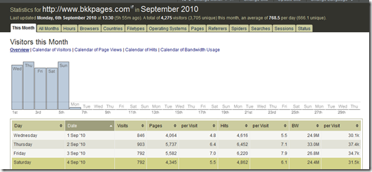
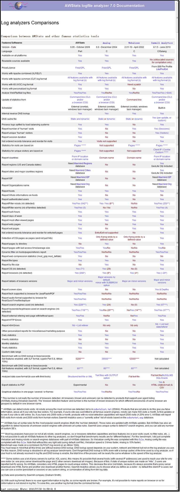

我们知道已经有很多像Awtstat这样的使用perl、c或者c++开发的强大的日志分析工具，但是同样也有很多使用PHP开发并且开源的日志分析软件，今天我就收集了一些与大家分享。
1、LogAnalyzer
LogAnalyzer是[Adiscon的监控软件产品线](http://www.monitorware.com/)中的一部分。可以再Windows以及Unix环境下运行。LogAnalyzer本是是免费的，GPL许可的产品。
LogAnalyzer的原名为phpLogCon，他在2010年的3月29日发布了3.0的稳定版，并且[正式改名为LogAnalyzer](http://loganalyzer.adiscon.com/news)。
程序运行必须有他们制定的数据支持，在Windows环境下， 可以使用[MonitorWare Agent](http://www.monitorware.com/)、[WinSysLog](http://www.winsyslog.com/)、[EventReport](http://www.eventreporter.com/)。在Linux环境下可以使用[rsyslog](http://www.rsyslog.com/)。现在Yum的源中包含了rsyslog这款软件，源中的版本是3.22.1，官方的最高版本是4.6.4的稳定版以及6.1.0的开发版。
由于不能使用原生的数据进行分析，我觉得算是他的一个缺点。
2、Jawstats

这是一款基于Awstat的PHP开源程序，提供了非常漂亮的分析统计结果的展示界面，支持中文。他的作者是[Jon Come](http://joncom.be/)。
JAWStats可以减轻AWStats的计算压力，同时安装非常简单，只要稍微修改一下配置文件就可以运行。配置项也可以非常简单。
JAWStats的使用界面也非常人性化，因为作者原来是一个UI工程师。在系统中，我们可以非常容易的在不同月份之间切换，还可以在不同站点的日志之间进行切换。也可以通过Web界面来进行分析数据的更新，正好切合我们的需求，只在需要看的时候出报表就好了。
JAWStats支持主题，可以进行主题的设计和切换。
总的来说，看完了JAWStats的介绍，觉得是比较推荐的一款产品。
3、Web Analytics. Open Source
一款GPL协议下的开源软件，界面和数据获取方式都是模仿GA的，对于小型站点的分析应该不错。有对于Wordpress和Mediawiki的统计支持。
4、Log Miner
LogMiner是一个分析Apache或者IIS日志，或者其他支持 combined 或者 W3C扩展日志格式的服务器。能够提取并展示包括访问量、点击、流量、请求数、访问路径、浏览器和操作系统在内的诸多指标。数据存储采用的是PostgreSQL，存储比较精简。
Log Miner开发的灵感源自于流行的 Webalizer ，但是有一些主要的不同：

> 使用关系型数据库作为后端数据存储，实时生成报表。而 Webalizer 则是生成 html 文件。基于DBMS数据库的方式能够随时提供不同形式的数据，但是日志文件的解析速度上不如 Webalizer。
Webalizer只保存最近12个月的数据，之前的数据则无法再查看。
Webalizer的报告结果是硬编码的，而Logminer则是每个报告对应一个PHP类，我们可以灵活的进行定义。
LogMiner提供了比Webalizer更多的报表，比如操作系统和访问路径。

5、Webalizer
Webalizer虽然不是PHP的，但是上面LogMiner总是拿这个作比较，就顺便说一下。用C写成，日志分析能力非常出众，采用HTML的报表展示形式，是一个非常流行的日志分析工具。
6、TraceWatch
一个PHP+Mysql的日志分析工具，界面不太喜欢，好像就是路径分析比较有特点，其他的感觉还有点慢，就没什么了。

其他还有一些不太知名的工具，就没有一一细看：
[AudiStat](http://adubus.free.fr/audistat/)、[SlimStat](http://slimstat.net/)、[Piwik](http://www.oschina.net/p/piwik)
结合看到的这些工具，针对我们单位的实际需求，感觉 Awstat + JAWStats 组合更为好一点。因为日志会收集到单独的日志服务器上，所以性能上的消耗也就不会在意了。接下来看看实际的效果吧。
PS：刚才看AWS的文档，看到一个对比，可能对于特性的了解能够更加的一目了然。

Technorati 标签:[日志](http://technorati.com/tags/%e6%97%a5%e5%bf%97),[Apache](http://technorati.com/tags/Apache),[Log](http://technorati.com/tags/Log),[PHP](http://technorati.com/tags/PHP),[开源](http://technorati.com/tags/%e5%bc%80%e6%ba%90)
参考资料：
1、[CrunchTools](http://crunchtools.com/)
2、[LogAnalyzer](http://loganalyzer.adiscon.com/)
3、[Jawstats](http://www.jawstats.com/)
4、[Awstat](http://www.awstats.org/)
5、[Web Analytics . Open Source](http://www.openwebanalytics.com/)
6、[Log Miner](http://logminer.sourceforge.net/)
7、[Webalizer](http://www.mrunix.net/webalizer/)
8、[TraceWatch](http://www.tracewatch.com/)

