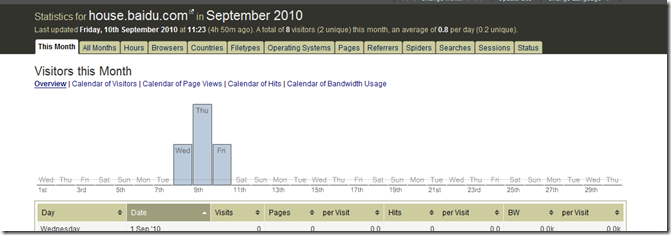

**Apache日志的几种形式**：

Apache的访问日志中会记录服务器所处理的所有请求，对apache的访问日志进行分析是一种比较传统的形式。虽然现在很多第三方的统计分析工具提供了嵌入到页面中的JS脚本来进行分析的方式，但是因为两种分析方式的侧重点不同，目前两种形式的日志分析仍并行存在。

不同版本的Apache httpd使用了不同的模块和指令来控制对访问的记录，包括mod_log_referer, mod_log_agent和```TransferLog```指令。现在，```CustomLog```指令包含了旧版本中相关指令的所有功能。日志分析与服务器产生的日志形式紧密相关，下面就是总结的一些常用的Apache访问日志的形式。

1、Common Log Format（CLF log format）
这是一种典型的记录格式：

> LogFormat “%h %l %u %t \”%r\” %>s %b” common
CustomLog logs/access_log common

上例中第一行先定义了日志的格式，后面一行再定义日志产生的位置和格式。最后产生的结果如下：
> 127.0.0.1 - frank [10/Oct/2000:13:55:36 -0700] "GET /apache_pb.gif HTTP/1.0" 200 2326

日志格式中具体字符代表的含义，我们可以在参考资料2中看到。

2、NCSA Combined log format
组合日志格式是另外一种常用的日志格式，如下：

> LogFormat "%h %l %u %t \"%r\" %>s %b \"%{Referer}i\" \"%{User-agent}i\"" combined
CustomLog log/access_log combined

记录的形式如下：
> 127.0.0.1 - frank [10/Oct/2000:13:55:36 -0700] "GET /apache_pb.gif HTTP/1.0" 200 2326 "http://www.example.com/start.html" "Mozilla/4.08 [en] (Win98; I ;Nav)"


**AWStat的安装**

AWStat的安装比较简单。可以使用tools文件下的配置工具，按照提示一步步进行安装，也可以自行创建一个配置文件并且进行配置。具体的过程[官方网站](http://awstats.sourceforge.net/docs/awstats_setup.html)上介绍的都比较清楚，就不再赘述了。

安装完成后，配置好 LogFile/LogFormat等几个必须配置的选项，确保你所要分析的Apache访问日志的格式和定义的格式一致，如果已经预定义的几种格式不能满足你的要求，也可以进行自己定义。例如我自己的Apache日志不属于某种规范，所以必须自己定义。

> Apache日志：
LogFormat "%h %l %u %t %T \"%r\" %>s %b \"%{Referer}i\" \"%{User-Agent}i\" \"%{Cookie}i\"" combined
AWStats日志格式：
LogFormat="%host %other %logname %time1 %other %methodurl %code %bytesd %refererquot %uaquot %otherquota"

这样就确保了AWStats可以正确分析我的日志，然后就执行日志分析命令。
> perl awstats.pl -config=baiduleju update

我所分析的日志，是从各个Web服务器上统一汇总过来的，所以LogFile配置中如果写成固定的文件名，则会不能适应日志文件的变化，我们日志文件存放的格式为：自定义目录/100910/100910_log_1[2.3.4].gz。与日期相关，并且进行了压缩，为此，我编写了一个脚本，让他来处理这些日志文件。
```sh
#!/bin/bash
DAY=$1
if [[ ! $DAY ]]
then
	DAY=`date -d '1 day ago' +%y%m%d`
fi
`cd /awstats的目录/awstats/wwwroot/cgi-bin`
`cp /data0/dpoolapachelog/$DAY/$DAY.house.baidu.com_* ./log_tmp/`
`gzip -d ./log_tmp/*`
`/awstats的目录/awstats/tools/logresolvemerge.pl ./log_tmp/* > ./log_tmp/newlog`
perl awstats.pl -config=baiduleju -update
`rm log_tmp/*`
```

主要过程就是将日志文件先拷贝到一个临时目录，然后利用logresolvemerge合并后进行分析，完成后删除。
最后在我指定的数据目录 ./data/ 下得到更新后的分析日志。

分析完成后，其实就可以通过web方式或者脚本生成静态的分析报告来查看结果了，但是awstats分析出来的结果呈现方式确实不是太好看，于是就用到了JAWStat。

**JAWStat的安装**

JAWStat需要Apache和PHP的支持，所以需要已经配置了相应的环境。它提供了一个非常友好的界面和方便的操作服务，而且支持不同的语言版本。截图如下：



配置也非常简单，只需要在程序的config.php文件中修改相应的参数就可以了。但是我发现在分析日志文件大的时候，会产生内存溢出的问题，需要修改一下最大内存限制。感觉处理方式上海由改进的可能，但是作者对这个的开发已经停滞了好久了。

参考资料：
1、[Apache日志文件](http://lamp.linux.gov.cn/Apache/ApacheMenu/logs.html)
2、[Apache模块mod_log_config](http://lamp.linux.gov.cn/Apache/ApacheMenu/mod/mod_log_config.html)
3、[AWStats](http://awstats.sourceforge.net/)
4、[JAWStats](http://www.jawstats.com/)


