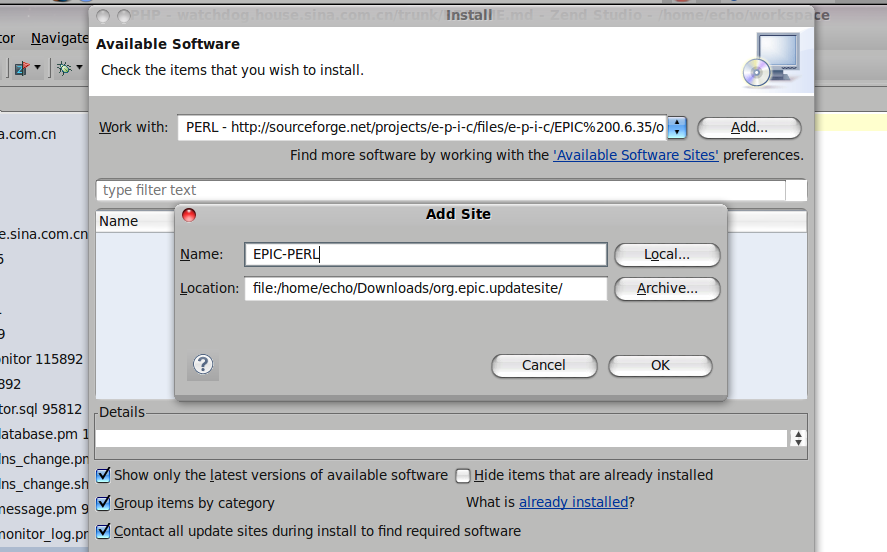

因为一直使用Zend Studio 进行PHP开发，所以再需要写Perl的时候，非常希望继续使用这个工具。
搜索了一下，发现EPIC-IDE.org 基于 Eclipse 开发了一款PERL的编辑器，因为ZendStudio也是基于Eclipse的，所以自然可以使用这个插件。
在 EPIC-ide 的官方页面中，提到了安装方法。但是这个网站貌似不是很稳定，笔者访问的时候，曾出现过一个下午都无法打开的状况。
如果大家能够打开，可以使用 Eclipse 自带的 Update Manager 进行安装。我以 ZendStudio 7.2.1 为例，来说一下步骤
1、首先打开编辑器后，点击 Help  -> Install New Software 打开安装窗口
2、点击 Add 按钮，再出现的对话框中，输入在线的安装地址**http://e-p-i-c.sf.net/updates 这个是稳定的版本，也可以使用一个测试版本
**
如果您不能打开下载的网址，也可以到 sourceforge 下在相应的软件包，然后参考 2 的方法，在本地搭建一个 update 服务,然后通过本地网络进行更新

3、安装过程中，按照提示进行一步一步的选择，完成后，会提示重启，之后就可以正常打开 .pl 的文件了，带有语法高亮
参考资料
1、[EPID-IDE](http://www.epic-ide.org/download.php)
2、[给Eclipse 安装 EPIC-IDE插件](http://fayland.org/journal/050312.html)

