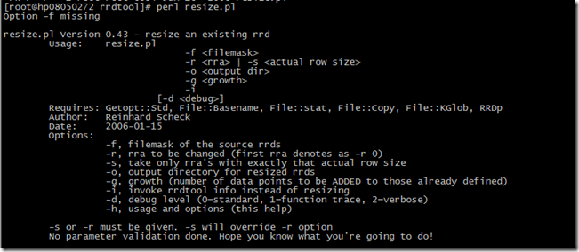
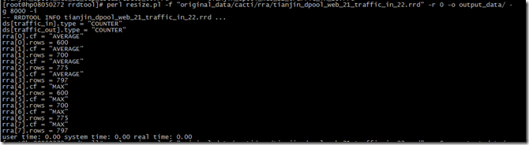
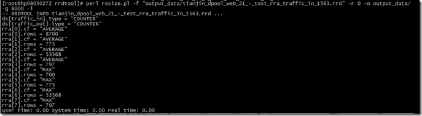
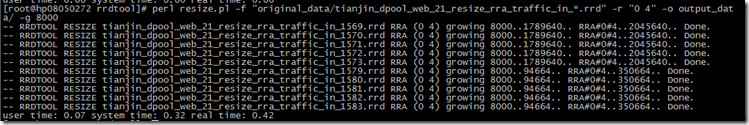

Cacti进行服务器监控时，5分钟的高精度数据默认只保留2天的数据记录，也就是说，两天以外的流量，我们就看不到5分钟的数据了。这对于我们现有的业务需求有所冲突，所以找了一些修改RRD保存周期的方法，可以对现有的RRD文件的保存周期进行修改。对于新建的rrd，可以通过 Data Source –> RRAs 中修改对应的 row，这样新建的数据，就默认使用新值。
> 注意：修改rrd尺寸的操作非常危险，在操作之前，备份您的rrd数据。本篇文章是个破坏你的rrd数据的最好机会。

不通过命令行修改rrd的最简单的办法是使用The Toolsmith。这个工具有商业版和免费版，感兴趣的同学可以点击下面的链接试用一下。
在参考资料1中可以下载一个resize.pl。是用来在命令行下修改rrd大小的工具，这个工具刚开始执行的时候，可能会提示一些perl模块的缺失。这个时候，一般只要按照提示进行安装就行了，我使用的是 perl –MCAPN –e shell 的方法。但是最后有一个提示找不到 RRDp.pm 的，这个在CPAN中找不到，需要下载安装 rrdtool-perl 的包，才能够提供这个模块。
完成这些之后，就可以正常使用 resize.pl 了。

开始之前，可以先查看一下rrd文件的信息。使用下面的命令：

> perl resize.pl -f "original_data/cacti/rra/tianjin_dpool_web_21_traffic_in_22.rrd" -r 0 -o output_data/ -g 8000 -i

可以看到这个文件的详细信息

1、**改变单个RRD中的RRA属性**。
最简单的办法就是把 –i 参数去掉就可以。

> perl resize.pl -f "original_data/cacti/rra/tianjin_dpool_web_21_-_test_rra_traffic_in_1563.rrd" -r 0 -o output_data/ -g 8000

之后查看存放在 output_data 下的输出文件，可以看到rrd确实增长了。

使用 –g 参数，表示将 row 的行数增长多少行。如果需要明确指定多少行，可以使用 –s 参数。
2、**改变单个RRD中的多个RRA**。
如果需要改变一个RRD中的多个RRA，可以使用下面的命令。

> perl resize.pl -f "original_data/tianjin_dpool_web_21_resize_rra_traffic_in_1579.rrd" -r "0 4" -o output_data/ -g 8000

这样输出的文件，其中的第0行和第4行已经被修改过了。
3、**修改多个RRD中的多个RRA**。
resize.pl 在文件名参数中可以支持通配符，这样就可以非常方便的修改多个RRD文件。
> perl resize.pl -f "original_data/tianjin_dpool_web_21_resize_rra_traffic_in_*.rrd" -r "0 4" -o output_data/ -g 8000

执行的结果是：

同样，在查询的时候我们也可以在文件名参数中使用通配符，这样就可以一次查询多个文件的信息了。
参考资料：
1、[Resize rrd files](http://docs.cacti.net/manual:088:8_rrdtool.04_resize#resize_rrd_files)
2、[The Toolsmith](http://www.thetoolsmith.com/)

