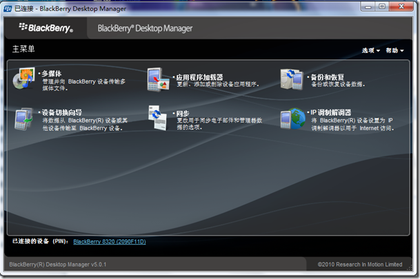
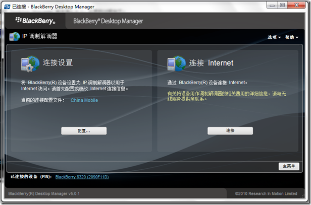
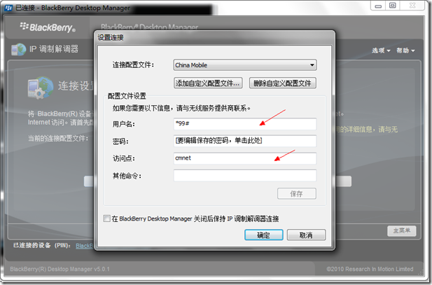
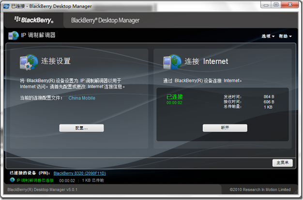

明天就要放假回家了，心情非常激动，但是回去之后没有网络环境非常苦恼。打听了一些3G网卡的收费，网卡加上SIM卡大多都要300元以上，我也就收收邮件，看看新闻，办一个3G网卡也不是非常合适，毕竟只有假期几天的时间用。拿起手上的黑莓手机，忽然有了想法。一直听说黑莓可以作为调制解调器带笔记本上网，今天就实验了一次。
我用的黑莓型号是8320，桌面管理器 Desktop Manager 版本是5.0.1。设置的过程如下：
1、手机连上电脑，打开Desktop Manager。

2、打开IP调制解调器

3、点击左侧的设置，进行拨号设置。然后点击添加自定义配置文件，完成后，填写相关的参数。

这里需要说明一下，只有图中标箭头的部分需要填写。刚开始的时候，我没有填写访问点，结果是提示网络连接成功，但是不能够打开网页。后来填写访问点，这个问题就解决了。我的手机选项TCP部分的设置为cmnet，如果上不了网的朋友不妨看看这部分的设置是否一致。
4、完成后连接互联网。

提示连接成功后，你就可以上网了，不过要注意流量，控制在自己套餐允许的范围内。我办了一个100元2G的套餐，感觉假期期间足够用了。
Update:实际在假期中使用的时候，我所在的区域信号非常好，峰值的下载速度可以达到30k/s左右，收邮件，看网页除了慢一点点以外，任何问题没有，而且流量也没有超过限制。

