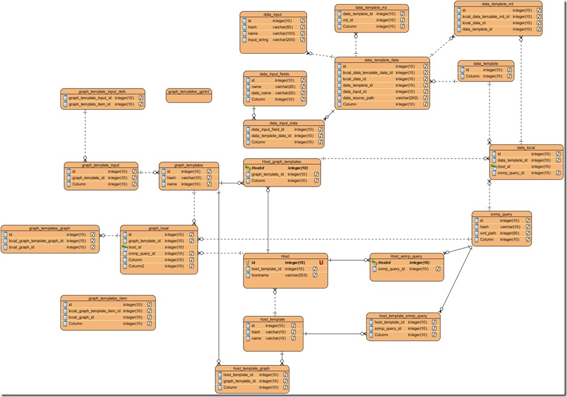

Cacti好用，很给力，但是他的数据结构却非常的乱，一般人都看不明白，也没有什么资料。想要做一些二次开发，在这个上面真是用了很大的功夫。

Cacti监控的来的数据，都存放在RRD文件中，其他的配置信息，存放在数据库中。配置信息中，可以主要归为三类：Host（主机）、Graph（图片）、Data（数据）。

我花了一点时间，将Cacti数据表结构画了出来：

因为接触建模软件不久，可能有些关系画的不是十分正确。希望这个结构图能够对大家了解Cacti的数据结构有所帮助。

参考资料：
1、[Cacti表结构和数据被动获取](http://blog.csdn.net/rj03hou/archive/2010/06/03/5645723.aspx)