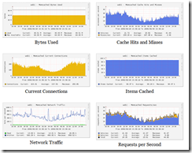
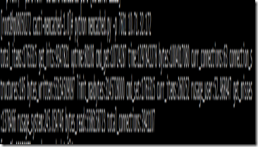
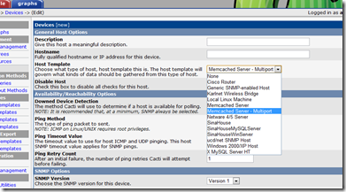
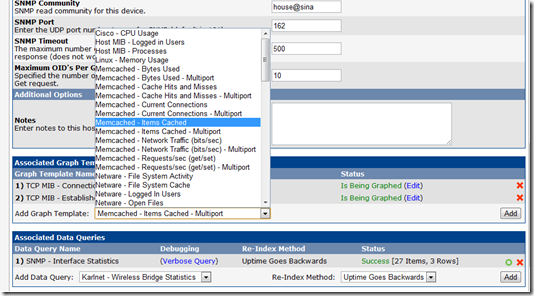

过年期间，看了一些Memcache的资料，整理了一个PPT。
**[Memcached分析](http://www.slideshare.net/Wonwang/memcached-6915055)**View more[presentations](http://www.slideshare.net/)from[Wonwang](http://www.slideshare.net/Wonwang).

收获最大的部分，我觉得是在应用上如何更好的对缓存进行使用和处理，来解决 Cache Stamples 的问题。通常只进行一次缓存判断的逻辑，在应对高并发的访问时，经常会引起问题，因此增加锁机制和Mutex就非常必要。
**Memcache服务器的状态**
如果有人反映memcache链接比较慢的时候，可以按照下面的步骤来进行查看
首先检查Memcached服务器组的 listen_disabled_num 参数，这个参数表明了这台服务器曾经达到最大连接的次数，这个数字当然是越小越好，如果这个数字不断快速的增长，我们就该小心我们的服务了。
accepting_conns 这个参数与上一个有关，我们可以简单的查看这个值是 1 或者 0 来判断服务器是否达到过最大连接。
curr_connections 这个状态显示了当前连接到服务器上的数量，注意这个数字不要超过设置的最大值
limit_maxbytes 当前服务器可以使用的最大内存数量，实际上服务器中的 memcached 进程占用的内存会比这个数字大一些
cmd_flush 服务器上执行了 flush_all 的次数
evictions 这个数字表示一些项目还没有过期，但是因为 slab 中已经没有可用的空间，导致最后根据LRU算法被剔除的情况
**一些统计数值**
缓存命中率：计算公式 get_hits / ( get_hits + get_misses ) 服务器的缓存命中率，越高越好

另外，可以使用下面这个脚本进行服务器的测试
测试脚本：[http://consoleninja.net/code/memcached/mc_conn_tester.pl](http://consoleninja.net/code/memcached/mc_conn_tester.pl)

**利用Cacti监控Memcached**
Cacti作为一套成熟的系统，可以用来绘制与Memcached相关的各种统计图表。下面提供的插件可以结合Cacti进行绘图，但是需要下面几个要求：1、系统已经安装了Cacti；2、已经安装好了Memcached；3、Cacti的机器上同时安装了Python；4、安装了Python的Memcached客户端。
下面是一些截图

下载Cacti取数据的脚本：[Cacti-memcached-1.0.tar.gz](http://s1.dlnws.com/dealnews/developers/cacti-memcached-1.0.tar.gz)
安装配置过程：
1、下载Python的客户端API，[python-memcached-1.47.tar.gz](ftp://ftp.tummy.com/pub/python-memcached/old-releases/python-memcached-1.47.tar.gz)
2、解压后安装

> tar –xvzf python-memcached-1.47.tar.gz
python setup.py install

3、下载Cacti的模板，[Cacti-memcached-1.0.tar.gz](http://s1.dlnws.com/dealnews/developers/cacti-memcached-1.0.tar.gz)
4、解压缩，然后将 memcached.py 拷贝到 cacti 的 /scripts/ 目录中
5、为了确认这个脚本是否能够正常运行，可以运行脚本进行测试
> python memcached.py hostname

正常情况下，我们可以取得所连接服务器的一些数据。
6、登录进入Cacti系统，选择导入模板，选择我们下载的模板中的 cacti_memcached_host_template.xml 文件，其它选项保持默认，进行保存
此时，我们在Cacti系统中引入模板就已经完成了，你会看到成功的提示，并且有一些相关的信息显式或者一些报错的界面。如果没有成功，可以参考这里的[帮助](http://dealnews.com/developers/cacti/memcached.html#help)。
7、系统的配置和使用
安装完成后，我们可以在新建Device时看到对应的模板，如下图

对于已经存在的Device，也可以在Associated Graph Templates中选择对应的模板

8、之后就可以在Graph中看到对应图表了。

Technorati 标签:[Memcache](http://technorati.com/tags/Memcache),[Linux](http://technorati.com/tags/Linux),[缓存](http://technorati.com/tags/%e7%bc%93%e5%ad%98),[Key-value](http://technorati.com/tags/Key-value)
参考资料
1、[Memcached Wiki Timeouts](http://code.google.com/p/memcached/wiki/Timeouts)
2、[利用Cacti监控Memcached](http://dealnews.com/developers/cacti/memcached.html)
3、[Memcached数据被踢现象分析(evicitions>0)](http://timyang.net/data/memcached-lru-evictions/)

