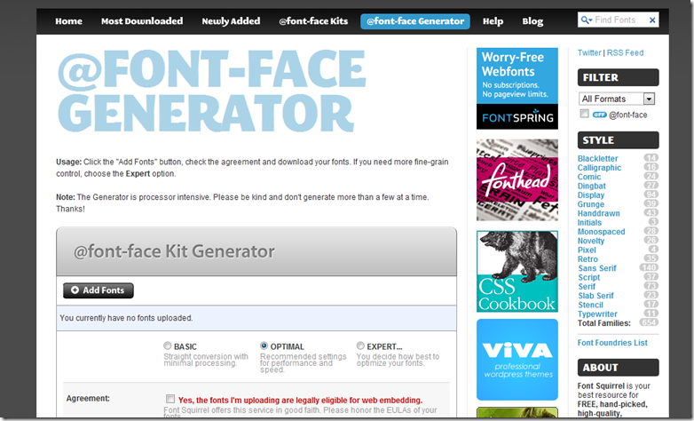

前一段时间听闻Google退出ubuntu字体的时候，使用了一下，从而了解到 font-face 的用法：
> **@font-face{font-family:'yahei';src:url(../images/msyh.eot);}**

利用这种方式，就可以在网页上显示用户的系统中不存在的字体。对于保证我们设计的一致性，减少图片的使用是非常有帮助的。
那么如何才能生成对应字体的EOT文件呢？
查阅资料后，找到了三个方法：
1、在线字体转换：[Font Squirrel](http://www.fontsquirrel.com/fontface/generator)

这个网站为我们提供了一个在线的字体转换服务，缺点是对于字体文件的大小有限制，更适合用来转换英文类的字体。
2、使用ttf2eot。
[ttf2eot](http://code.google.com/p/ttf2eot/wiki/Demo)是一个开源项目。支持Linux和Windows的环境，能够快速的生成EOT文件。使用起来也非常方便。
3、Microsoft WEFT。
[Microsoft WEFT](http://www.microsoft.com/typography/web/embedding/weft3/download.aspx)是微软推出的一款用来解决网页字体问题的软件。这款软件能够分析你的网页中调用了哪些字体（应当是通过css判断出来）然后会从系统中选择对应的字体进行转换，生成的EOT文件，也会根据页面中用到的字体情况进行缩减，所以生成的文件比较小。我认为非常适合用于中文类字体的生成。
具体的操作工程如下：

安装程序并运行后，点击Wizard，第一步是输入姓名和邮箱，完成后进入到网页选择的界面。这里是选择要用到特殊字体的页面。点击下一步后会弹出一个关于编码问题的对话框，一直点继续就可以了。

接着，WEFT会分析你的网页中用到了哪些字体。一般通用的字体，我们可以不选择嵌入，只对特定的字体进行转换。

之后，在选择生成文件保存的位置，就可以生成文件了。

将生成的文件拷贝到服务器的指定位置，在对应的页面中补充 font-face 样式，就可以实现在用户浏览器上显示特殊字体的目的。

参考资料：
1、[用Microsoft WEFT工具制作EOT字库](http://longoes.com/blog/design/microsoft-weft_font_family.html)
2、[网页字体终极解决方案](http://blog.cnfront.com/article.asp?id=229)
3、[TTF2EOT](http://code.google.com/p/ttf2eot/)
4、[Font Squirrel](http://www.fontsquirrel.com/fontface/generator)
5、[Microsoft WEFT](http://www.microsoft.com/typography/web/embedding/weft3/weft01.htm)
6、[CSS嵌入任意字体](http://blog.csdn.net/ruanzhijun9999999999/archive/2010/10/25/5963253.aspx)

