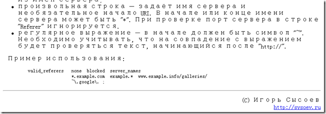

昨天为单位的Ngnix服务器配置了一个Rewrite规则，以防止符合特定规则的图片被盗链。同时，还有一个需求就是，从我们的管理站点来的请求应该可以访问这些图片。查了一些资料，最后总结如下：
> location ~ .*\.(gif|jpg|jpeg|png|bmp|swf)$
{
valid_referers server_names admin.xxx.com.cn;
if ($invalid_referer) {
rewrite "^/folderpath1/([a-z0-9]{2})/([a-z0-9]{2})/([0-9a-z]*)\.([a-z0-9]{3})" /403.html last;
rewrite "^/folerpath2/([a-z0-9]{2})/([a-z0-9]{2})/([0-9a-z]*)\.([a-z0-9]{3})" /403.html last;
}
expires      365d;
}

在解决这个问题的过程中，找了一些资料，在解决 valid_referers 这个配置的时候，按照网上的一些文章，总是不能够生效。后来看了官方的资料后，才知道要加上 server_names 这个参数。

由此可见，网上的很多资料都没有经过博主的验证，大家只是简单的转载。希望今后能够有更多的经过验证的，负责任的文章出现网络上，而不是简单的转载。
当然，这里写的这个规则只能是简单的做一些盗链的防范。想要更深入的防止盗链现象的发生，还有很多的工作可以做，这里并没有深入下去。
Technorati 标签:[ngnix](http://technorati.com/tags/ngnix),[linux](http://technorati.com/tags/linux),[rewrite](http://technorati.com/tags/rewrite),[防盗链](http://technorati.com/tags/%e9%98%b2%e7%9b%97%e9%93%be)
参考资料：
1、[Ngnix的Rewrite配置](http://www.ccvita.com/319.html)
2、[Ngnix防盗链](http://www.xpb.cn/blog/723.html)
3、[Ngnix Wiki](http://wiki.nginx.org)
4、[检测Ngnix配置是否正确](http://www.jiucool.com/blog/nginx-is-configured-correctly-detected/)

