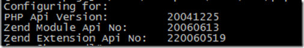
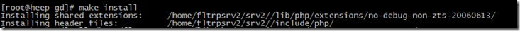

1、进入与现有环境相同的PHP源码包的ext目录中，进入到想要安装的扩展目录.
> cd php-5.2.x/ext/gd2/

2、执行phpize。/home/fltrpsrv2/srv2/bin/phpize

> 

3、执行安装
> ./configure –with-php-config=/path-to-phpconfig （这一步要确认系统中有php-config）
make
make install

完成后，会提示已经编译好的模块的位置。如果配置正确，就会在系统PHP环境的模块目录下，如果不对，需要自己拷贝到对应的目录。

4、修改php.ini打开模块支持。
> extension=gd2.so

最后，就可以看到模块已经支持了 ;)

参考资料：
1、[Linux下用phpize给PHP动态添加扩展](http://www.php100.com/html/webkaifa/Linux/2009/1202/3591.html)

