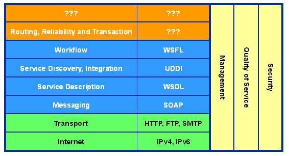

0、NuSOAP的简介
[NuSOAP](http://sourceforge.net/projects/nusoap/)是一组功能强大的PHP类，这个工具的发布让使用和创建SOAP消息变得相当简单。 NuSOAP有Dirtrich Ayala编写，可以无缝的与许多最流行的SOAP服务实现交互，它以LGPL协议进行发布。NuSOAP的主要特性包括：
> 简单：NuSOAP的面向对象方法隐藏了SOAP消息的组装、解析、提交和接收的有关细节，是用户能够集中精力处理自己的业务。
WSDL的生成和导入：NoSOAP可以生成一个对应于所发布的Web服务的WSDL文档，并且能导入一个WSDL引用在NuSOAP客户端使用。
代理类：NuSOAP可以生成的一个代理类，允许调用远程方法，如同调用本地方法一样。
HTTP代理：出于多种原因（安全性和审计是其中两个原因），有些客户端被强制将请求委托给HTTP代理，由代理代表客户端执行请求。也就是说，需要所有SOAP请求都传递给此代理，而不是直接查询服务器。NuSOAP为指定代理服务器提供了基本支持。
SSL：如果可以通过PHP使用CURL扩展，NuSOAP还支持通过SSL的安全通信。

1、Nusoap的获取安装
NuSOAP是一组PHP类，只要从SourceForge下载源码后，放入自己的工程目录引用，就可以使用。当然，NuSOAP库的存放位置可以自由决定，include目录、工程目录或者任何能够访问到的位置。
2、NuSOAP的使用
要使用NuSOAP，我觉得需要要对于SOAP有些基础得了解，附录中的参考资料我们可以了解到一些知识，从下面的图片，也可以了解到SOAP在Web服务堆栈中的地位。

使用SOAP时，有客户端和服务器两种情况。具体的使用比较简单，以至于NuSOAP官方都没有什么文档来说明，也许作者觉得不需要说明吧。下面就结合CodeIgniter框架，来说明NuSOAP的使用。
PS：需要说明的一点，NuSOAP不能和PHP的SOAP扩展同时使用，如果你的LAMP环境中安装了SOAP的扩展，那么NuSOAP直接是不能用的，因为类名重复的，如果花些力气把名字改下，也可以使用 :)
3、CI中使用Nusoap的方法
CI中调用第三方的类库，如果简单的调用，则非常的简单。一般的做法是将NuSOAP放在application/libraries 下面，然后编写一个引用这些文件的类，如 Nusoap_lib.php
> <?php  if ( ! defined('BASEPATH')) exit('No direct script access allowed');
class Nusoap_lib {
function __construct(){
$library_path = '/home/apache/htdocs/libraries/';
$nusoap = $library_path . 'nusoap0.9.5/nusoap.php';
require_once $nusoap;
}
}
?>

这样，我们就可以在其他的文件中通过CI常规的加载的方式来调用 NuSOAP 进行使用，比如在一个 Client类中。
> $this->load->library('Nusoap_lib');

$api_url = "[http://app.x.com/webservicefordiscuz/Service.asmx";](http://app.x.com/webservicefordiscuz/Service.asmx";)
$this->nusoap_client = new SoapClient( $api_url );
$this->nusoap_client->soap_defencoding = 'utf-8';
$this->nusoap_client->decode_utf8 = false;
$this->nusoap_client->xml_encoding = 'utf-8';
$err = $this->nusoap_client->getError();
if( $err ){
echo '<h2>Constructor error</h2><pre>' . $err . '</pre>';
echo '<h2>Debug</h2><pre>' . htmlspecialchars($client->getDebug(), ENT_QUOTES) . '</pre>';
exit();
}else{
}
try{
$result = $this->nusoap_client->call(
'CheckExistUser',
array('username' => "$username"),
'',
'[http://app.x.com/webserviceForDiscuz/CheckExistUser'](http://app.x.com/webserviceForDiscuz/CheckExistUser')
);
print_r( $result );
echo " ";
echo '
Request: ';
echo '<pre>',htmlspecialchars($this->nusoap_client->request,ENT_QUOTES),'</pre>';
echo ' Response: ';
echo '<pre>',htmlspecialchars($this->nusoap_client->response,ENT_QUOTES ),'</pre>
';
echo " ";
print_r( $this->nusoap_client );
}catch(Exception $e){
echo $e->getMessage();
}

事实上，在CI中使用NuSOAP，最大的挑战不在于如何引入。而在于理解并使用NuSOAP，我们照着参考资料1中的例子，一步步也能做出一个SOAP应用，但是却不是十分理解为什么要这样做，以及SOAP的具体通信和实现方式是怎么样的。建议感兴趣的同学可以看看IBM Developer Works中关于SOAP的介绍，相信对于SOAP的理解和今后的使用会有很大帮助。
下面，是我自己试验的过程中的两个例子，希望对大家有所帮助。
服务端
> <?php  if ( ! defined('BASEPATH')) exit('No direct script access allowed');
class Server extends Controller{
function __construct(){
parent::__construct();
$this->load->library('Nusoap_lib');
$this->nusoap_server = new soap_server();
$this->nusoap_server->register(
'hello',
array(
'name' => 'xsd:string'
),
array('return'=>'xsd:string'),
'uri:soap/server',
'uri:soap/server/hello',
'rpc',
'encoded'
);
}
function index(){
if($this->uri->segment(3) == "wsdl"){
$_SERVER['QUERY_STRING'] = "wsdl";
}else{
$_SERVER['QUERY_STRING'] = "";
}
function hello($name){
return "Hello $name.";
}
$this->nusoap_server->service( file_get_contents('php://input') );
exit;
}
}
?>

客户端
> <?php  if ( ! defined('BASEPATH')) exit('No direct script access allowed');
class Client extends Controller{
function __construct(){
parent::__construct();
$this->load->library('Nusoap_lib');
}
function index(){
$this->nusoap_client = new SoapClient('[http://mti.x.com/soap/server');](http://mti.x.com/soap/server');)
//        $this->nusoap_client->soap_defencoding = 'utf-8';
//        $this->nusoap_client->decode_utf8 = false;
//        $this->nusoap_client->xml_encoding = 'utf-8';
$err = $this->nusoap_client->getError();
if( $err ){
echo '
<b>Constructor error:' . $err . '</b>
';
}
$result = $this->nusoap_client->call(
'hello',
array('name'=>'World'),
'uri:soap/server',
'uri:soap/server/helo' );
if( $this->nusoap_client->fault ){
echo '
<b>Fault:';
print_r( $result );
echo '</b>
';
}else{
print_r( $result );
}
echo " ";
echo '
Request: ';
echo '<pre>',htmlspecialchars($this->nusoap_client->request,ENT_QUOTES),'</pre>';
echo ' Response: ';
echo '<pre>',htmlspecialchars($this->nusoap_client->response,ENT_QUOTES ),'</pre>
';
echo " ";
// Display the debug messages
echo '<h2>Debug</h2>';
echo '<pre>' . htmlspecialchars($this->nusoap_client->debug_str, ENT_QUOTES) . '</pre>';
}

}

4、常见问题
调试的三个方法：1、使用->request，->response查看消息头；2、使用日志查看调试信息；3、使用错误信息捕捉。
Technorati 标签:[SOAP](http://technorati.com/tags/SOAP),[NuSOAP](http://technorati.com/tags/NuSOAP),[PHP](http://technorati.com/tags/PHP),[WSDL](http://technorati.com/tags/WSDL)
参考资料：
1、[Nusoap in Code Igniter 1.5.4](http://codeigniter.com/forums/viewthread/59710/)
2、[CI Nusoap Library](http://codeigniter.com/wiki/CI_Nusoap_Library)
3、[浅谈SOAP](http://www.ibm.com/developerworks/cn/xml/x-sisoap/index.html)
4、[WSDL：描述你的Web服务](http://www.ibm.com/developerworks/cn/webservices/ws-wsdl/index.html)
5、[NuSoap的使用](http://www.uh80.com/?p=50)
6、[Introduction to NuSOAP](http://www.scottnichol.com/nusoapintro.htm)

