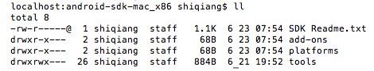
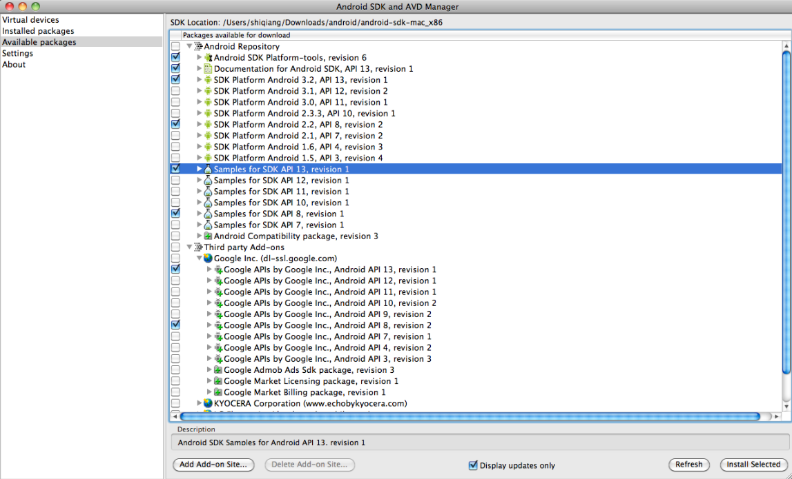
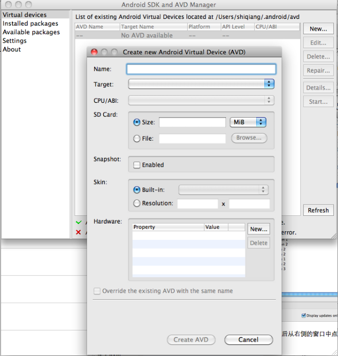
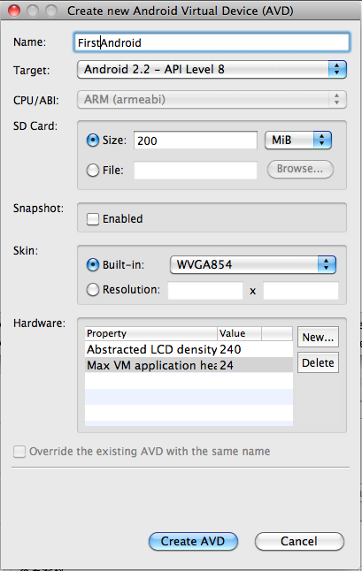
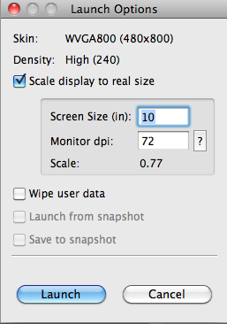
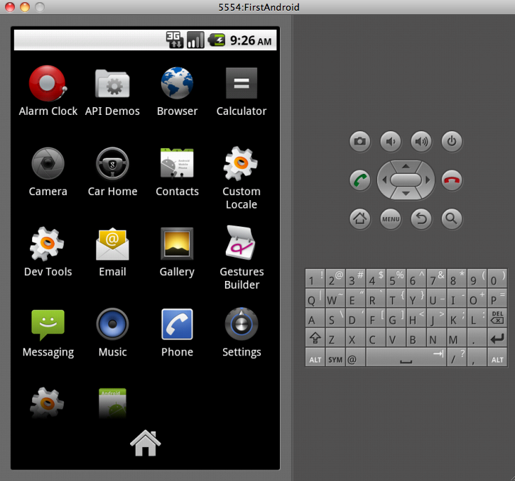

像iPhone的iOS或者其他的手机操作系统一样，Android的开发者非常需要一个模拟器，以在设备上实地测试前对自己开发的应用进行测试。这需要借住SDK来实现（Software Development Kit）。与iPhone的iOS SDK和Microsoft的SDK不同，Android的SDK支持PC和Mac系统。

下面是如何安装和使用的过程，我的环境是Mac OS X 10.6.8：

1、首先下载适合自己系统的SDK，Win 或者 Mac，[SDK下载](http://developer.android.com/sdk/index.html)。

2、下载并解压缩后，我们可以看到SDK目录中的文件如下。

3、接下来从tools文件夹中打开android程序，这是用来打开app或者脚本的SDK管理器。

4、然后我们可以看到弹出的Android SDK and AVD Manager窗口，按照下图的提示，从资源库中下载一些我们需要的组件。

5、下载并安装这些资源后，点击左侧的 "Virtual Devices" 菜单，然后从右侧的窗口中点击 New 。在新弹出的窗口中，我们需要在这里配置我们的虚拟设备或环境。

这里我选择了Android 2.2的环境，选完后如下。

创建之后，我们就可以通过右侧的Start按钮来启动模拟器了。启动的时候，会出现下面的界面来选择缩放的比例（如果默认的情况，笔记本屏幕可能无法显示全）。我这里设置了10，能够比较好的显示。

到此为止，我们就将模拟器创建好了。这还只是最基础的安装，缺少了很多的组件。更复杂的操作，留作后续来讲解了。

参考资料：
1、[Android 2.2 Froyo SDK Emulator for PC and Mac OS X](http://www.blogsdna.com/10400/android-2-2-froyo-emulator-for-pc-and-mac-os-x.htm)