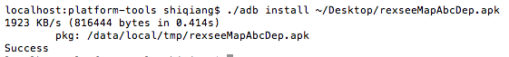

安装了Android模拟器之后（具体模拟器的安装步骤可以参考 [Mac下安装Android模拟器](http://edulinks.cn/2011/07/27/20110727-install-android-simulator/)），我们可能经常需要将从网上下载来得apk进行安装，在没有Eclipse开发环境的情况下，也可以进行安装，具体的方法如下：

1. 进入终端，找到adb

之前的文章提到adb在sdk的tools目录下，可是新的sdk已经将adb移到了platform-tools目录下，如果你的sdk包中没有，你还需要通过AVD Manager进行安装。

2. 启动模拟器，执行 emulator-arm 命令

开始安装之前，首先要启动模拟器，待开始运行后，在 tools 文件夹下找到 emulator 命令并执行。这个命令会一闪而过。

3. 安装apk

利用adb执行安装 ./platform-tools/adb install xxx.apk

安装成功后会有提示，此时就可以到模拟器中查看了。