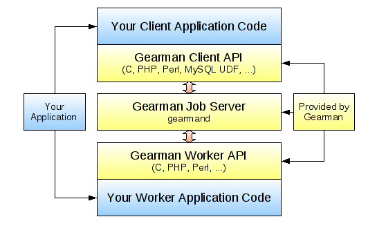
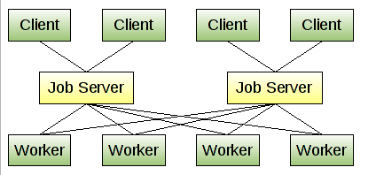
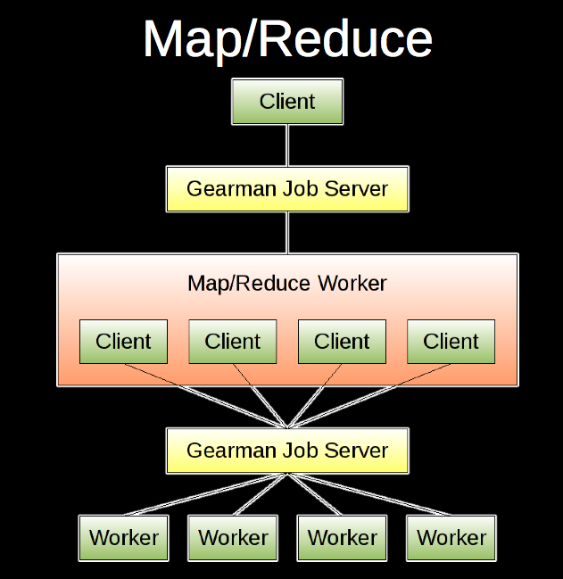
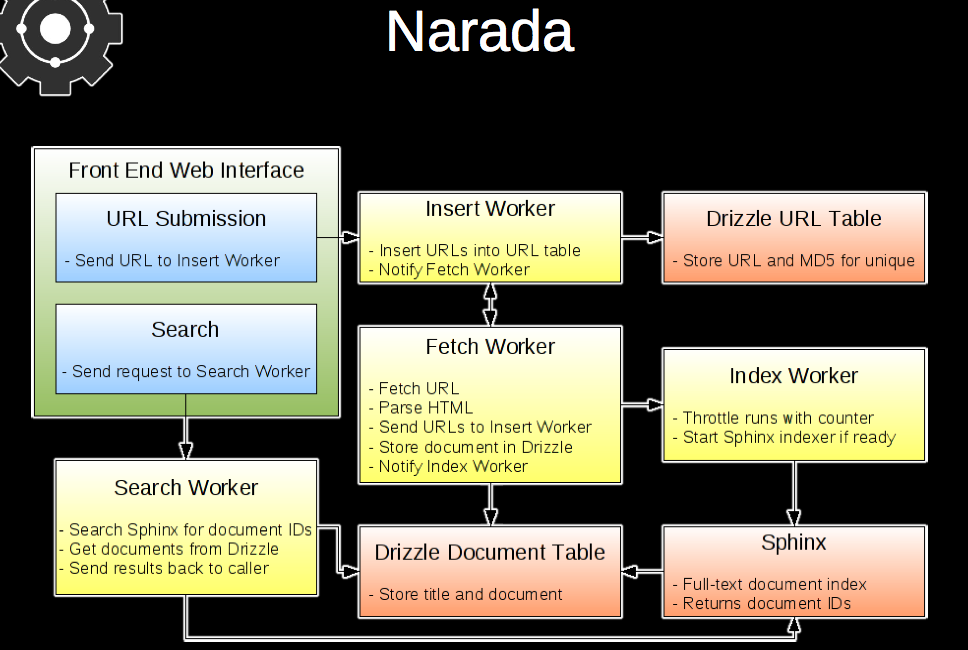
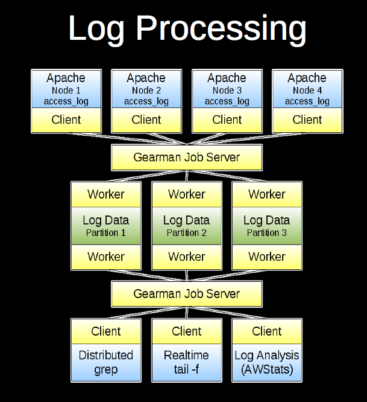

对于分布式网络环境或者有大量任务的应用，我们需要将任务在不同的服务器之间进行分布，这个时候正好是Gearman发挥实力的时候。虽然我们也可以使用MQ队列再加一些自己实现的调度算法来将任务进行分发，但是既然已经有了成熟的产品，为什么不使用下呢。

## Gearman介绍

Gearman 提供了一种通用的程序框架来将你的任务分发到不同的机器或者不同的进程当中。它提供了你进行并行工作的能力、负载均衡处理的能力，以及在不同程序语言之间沟通的能力。Gearman能够应用的领域非常广泛，从高可用的网站到数据库的复制任务。总之，Gearman就是负责分发处理的中枢系统，它的优点包括：

* **开源：**Gearman免费并且开源而且有一个非常活跃的开源社区。
* **多语言支持**：Gearman支持的语言种类非常丰富。让我们能够用一种语言来编写Worker程序，但是用另外一种语言编写Client程序。
* **灵活**：不必拘泥于固定的形式。您可以采用你希望的任何形式，例如 Map/Reduce。
* **快速**：Gearman的协议非常简单，并且有一个用C语言实现的，经过优化的服务器，保证应用的负载在非常低的水平。
* **可植入**：因为Gearman非常小巧、灵活。因此您可以将他置入到现有的任何系统中。
* **没有单点**：Gearman不仅可以帮助扩展系统，同样可以避免系统的失败。

## Gearman的工作原理

使用 Gearman 的应用通常有三部分组成：一个Client、一个Worker、一个 任务服务器。 Client的作用是提出一个 Job 任务 交给 Job Server 任务服务器。Job Server 会去寻找一个 合适的 Worker 来完成这项任务。Worker 执行由 Client 发送过来的 Job，并且将结果通过 Job Server 返回给 Client。Gearman 提供了 Client 和 Worker 的 API，利用这些API 应用可以同 Gearman Job Server来进行通信。Gearman 内部 Client 和 Worker 之间的通信都是通过 TCP 连接来进行的。工作的流程如下图所示：

## **Gearman的用处**

Gearman首先提供了一个多语言通讯的接口，当然还有比这个更简单有效的办法。Gearman可以将工作的负载分担到不同的机器中，如下图所示：

Job Server 可以开启多个实例，这样在其中一个发生故障的时候，可以 Failover 到其他的机器上。同时 Worker 也可以是多个实例进行运行，因为当前的服务器很多都是多核的。

Gearman要依赖于 Boost C++ Libraries 中的 program_options 库，并且需要的版本大于 1.39。笔者的CentOS 5.2 系统中自带的 1.33 不能满足需求，在自己安装的过程中会遇到一些问题，建议参考 Boost 官方手册中的 Easy Build and Install 这部分。

安装Gearman之后，第一次启用可能会遇到 `error while loading shared libraries: libgearman.so.1` 这个问题。可以用下面的方法解决：

> 当运行 `/usr/local/sbin/gearmand -d` 时出现 `error while loading shared libraries: libgearman.so.1` 运行一下 `/sbin/ldconfig -v` ，然后再去运行gearman就可以了

`ldconfig` 命令的用途，主要是在默认搜寻目录(/lib和/usr/lib)以及动态库配置文件 `/etc/ld.so.conf` 内所列的目录下，搜索出可共享的动态链接库(格式如前介绍,lib*.so*),进而创建出动态装入程序(ld.so)所需的连接和缓存文件。缓存文件默认为 `/etc /ld.so.cache`，此文件保存已排好序的动态链接库名字列表。`ldconfig` 通常在系统启动时运行，而当用户安装了一个新的动态链接库时，就需要手工运行这个命令。

需要小心的一件事情是数据的共享。Gearman 不进行所交换数据的任何转换或操作。对于这里使用的简单字符串和整数没有问题，但是不能共享 PHP 中的数组值并期望能在 Java 语言中被理解。对于这种类型的交互，可以使用很多结构化数据标准中的一种，比如 JavaScript Object Notation (JSON) 或 XML。另外，如果您在处理来自数据库的信息，只要共享 ID 或者找到需要处理的数据时要用到的信息即可，或者使用 memcached 这样的透明方法（尽管可能仍然需要 JSON 或等价物）。

## 参考资料

1. [用 Gearman 分发 PHP 应用程序的工作负载](http://www.ibm.com/developerworks/cn/opensource/os-php-gearman/)
2. [Gearman](http://gearman.org/)
3. [error while loading shared libraries: libgearman.so.1](http://blog.163.com/lgh_2002/blog/static/44017526201142610506817/)
4. [跨多种环境部署Gearman](http://www.ibm.com/developerworks/cn/opensource/os-gearman/index.html)

