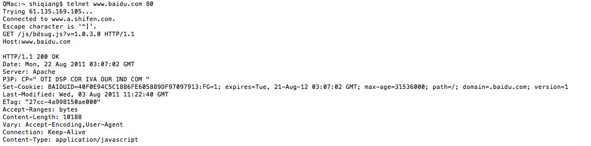

为了提高用户访问网站的速度，不少的浏览器都使用了本地缓存的策略。所有的本地缓存策略，都应当是在遵循RFC2616的基础上来实现的。有了本地缓存之后，用户请求服务器的文件，如果本地缓存的文件和服务器上的文件仍一致（这种一致的判断规则遵循RFC2616中设定的原则），则服务器只需要返回一个 304 的状态码，浏览器仍使用本地缓存为用户服务。

用户在浏览过程中，通常有三种操作：第一次访问一个页面、刷新页面、强制刷新页面（Deep Refresh）。不同的浏览器，其缓存策略在不同的用户浏览阶段发生。为了不同浏览器的缓存效果，设定了几种环境：浏览器缓存禁用时第一次浏览（或清空缓存后第一次浏览）、浏览器缓存启用的情况（用户正常浏览）、用户刷新页面、用户强制刷新页面，来察看不同情景下不同浏览器的反映。

测试的页面选择了百度的一个JS文件：http://www.baidu.com/js/bdsug.js?v=1.0.3.0

其第一次请求的响应头为：

其中携带了缓存控制信息，支持这些头信息的浏览器会进行缓存，第二次请求服务器就会返回304响应。

下面是测试的结果：

PS：对于Firefox对于Etag的头信息的解释，我和 教导主任 进行了一些交流和测试，发现一些问题。

Firefox中访问文件时，在浏览器中输入地址后回车，和点击刷新按钮效果是不太一样的。

例如对于Google的一个图片文件：http://www.google.com/images/nav_logo83.png

访问过一次之后，如果点击刷新按钮，返回的是304。如果是从地址栏中输入地之后回车，则会返回200。

但是百度的JS文件中，返回的头信息中带有ETag信息，在Firefox中进行刷新操作会返回304，从地址栏输入地址后回车，返回的也是304的状态码。

这个区别，可能和Firefox内部的实现机制有关系，但是具体Firefox内部是如何来进行解释的，则不是十分清楚。如果有了解的朋友，还望不吝赐教。

参考资料：

1、[Cache control headers and browser cache behaviours](http://dev.robertmao.com/2007/06/30/cache-control-header-and-browser-cache-behaviours/)

2、[减少chrome的io，限制、禁用chrome硬盘缓存](http://hi.baidu.com/tulalatu/blog/item/c00b12ee158ee6c4b21cb1b4.html)

3、[The state of browser caching](http://www.mnot.net/blog/2006/05/11/browser_caching)