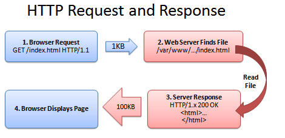
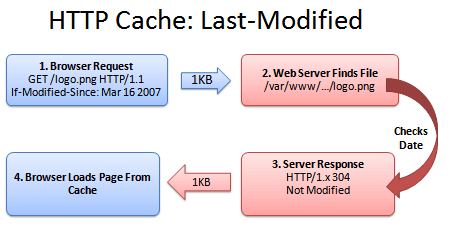
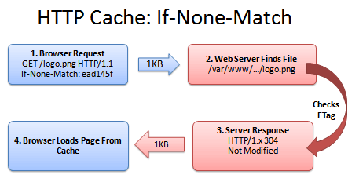
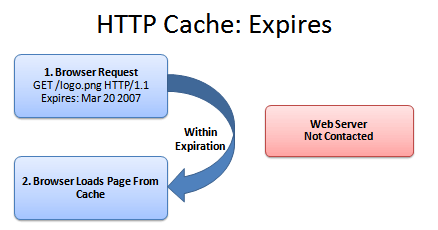

对于网站来说，速度是第一位的。用户总是讨厌等待，面对加载的Video和页面，是非常糟糕的用户体验。所以如何利用Cache来优化网站，值得深入研究。

**什么是缓存？**

缓存是一个到处都存在的用空间换时间的例子。通过使用多余的空间，我们能够获取更快的速度。用户在浏览网站的时候，浏览器能够在本地保存网站中的图片或者其他文件的副本，这样用户再次访问该网站的时候，浏览器就不用再下载全部的文件，减少了下载量意味着提高了页面加载的速度。

下面这个图例说明了浏览器和服务器之间如何进行交互。

**缓存的缺点**

缓存非常有用，但是也带来了一定的缺陷。当我们的网站发生了更新的时候，比如说Logo换了，浏览器本地仍保存着旧版本的Logo，那么浏览器如何来确定使用本地文件还是使用服务器上的新文件？下面来介绍几种判断的方法。

**Caching Method 1：Last-Modified**

服务器为了通知浏览器当前文件的版本，会发送一个上次修改时间的标签，例如：

Last-modified: Fri, 16 Mar 2007 04:00:25 GMT
File Contents (could be an image, HTML, CSS, Javascript...)

这样浏览器就知道他收到的这个文件创建时间，在后续的请求中，浏览器会按照下面的规则进行验证：
1、浏览器：Hey，我需要logo.png这个文件，如果是在  Fri, 16 Mar 2007 04:00:25 GMT 之后修改过的，请发给我。
2、服务器：（检查文件的修改时间）
3、服务器：Hey，这个文件在那个时间之后没有被修改过，你已经有最新的版本了。
4、浏览器：太好了，那我就显示给用户了。

在这种情况下，服务器仅仅返回了一个304的响应头，减少了响应的数据量，提高了响应的速度。

**Caching Method 2: ETag**

通常情况下，通过修改时间来比较文件是可行的。但是在一些特殊情况，例如服务器的时钟发生了错误，服务器时钟进行修改，夏时制DST到来后服务器时间没有及时更新，这些都会引起通过修改时间比较文件版本的问题。

ETag可以用来解决这种问题。ETag是一个文件的唯一标志符。就像一个哈希或者指纹，每个文件都有一个单独的标志，只要这个文件发生了改变，这个标志就会发生变化。

服务器返回ETag标签：

ETag: ead145f
File Contents (could be an image, HTML, CSS, Javascript...)

接下来的访问顺序如下图所示：

1、浏览器：Hey，我需要Logo.png这个文件，有没有不匹配“ead145f”这个串的
2、服务器：（检查ETag...）
3、服务器：Hey，我这里的版本也是"ead145f"，你已经是最新的版本了
4、浏览器：好，那就可以使用本地缓存了

如同 Last-modified 一样，ETag 解决了文件版本比较的问题。只不过 ETag 的级别比 Last-Modified 高一些。

**Caching Method 3：Expires**

缓存一个文件，并且与服务器确认版本的方式非常好，但是仍有一个缺点，我们必须连接服务器。每次使用前都进行一次比较，这种方法很安全，但还不是最好的。我们可以使用 Expiration Date 来减少这种请求。

就像我们用牛奶来煮麦片一样，每次喝之前都要检查一下牛奶是否安全。但是如果我们知道牛奶的过期时间，我们就可以在过期之前，直接使用而不用再送去检查。一旦超过了过期时间，我们再去买一份新的回来。服务器返回的时候，会带上这份数据的过期时间：

Expires: Tue, 20 Mar 2007 04:00:25 GMT
File Contents (could be an image, HTML, CSS, Javascript...)

这样，在过期之前，我们就避免了和服务器之间的连接。浏览器只需要自己判断手中的材料是否过期就可以了，完全不需要增加服务器的负担。

**Caching Method 4：Max-age**

Expires的方法很好，但是我们每次都得算一个精确的时间。max-age 标签可以让我们更加容易的处理过期时间。我们只需要说，这份资料你只能用一个星期就可以了。

Max-age 使用秒来计量，下面是一些常用的单位：
1 days in seconds = 86400
1 week in seconds = 604800
1 month in seconds = 2629000
1 year in seconds = 31536000

**额外的标签**

缓存标签永远不会停止工作，但是有时候我们需要对已经缓存的内容进行一些控制。

Cache-control: public 表示缓存的版本可以被代理服务器或者其他中间服务器识别。
Cache-control: private 意味着这个文件对不同的用户是不同的。只有用户自己的浏览器能够进行缓存，公共的代理服务器不允许缓存。
Cache-control: no-cache 意味着文件的内容不应当被缓存。这在搜索或者翻页结果中非常有用，因为同样的URL，对应的内容会发生变化。

注意：有些标签只是在支持HTTP/1.1的浏览器上可用，如果想要了解更多，那么推荐RFC2616以及[Cache docs](http://www.mnot.net/cache_docs/)。

参考资料：
1、[How to Optimize Your Site with HTTP Caching](http://betterexplained.com/articles/how-to-optimize-your-site-with-http-caching/)

