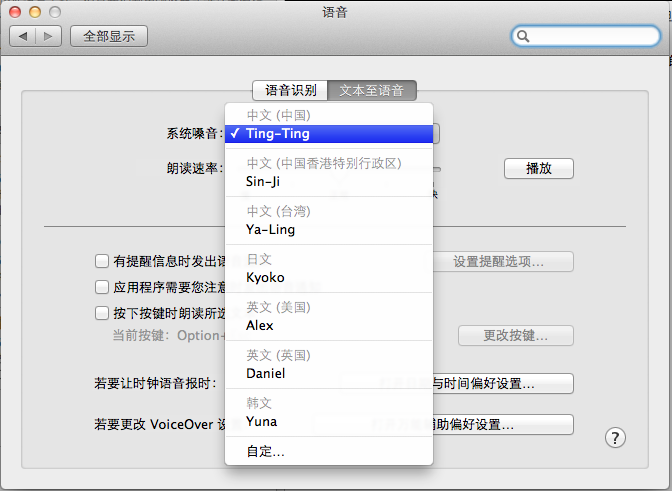
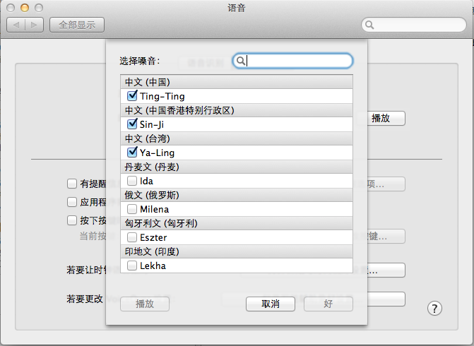
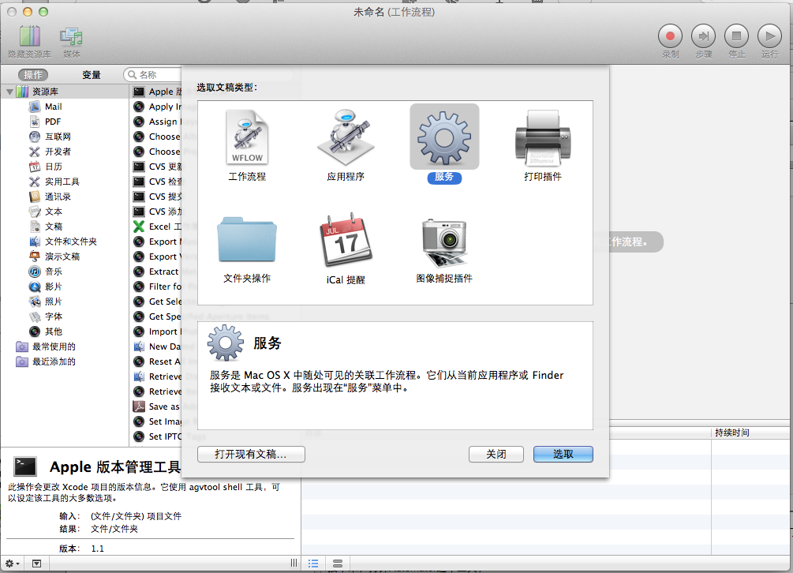
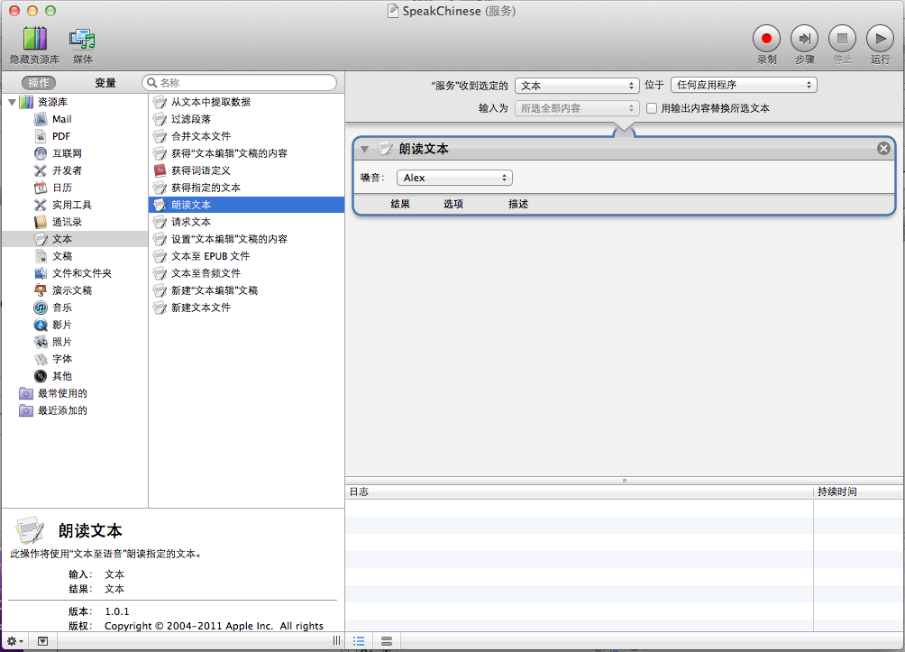
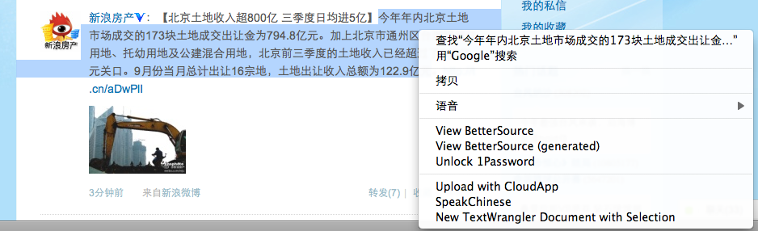
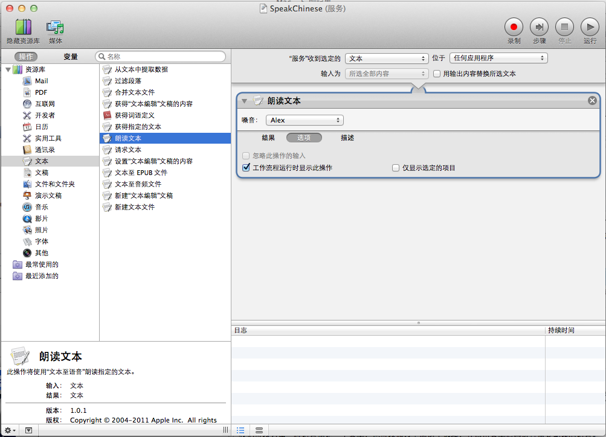

Mac Lion的新特性中提到，这次的更新提供了22中新语言支持，但是我们利用浏览器或者文本编辑器进行语音的朗读时，默认都是使用的英文，那么如何让Lion来朗读其他语言呢。

Mac 提供了实现这个功能的方法，下面来介绍利用Automator实现朗读不同语言的功能。

首先，我们需要在“语音”选项中安装我们需要朗读的语言。

上图中这些语言是我已经安装在自己的机器上的，如果大家的没有这些项目，可以点击“自定”菜单

在弹出的窗口中选择需要的语言，这时会提示这些语言需要下载。语音文件占用的空间比较大，我选择了中文、台湾、香港三个就用了1G多的空间。然后就等待下载安装完成。

接下来，打开Automator这个工具，第一次打开时，会提示选择要创建的文稿类型，选择“服务”，如下图。

然后从左侧资源库中选择“文本”，“朗读文本”，拖动到右侧的空白区域中。使用Command + S 进行保存，我这里命名为 SpeekChinese。至此，配置工作就完成了。

我们可以使用Safari来进行测试，打开一个中文页面，选中一段文字，点击右键，

看到菜单中的“SpeakChinese"选项了吧，点击就可以听到中文的朗读了。

参考资料：
1、[Automator Service for multi-language speech](http://hints.macworld.com/article.php?story=20110722230755650)

