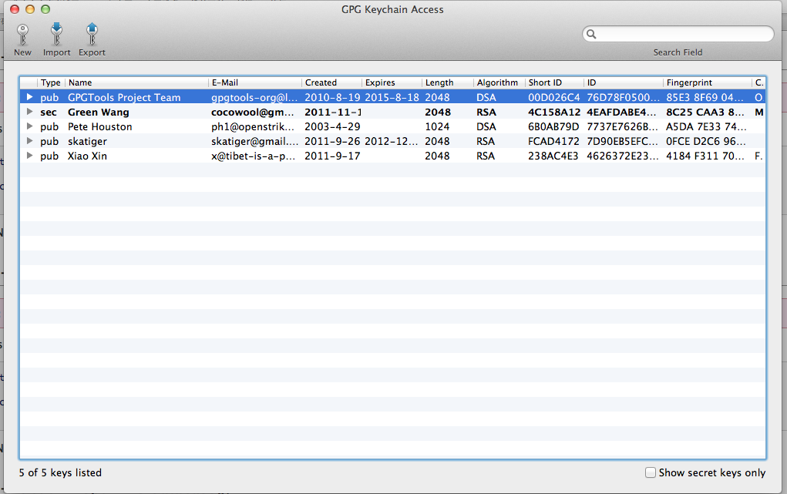
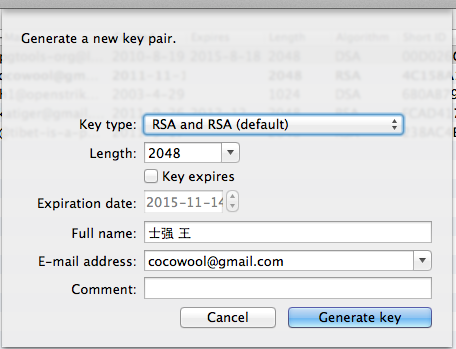
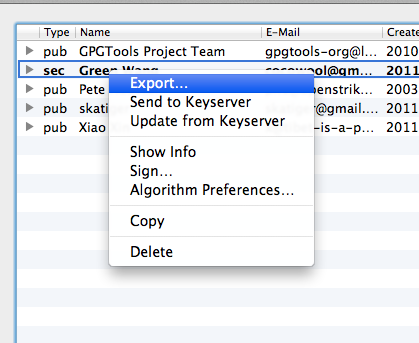
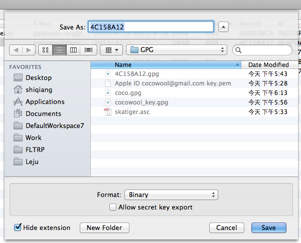
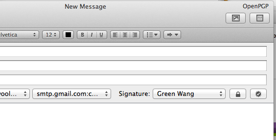

我和火星人也很好奇如何能够更安全的传输邮件，所以决定试一试。他的环境是 Linux Ubuntu ，我的环境是 Mac OS X Lion。

GnuPG全称GNU PrivacyGuard，它是基于公钥/私钥体系的加密工具PGP（Pretty Good Privacy）的开源版本它遵循OpenPGP标准。你可以免费使用，自由传播，并可以获得它的源代码。可以用于对Email、文件及其他数据的加密与验证，确保通信数据的保密性、完整性和真实性。

**PGP原理及规则**

PGP使用双密匙来加密数据。每个使用PGP加密技术的人都要创建一对密匙，一个叫做公匙，另一个叫做私匙。公匙可被广泛传播，你可以贴在自己的网页上或发到专门的公钥管理网站上等等。私匙属于个人信息，绝不应该泄漏给其他人。

公匙和私匙相互作用对数据进行加密及解密。被公匙加密的数据只能被私匙解密，被私匙加密的数据也只能被一个公匙解密。这样就可以实现双重认证。

例如，A要给B发信息：

* A不想信息被其他人看见，怎么办？

首先A必须通过某些途径得到B的公钥。
在发送信息前，使用B的公匙对信息进行加密。
这样只有B用对应的私匙才能解密收到的信息。所以就保证了信息传输的安全，这就是PGP所谓的加密(encryption)与解密(decryption)。

* B收到信息后如何确定这信息是A发的呢？

首先A必须通过某种途径把自己的公钥发给B。
在发送信息前，A先用自己的密钥加密信息。
B收到信息后就可以使用A的公钥来对收到的信息进行验证。这样就能确定信息来自A，这就是PGP所谓的签名(signature)与验证(verification)。

**如何在Lion中使用PGP加密你的邮件**

当前，gpgtools.org 上已经提供了集成的工具包来进行GPG的加密等相关工作。

1、下载 GPGTools，并进行安装。

首先从[http://www.gpgtools.org/](http://www.gpgtools.org/)下载 gpgtools，下载后进行安装。工具包中包括了如下软件：

GPGMail、GPG Keychain Access、MacGPG1、MacGPG2、GPGService、GPGPreference、Mobile OpenGPG。

安装之后，你就可以在 terminal 中看到 gpg 命令已经被安装好了。

2、打开 GPG Keychain Access 生成自己的公钥和密钥对。

正常情况下，第一次打开的时候，列表中应该是个空白的界面，紧接着会提醒用户生成自己的密钥对。

创建密钥对，默认会用你的电脑帐号对应的邮箱，你也可以选择或者输入其他的邮箱。Full name部分注意用户名要大于五个字符，所以中文姓名会有提示。Length 一般选择2048,也可以选择4096这样安全性能够更高一些。完成后，点击 Generate Key，生成自己的密钥对。

3、将自己的公钥导出并发送给其他人。

选中自己的密钥对，点击右键，选择导出。

导出的格式选项中，选择 binary 的格式。笔者试验了 ASCII 格式好像不能够正确导出。将导出的公钥发送给其他人，同时将别人的公钥 Import 到 GPG keychain Access 中。

4、最后，就可以在Mail中使用GPG进行邮件加密和签名。

大功告成！

参考资料：
1、[GpGTools](http://gpgtools.org/)
2、[GpGMail Not working after an os update](https://github.com/GPGTools/GPGMail/wiki/Not-working-anymore-after-an-OS-update)
3、密码学简介
4、[GPG签名和加密](http://lagignition.blog.163.com/blog/static/1287300232009101082517154/)
5、[Apple Mail PGP](http://blog.sina.com.cn/s/blog_5595d514010008xe.html)
6、[Using GNUPG encryption with Mac OS X Mail](http://www.wasuvi.com/?page_id=2368)