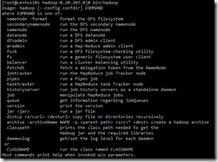
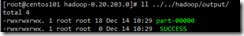

通过本节的学习，可以掌握如何在单节点上使用Hadoop进行Map/Reduce以及HDFS存储的实现。

### **环境要求：**

支持的平台：
支持GNU/Linux平台，可以作为测试和生产环境使用。Hadoop在2000个节点的生产环境中经受过考验。
支持Win32平台作为测试环境，正式环境的测试还不够充分，所以发布版暂时不能支持Win32环境。
需要的软件：
1、Java 1.6.x，必须。
2、ssh、sshd，必须。

如果是在Windows环境下，你也许需要 Cygwin。
安装必要的软件
如果服务器没有必要的软件，就必须进行安装。不同的发行版本，有不同的安装方法。例如Ubuntu下：
```sh
$ sudo apt-get install ssh
$ sudo apt-get install rsync
```

### **下载Hadoop**

从[这里](http://hadoop.apache.org/core/releases.html)下载一个Hadoop的稳定版本。

**开始我们的Hadoop之旅**
解压下载的软件，在解压后的目录中，编辑 conf/hadoop-env.sh 脚本设置服务器的JAVA_HOME目录。
我的环境是 Centos6.0，yum安装了OPEN-JDK，对应的目录为：
/usr/lib/jvm/java-1.6.0-openjdk-1.6.0.0/jre/
执行 bin/hadoop 命令，如果如下图所示，我们就做好使用 Hadoop 的准备了。



可以用三种方式使用Hadoop：
本地模式(Local Standalone Mode)；
伪分布式模式(Pseudo-Distributed Mode)；
完全分布式模式；

**本地模式**

默认情况下，Hadoop是配置为本地运行的，以一个单独的Java进程运行，这种方式非常适合Debug。
在本地，我选择了对 194Mb 的访问日志进行分析，如下代码：
`bin/hadoop jar hadoop-examples-0.20.203.0.jar grep input/ output/ 'favicon[a-z.]+'`

这个任务是分析日志中出现的favicon的次数，统计结果如下：



其中part文件中存储了我要查找的favicon字符串出现的次数。

**伪分布式模式**

配置：
参照官方的配置进行，分别对conf/core-site.xml、conf/hdf-site.xml、conf/mapred-site.xml进行配置。配置的内容都比较类似，主要是配置一个服务器的主机名，然后配置对应的IP或值。
设置无需密码的SSH：
按照官方的设置
```sh
$ ssh-keygen -t dsa -P '' -f ~/.ssh/id_dsa
$ cat ~/.ssh/id_dsa.pub >> ~/.ssh/authorized_keys
```

但是第一次登陆的时候始终需要提示是否保存，这个有点不得其解。
**执行：**
首先格式化一个新的分布式文件系统
`$ bin/hadoop namenode -format`

完成后，会有一些提示，根据提示可以在 /tmp/hadoop-root/dfs 中找到两个文件夹。
然后启动 Hadoop 的守护进程
`$ bin/start-all.sh`

~~我在安装的过程中提示了未知的jvm参数，但是并没有重大的影响，启动仍正常结束了，不知道什么原因~~。

这个问题是因为用root用户启动造成的，可以参考参考资料6中的方法，为hadoop这个文件打一个patch就可以解决。然后重新格式化namenode，进行测试。
`bin/hadoop jar hadoop-examples-0.20.203.0.jar grep logs output 'favicon'`

执行上面的语句，可以对日志进行 WordCount 的分析。
测试完成后，可以关闭所有的服务

`bin/stop-all.sh`

参考资料：
1、[Single Node Setup](http://hadoop.apache.org/common/docs/stable/single_node_setup.html)
2、[Hdfs Shell Handbook](http://hadoop.apache.org/common/docs/r0.20.0/hdfs_shell.html#put)
3、[Hdfs error：could only be replicated to 0 nodes instead of 1](http://stackoverflow.com/questions/5293446/hdfs-error-could-only-be-replicated-to-0-nodes-instead-of-1)
4、[Hadoop：Could not create Java Virtual Machine](http://www.koopman.me/2009/04/hadoop-0183-could-not-create-the-java-virtual-machine/)
5、[Namenode not starting](http://lucene.472066.n3.nabble.com/Namenode-not-starting-td3302351.html)
6、[Faile to start datanode while start-dfs.sh is executed by root user](https://issues.apache.org/jira/browse/HDFS-1943)