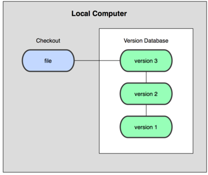
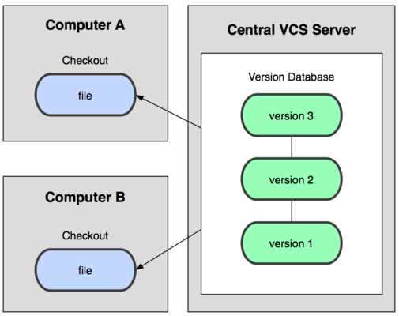
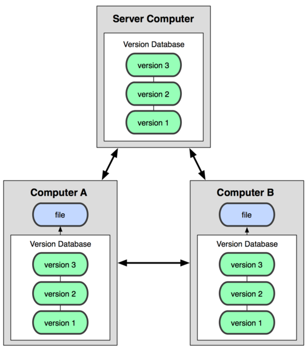
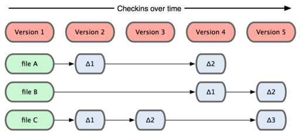
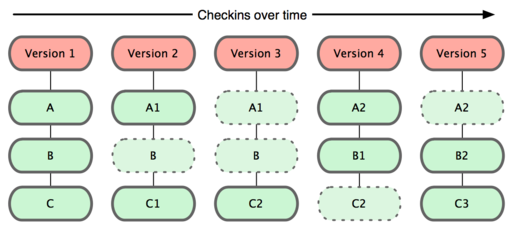
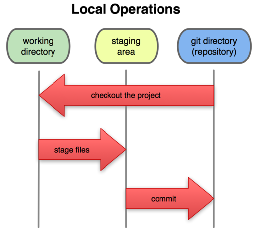

**源代码管理系统（SCM）与版本控制**

版本控制是一种记录若干文件内容变化，以便将来查阅特定版本修订情况的系统。

**本地版本控制系统**

许多人习惯用复制整个项目目录的方式来保存不同的版本，或许还会改名加上备份时间进行区别。这么做的唯一好处就是简单，坏处也不少：有时候会混淆所在的工作目录，一旦弄错了文件数据就没办法撤销恢复。为了解决这个问题，人们很久以前就开发了许多本地版本控制系统，大多是采用某种简单的数据库来记录文件的历次更新差异。

**集中化的版本控制系统**

接下来人们又遇到一个问题，如何让在不同系统上的开发者协同工作？于是，集中化的版本控制系统（Centralized Version Control Systems）应运而生。这类系统，诸如CVS、Subversion等，都有一个单一的集中管理服务器，保存所有文件的修订版本，而协同工作的人们都通过客户端连到这台服务器，取出最新的文件或者提交更新。多年以来，这已成为版本控制系统的标准做法。

这么做带来了很多好处，特别是相对于本地版本控制系统来说。现在，每个人都可以在一定程度上看到项目中的其他人正在做什么，管理员也可以轻松掌握每个开发者的权限，看到每个人每天的提交记录。这样做最大的缺点就是中央服务器的单点故障。如果宕机一小时，那么在一小时内所有人都无法提交更新，也就无法协同工作。要是中央服务器的磁盘发生故障，碰巧没有备份或者备份不及时，就会有丢失数据的风险。最坏的情况是彻底丢失整个项目的所有历史更改记录，而被客户端提取出来的某些快照数据除外，但是不能够保证所有的数据都已经有人事先完整的提取出来。

本地版本控制系统也存在类似问题，只要整个项目的历史记录被保存在单一位置，就有丢失所有历史更新记录的风险。

**分布式版本控制系统**

分布式版本管理系统就是为了解决这个单点问题，在这类系统中，像Git、Mercurial、Bazaar以及Darcs等，客户端并不只是提取最新的文件快照，而是把原始的代码仓库完整地镜像下来。这么一来，任何一处协同工作用的服务器发生故障，事后都可以用任何一个镜像出来的本地仓库恢复。因为每一次的提取操作，实际上都是一次对代码仓库的完整备份。更进一步，这类系统都可以指定和若干不同的远端代码仓库进行交互。因此，你就可以在同一个项目中，分别和不同工作小组的人相互协作。你可以根据需要设定不同的协作流程。

**Git与SVN等常规版本控制软件的区别**

Git 是一个快速、可扩展的分布式版本控制系统，它具有极为丰富的命令集，对内部系统提供了高级操作和完全访问。

Git诞生于2005年，起因是因为Linux内核开源项目使用的版本控制系统BitKeeper被收回，这就迫使Linux开源社区（特别是Linux的缔造者Linus Torvalds）不得不吸取教训，只有开发一套属于自己的版本控制系统才不至于重蹈覆辙。他们对新系统制定的目标如下：
速度快，设计简单，对非线性开发模式的强力支持（允许上千个并行开发的分支），完全分布式，有能力高效管理类似Linux内核一样的超大规模项目（速度和数量）。

经过不断的完善，Git始终保持着如下的特点：
1、直接记录快照，而非差异比较。

Git和其他版本控制系统的主要差别在于，Git只关心文件数据的整体是否发生变化，而大多数其他系统则只关心文件内容的具体差异。这类系统（CVS、Subversion等）每次记录都有哪些文件做了更新，以及更新了哪些行的什么内容，如下图：

Git 并不保存这些前后变化的差异数据。实际上，Git 更像是把变化的文件作快照后，记录在一个微型的文件系统中。每次提交更新时，它会纵览一遍所有文件的指纹信息并对文件作一快照，然后保存一个指向这次快照 的索引。为提高性能，若文件没有变化，Git 不会再次保存，而只对上次保存的快照作一链接。Git 的工作方式就像下图所示：

这是 Git 同其他系统的重要区别。它完全颠覆了传统版本控制的套路，并对各个环节的实现方式作了新的设计。Git 更像是个小型的文件系统，但它同时还提供了许多以此为基础的超强工具，而不只是一个简单的 VCS。

2、支持离线工作（近乎所有操作都是本地执行），本地提交可以稍后提交到服务器上；

3、时刻保持数据完整性；

4、多数操作仅添加数据；

文件的三种状态

对于任何一个文件，在 Git 内都只有三种状态：已提交（committed），已修改（modified）和已暂存（staged）。已提交表示该文件已经被安全地保存在本地数据库 中了；已修改表示修改了某个文件，但还没有提交保存；已暂存表示把已修改的文件放在下次提交时要保存的清单中。由此我们看到 Git 管理项目时，文件流转的三个工作区域：Git 的工作目录，暂存区域，以及本地仓库。

每个项目都有一个 Git 目录（译注：如果 git clone 出来的话，就是其中 .git 的目录；如果git clone --bare 的话，新建的目录本身就是 Git 目录。），它是 Git 用来保存元数据和对象数据库的地方。该目录非常重要，每次克隆镜像仓库的时候，实际拷贝的就是这个目录里面的数据。

从项目中取出某个版本的所有文件和目录，用以开始后续工作的叫做工作目录。这些文件实际上都是从 Git 目录中的压缩对象数据库中提取出来的，接下来就可以在工作目录中对这些文件进行编辑。

所谓的暂存区域只不过是个简单的文件，一般都放在 Git 目录中。有时候人们会把这个文件叫做索引文件，不过标准说法还是叫暂存区域。

基本的 Git 工作流程如下：

1. 在工作目录中修改某些文件。 2. 对修改后的文件进行快照，然后保存到暂存区域。 3. 提交更新，将保存在暂存区域的文件快照永久转储到 Git 目录中。

所以，我们可以从文件所处的位置来判断状态：如果是 Git 目录中保存着的特定版本文件，就属于已提交状态；如果作了修改并已放入暂存区域，就属于已暂存状态；如果自上次取出后，作了修改但还没有放到暂存区域，就 是已修改状态。

**Git的使用**

Git 支持许多数据传输协议，包括本地传输、 git://协议、http(s):// 或者 SSH传输协议 user@server:/path.git，除了HTTP协议之外，其他所有协议都要求在服务器端安装并运行Git。

一、使用本地仓库

对于本地的项目管理，一些具体的操作方法可以参考这篇文章：[Git基础](http://www.open-open.com/lib/view/open1328069733264.html)里面详细的讲解了Git每个操作的使用方法和效果。因为本文主要目的在于演示如何利用GitHub参与开源项目，对于使用细节就不再花时间描述了，不过我认为仔细的看看这些使用方法对于提高工作效率非常有帮助。

使用本地仓库，用户只是自己一个人，所以不存在协同工作的问题，不管怎么玩儿，一般不会出问题。使用远程仓库，情况就会复杂、有趣的多。

二、使用远程仓库

要参与任何一个 Git 项目的协作，必须要了解该如何管理远程仓库。远程仓库是指托管在网络上的项目仓库，可能会有好多个，其中有些你只能读，另外有些可以写。同他人协作开发某 个项目时，需要管理这些远程仓库，以便推送或拉取数据，分享各自的工作进展。管理远程仓库的工作，包括添加远程库，移除废弃的远程库，管理各式远程库分 支，定义是否跟踪这些分支，等等。

以现在比较流行的GitHub为例，如果我在上面创建了一个项目，实际上相当于使用 git init 新建了一个服务器端的仓库。如果我想在本地进行开发，那么我就需要 git clone 到我的本地。做了一些开发之后，我可以 git push 将本地的修改推送到服务器仓库中。随着项目发展，有其他人想要参与到这个项目中来，他可以在GitHub上Fork我这个项目，这样他对这个项目才有写权限，而且可以将他的工作保存到GitHub的服务器上。如果他希望将自己的工作提交给我，首先他需要在本地开发环境中添加我的远程仓库 git remote add。然后 git push remotename master 发起推送的请求，如果我接受了，他的工作就可以合并到主干中了。因为我们此时是并行开发，如果他想看我的工作，可以采用 git pull remotename 的方式将我所做的修改拉取到本地，非常的方便。

上面这段话，描述了我们在使用远程仓库以及与其他人协作过程中的大体流程，需要用到的一些远程仓库的操作如下：

1、查看当前配置的远程仓库

可以使用 git remote -v 来查看当前项目中都添加了哪些远程仓库

其中Origin一般是自己在服务器上的远程仓库，其他的为他人的远程仓库。

2、添加新的远程仓库

要添加一个新的远程仓库，可以指定一个简单的名字，以便将来引用，运行 git remote add [shortname] [url]

git remote add pb git://github.com/paulboone/ticgit.git

3、抓取远程仓库的信息

git fetch [remote-name]

此命令会到远程仓库中拉取所有你本地仓库中还没有的数据。运行完成后，你就可以在本地访问该远程仓库中的所有分支，将其中某个分支合并到本地，或者只是取出某个分支，一探究竟。如果是克隆了一个仓库，此命令会自动将远程仓库归于 origin 名下。所以，git fetch origin 会抓取从你上次克隆以来别人上传到此远程仓库中的所有更新（或是上次 fetch 以来别人提交的更新）。有一点很重要，需要记住，fetch 命令只是将远端的数据拉到本地仓库，并不自动合并到当前工作分支，只有当你确实准备好了，才能手工合并。

4、 从远程仓库抓取信息并合并

git pull [remote-name]

可以使用 git pull 命令自动抓取数据下来，然后将远端分支自动合并到本地仓库中当前分支。在日常工作中我们经常这么用，既快且好。实际上，默认情况下git clone 命令本质上就是自动创建了本地的 master 分支用于跟踪远程仓库中的 master 分支（假设远程仓库确实有 master 分支）。所以一般我们运行git pull，目的都是要从原始克隆的远端仓库中抓取数据后，合并到工作目录中的当前分支。

5、推送数据到远程仓库

git push [remote-name] [branch-name]

项目进行到一个阶段，要同别人分享目前的成果，可以将本地仓库中的数据推送到远程仓库。实现这个任务的命令很简单： git push [remote-name] [branch-name]。如果要把本地的 master 分支推送到origin 服务器上（再次说明下，克隆操作会自动使用默认的 master 和 origin 名字），可以运行下面的命令:

git push origin master

只有在所克隆的服务器上有写权限，或者同一时刻没有其他人在推数据，这条命令才会如期完成任务。如果在你推数据前，已经有其他人推送了若干更新，那 你的推送操作就会被驳回。你必须先把他们的更新抓取到本地，合并到自己的项目中，然后才可以再次推送。

6、查看远程仓库信息

git remote show [remote-name]

7、远程仓库的删除和重命名

git remote rename ［old name] [new name]

git remote rm [remote-name]

**Git与GitHub**

GitHub是一个利用Git提供免费的代码托管服务的网站（类似的网站还有老牌的SourceForge），很多著名的项目都托管在上面。

要想在GitHub上参与开源项目，根据Git的使用方法，有两种途径可以实现。

第一种是项目的创建人将你添加到项目的合作贡献者列表中，这样你就可以直接向这个项目推送代码。
第二种是Fork一份代码到自己的空间下，这样的一份代码自己具有推送的权限。如果开发的进展很好，项目的创建者可以将Fork的这些项目添加为Remote仓库，在他认为合适的时候将代码fetch到自己的仓库中进行合并，也可以由我们发起请求，请创始人将代码合并。GitHub上提倡的就是使用这种方式进行开发合作。

下面以PHP-Daemon这个项目为例，演示一下如何参与到GitHub中托管的开源项目中。

0、安装配置Git

1、首先[注册](https://github.com/signup/free)一个GitHub的帐号。

2、选择一个自己喜欢的项目，进行Fork。

3、建立本地的资源池（Local Repo）。

可以使用下面的命令将项目复制到本地，复制的地址可以是SSH的也可以是HTTP形式的，具体的地址在项目页面中可以看到。

git clone git@github.com:cocowool/PHP-Daemon.git

4、配置源项目地址。

项目克隆完成后，默认有一个名为“origin”的远端指向了我在GitHub上的项目，而并非原始的项目。为了能够及时获取原始项目上的更新，我们需要再增加一个远端，命名为“upstream”。

git remote add upstream[https://github.com/shaneharter/PHP-Daemon.git](https://github.com/shaneharter/PHP-Daemon.git)
git fetch upstream

5、接下来可以做的事情。

推送提交 Push Commits

**一些小Tips**

Mac OS X Lion 中自带了Git的命令行和图形化界面，虽然他的图形化界面简陋到吐血。
Mac下还有一个gitk，提供了图形化工具来进行历史的查阅。它是用 Tcl/Tk 写成的，基本上相当于 git log 命令的可视化版本，凡是git log 可以用的选项也都能用在 gitk 上。

在项目目录下输入 /Developer/usr/bin/gitk 就可以看到。

参考资料：
1、[Wiki GitHub](http://zh.wikipedia.org/zh/GitHub)
2、[Git版本控制](http://zh.wikipedia.org/wiki/%E7%89%88%E6%9C%AC%E6%8E%A7%E5%88%B6)
3、Wiki[Git](http://zh.wikipedia.org/wiki/Git)
4、Git Homepage
5、[使用Git管理源码](http://www.ibm.com/developerworks/cn/linux/l-git/)
6、[Jquery at GitHub](https://github.com/jquery/jquery)
7、[GitHub Fork a repo](http://help.github.com/fork-a-repo/)
8、[Git详解之一：Git起步](http://www.open-open.com/lib/view/open1328069609436.html)
9、[Open经验库Git系列文章](http://www.open-open.com/lib/list/282?pn=1)
10、Pro Git

