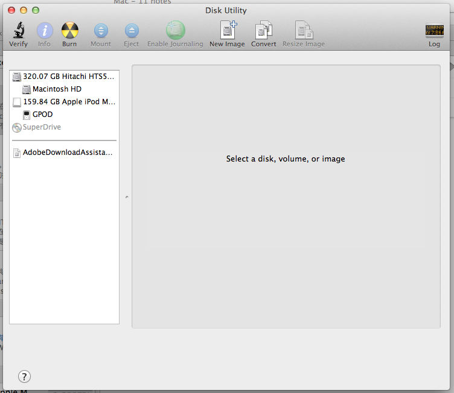
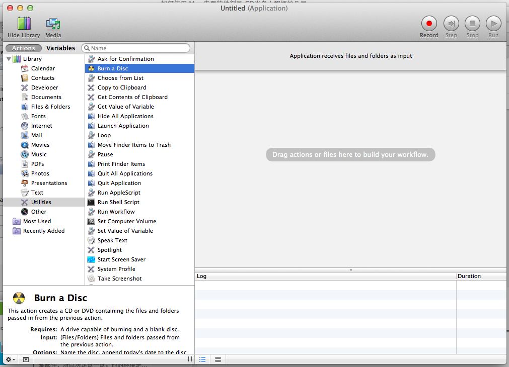

在Mac下如何刻录光盘呢，在Spotlight中搜索了dvd、cd什么的，出来的程序基本上都不能刻录光盘，一时摸不着头脑。查了资料之后，才发现Mac的光盘刻录在Disk Utility中。

看到那个象原子弹标志的 Burn 了吧。

具体的步骤如下：

1、插入一张空白光盘；
2、启动Disk Utility 程序；
3、From the File menu, choose Open Disk Image and select the ISO to be burned.
In the list of volumes, you will now see an item representing the ISO file. Select it.
Click the Burn button and follow the instructions.

当然，还有一个地方可以找到这个实用工具。

在Spotlight中搜索Automator，打开后选择Application，然后在Utilities中可以看到Burn a Disc的选项。

参考资料：
1、[How to burn ISO disc images](http://hints.macworld.com/article.php?story=20060619181010389)
2、[如何使用Mac内置软件刻录CD光盘](http://www.maqingxi.com/archives/1705.html)