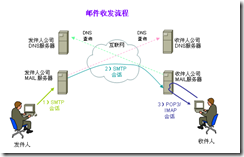

SMTP是Simple Mail Transfer Protocol的简写。
邮件是日常工作、生活中不能缺少的一个工具，下面是邮件收发的流程。

邮件的发送，主要是通过SMTP协议来实现的。SMTP协议最早在RFC 821（1982年）中定义，最后更新是在RFC 5321（2008年）中，更新中包含了扩展SMTP（ESMTP）。
在平时的程序开发中经常会有发送邮件的这种需求，所以免不了要对邮件发送服务器的可用性进行测试。下面是整理的命令，用来在命令行下测试SMTP服务器，进行邮件发送等操作，相信对于加深SMTP的理解可以起到促进作用。
SMTP默认使用25端口，我们可以使用telnet工具进行测试。
1、连接SMTP服务器，查看是否存活。

>telnet smtp.sina.com 25
>Connected to mail.sina.com.
>Escape character is '^]'.
>220 smtp ready
在telnet下转义符是Ctrol+]，如果想退出，按转义符后输入quit，就可以退回到命令行了。
2、用户登陆
连接到服务器后，使用AUTH LOGIN命令进行用户登陆（SMTP命令不区分大小写）
>auth login
>334 VXNlcm5hbWU6
>c2VydmljZUBoZWVwLmNx
>334 UGFzc3dvcmQ6
>xxxxxxxx
>235 go ahead
235返回码表明登陆验证成功，用户可以进行后续的操作了。用户邮箱和密码是经过Base64编码的，这个与服务器的安全特性相关，属于可配置项。
3、发送邮件。
用户身份验证通过后，执行下面的命令进行邮件的发送。
>235 #2.0.0 OK Authenticated
>MAIL FROM:[yunpan001@sina.com](mailto:yunpan001@sina.com)
>250 sender <yunpan001@sina.com> ok
>RCPT to:[cocowool@gmail.com](mailto:cocowool@gmail.com)
>250 recipient <cocowool@gmail.com> ok
>DATA
>354 go ahead
>Subject: Hi smtp mail
>hello mail
>.
>250 ok:  Message 1763097690 accepted
**SMTP命令列表**
**HELO**
客户端为标识自己的身份而发送的命令（通常带域名）
**EHLO**
**
**
使服务器可以表明自己支持扩展简单邮件传输协议 (ESMTP) 命令。
**MAIL FROM**
标识邮件的发件人；以 MAIL FROM: 的形式使用。
**RCPT TO**
标识邮件的收件人；以 RCPT TO: 的形式使用。
**TURN**
允许客户端和服务器交换角色，并在相反的方向发送邮件，而不必建立新的连接。
**ATRN**
ATRN (Authenticated TURN) 命令可以选择将一个或多个域作为参数。如果该会话已通过身份验证，则ATRN 命令一定会被拒绝。
**SIZE**
提供一种使 SMTP 服务器可以指出所支持的最大邮件大小的机制。兼容的服务器必须提供大小范围，以指出可以接受的最大邮件大小。客户端发送的邮件不应大于服务器所指出的这一大小。
**ETRN**
SMTP 的扩展。SMTP 服务器可以发送 ETRN 以请求另一台服务器发送它所拥有的任何电子邮件。
**PIPELINING**
提供发送命令流（而无需在每个命令之后都等待响应）的能力。
**CHUNKING**
替换 DATA 命令的 ESMTP 命令。该命令使 SMTP 主机不必持续地扫描数据的末尾，它发送带参数的 BDAT 命令，该参数包含邮件的总字节数。接收方服务器计算邮件的字节数，如果邮件大小等于 BDAT 命令发送的值时，则该服务器假定它收到了全部的邮件数据。
**DATA**
客户端发送的、用于启动邮件内容传输的命令。
**DSN**
启用传递状态通知的 ESMTP 命令。
**RSET**
使整个邮件的处理无效，并重置缓冲区。
**VRFY**
确认在邮件传递过程中可以使用邮箱；例如，vrfy ted 确认在本地服务器上驻留 Ted 的邮箱。该命令在 Exchange 实现中默认关闭。
**HELP**
返回 SMTP 服务所支持的命令列表。
**QUIT**
终止会话。
**SMTP命令响应码**
211  System status, or system help reply
214  Help message (Information on how to use the receiver or the meaning of a particular non-standard command; this reply is useful only to the human user)
220  <domain> Service ready
221  <domain> Service closing transmission channel
250  Requested mail action okay, completed
251  User not local; will forward to <forward-path> (See Section 3.4)
252  Cannot VRFY user, but will accept message and attempt delivery (See Section 3.5.3)
354  Start mail input; end with <CRLF>.<CRLF>
421  <domain> Service not available, closing transmission channel (This may be a reply to any command if the service knows it must shut down)
450  Requested mail action not taken: mailbox unavailable (e.g., mailbox busy or temporarily blocked for policy reasons)
451  Requested action aborted: local error in processing
452  Requested action not taken: insufficient system storage
455  Server unable to accommodate parameters
500  Syntax error, command unrecognized (This may include errors such as command line too long)
501  Syntax error in parameters or arguments502  Command not implemented (see Section 4.2.4)
503  Bad sequence of commands
504  Command parameter not implemented
550  Requested action not taken: mailbox unavailable (e.g., mailbox not found, no access, or command rejected for policy reasons)
551  User not local; please try <forward-path> (See Section 3.4)
552  Requested mail action aborted: exceeded storage allocation
553  Requested action not taken: mailbox name not allowed (e.g.,mailbox syntax incorrect)
554  Transaction failed (Or, in the case of a connection-opening response, "No SMTP service here")
555  MAIL FROM/RCPT TO parameters not recognized or not implemente
参考资料：
1、[SMTP指令说明](http://blog.donews.com/Shan/page/17)
2、[SMTP百度百科](http://baike.baidu.com/view/5450.htm)
3、[Wiki Smtp](http://en.wikipedia.org/wiki/Simple_Mail_Transfer_Protocol)
4、[RFC 5321](http://tools.ietf.org/html/rfc5321)
5、[电子邮件收发原理和实现](http://univasity.iteye.com/blog/1173296)
6、[Telnet下Smtp命令发送邮件](http://compig.net/blog/?p=5)
7、[Send Mail Using Telnet](http://www.yuki-onna.co.uk/email/smtp.html)

