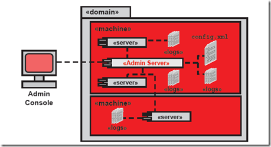
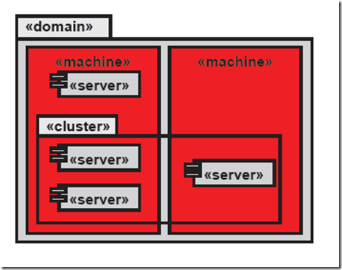
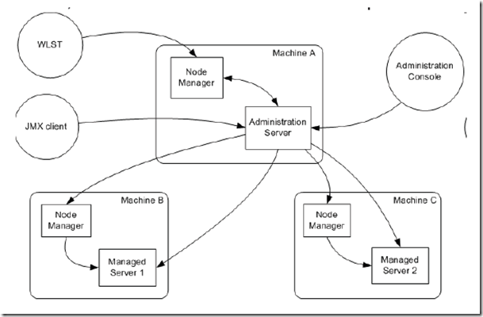
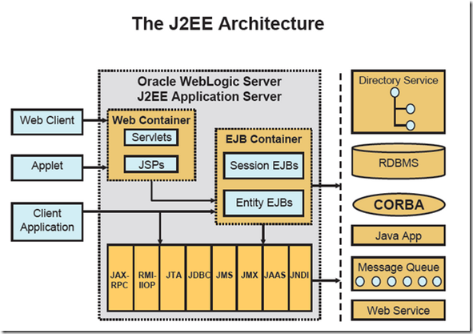

**WebLogic 中的基本概念**

上周参加了单位组织的WebLogic培训，为了便于自己记忆，培训后，整理梳理了一些WebLogic的资料，会陆续的发出来，下面是一些基本概念。

Domain ：

域是作为单元进行管理的一组相关的 WebLogic Server 资源。一个域包含一个或多个 WebLogic Server 实例，这些实例可以是群集实例、非群集实例，或者是群集与非群集实例的组合。一个域可以包含多个群集。域还包含部署在域中的应用程序组件、此域中的这些应用程序组件和服务器实例所需的资源和服务。应用程序和服务器实例使用的资源和服务示例包括计算机定义、可选网络通道、连接器和启动类。

Domain 中包含一个特殊的 WebLogic 服务器实例，叫做 Administration Server，这是我们配置、管理Domain中所有资源的核心。通常，我们称加入Domain中的其他实例为 Managed Server，所有的Web应用、EJB、Web Services和其他资源都部署在这些服务器上。

我们可以按照以下的一些标准来组织Domain：程序的逻辑划分，例如一个电商网站，可以将前台作为一个Domain，订单处理作为一个Domain，其他资源作为一个Domain；以物理地域为划分，例如一个跨国公司的网站，每个国家可以建立一个Domain；以尺寸来划分。

Administration Server ：

管理服务器是控制整个域配置的中心操作节点，管理服务器维护着整个域 Domain 的配置并将配置分配到每个被管理服务器 Managed Server 中，每个域中都必须有一个Administration Server。我们可以通过三个渠道访问管理服务器：Admin Server console、Oracle WebLogic Scripting Tool WLST、JMX客户端（通过WebLogic提供的API来实现），最后我们还可以通过SNMP协议来监控Admin Server的状态。

Admin Server 如果挂了，对于Domain中的Managed Server不会产生影响，如果配置了集群，对于负载均衡和Failover机制也不会产生影响，因为这些都是基于配置文件的（config.xml），而不依赖与Admin Server的实例。Admin Server 不必时刻运行，当我们需要修改配置或者部署应用时，把Admin Server运行起来就行。

Managed Server ：

被管理服务器是一个WebLogic Server的实例，他从Admin Server那里获取配置信息。通常在Managed Server上部署自己的服务、组件或应用。基于性能考虑，Managed Server维护着一份只读的域配置文件，当服务启动的时候，会从Admin Server上同步配置文件信息，如果配置文件发生了改变，Admin Server也会将改变推送到Managed Server上。

Machine ：

Machine 是指运行WebLogic Server实例的物理机器，通常与部属在其上的Managed Server相关连。Machine用于Node Manager（一个运行在物理服务器上的进程，可以远程重启Admin 和 Managed Server）重启失败的Managed Server，以及为集群的Managed Servers选择合适的Session存放位置（Session避免存放在同一台Machine上）。

Node Manager：

运行在物理服务器上的一个进程，用来远程执行Admin Server 和 Managed Server的启动 Start、停止 Stop、挂起 Suspend、重启 Restart 操作。该进程与Domain并不关联但是与Machine相关连，如果你想在Admin Console 中对Server进行控制，则必须安装Node Manager。Node Manager 提供了Java-based和Script-based两个版本，实现的功能一样。

Cluster ：

集群是一组WebLogic Server的组合，集群是为了满足服务的高可用（High Avilability）以及可扩展（Load Balancing）需求而出现的。需要注意的是，集群中的WebLogic Server必须版本号一致。Cluster需要注意的几个问题：不能够跨Domain、Cluster中的服务器必须在同一个域中、Domain中可以有多个Cluster。

J2EE Standard ：

J2EE框架中的其他内容：JDBC、JNDI、JTA、JMS、JAAS、JMX、RMI-IIOP等。
Java Servlets and JavaServer Pages：
Servlet 是一个在服务器容器内运行的单独线程，JSP文件最终也会被编译成 Servlet，所以 Servlet 是JAVA编程中的一个非常重要的概念。

参考资料：
1、[Oracle University](http://education.oracle.com/pls/web_prod-plq-dad/db_pages.getpage?page_id=3&p_org_id=1001&lang=US)
2、[WebLogic Domain 的定义](http://www.lupaworld.com/tutorial-view-aid-748.html)
3、[百度文库 WebLogic基础知识](http://wenku.baidu.com/view/f3ef19f6f90f76c661371a3a.html)
4、[WebLogic几个基本概念](http://www.cnblogs.com/google4y/archive/2012/02/01/2334158.html)
5、[WebLogic基本概念](http://blog.retailsolution.cn/archives/2953)