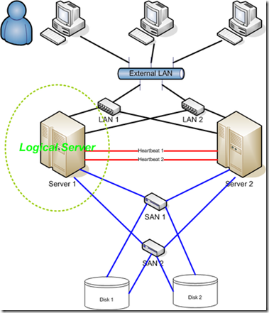
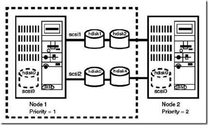
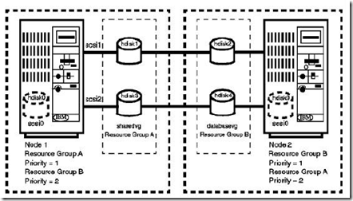
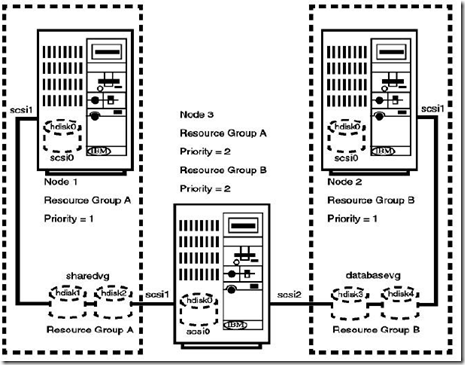

HACMP，全称为IBM High Availablity Cluster Multiprocessing。
IBM PowerHA （原来称为HACMP）是IBM为AIX Unix以及基于System p平台的Linux开发的一个集群高可用性的解决方案，其全称为High Availability Cluster MultiProcessing。HACMP的产品最早发布与1991年，如今的PowerHA SystemMirror for AIX7.1 已经是第20个版本。
PowerHA最多可以支持32台Computer或者节点Node，可以主动的在节点上运行应用（Active），也可以被动的接管失败的节点（Passive）。文件系统中的数据也可以在集群之间共享。
PowerHA高度依赖 IBM RSCT（IBM Reliable Scalable Cluster Technology, RSCT,是为AIX和Linux集群环境管理，提供的一组全面的软件[[2](http://en.wikipedia.org/wiki/IBM_RSCT)]）
下面探讨一下关于HACMP中实现高可用的方式，如下图是一个高可用的系统，在每个可能出现问题的节点上增加了冗余。

为了实现系统的高可用，避免单点故障（Single Points Of Failure，SPOF），我们需要考察一个系统中的以下节点：
1、服务器节点；
2、服务器电源；
3、网络适配器 Network Adapter；
4、网络通路 Network；
5、磁盘 Disk Adapter；
6、应用程序 Application；
在HACMP中，通常将集群资源配置为一个个资源组 Resource Groups。这些资源组具有以下的属性：可以配置启动 Startup、切换 Failover、回撤 Fall back策略，设置处理时间和分布策略等。
HACMP Hot standby configuration

Mutal takeover

Third party takeover

最近的版本信息：
--------------------------
PowerHA 7.1 发布于2010年，可用于AIX V6.1 TL6 以及 AIX V7.1
PowerHA 6.1 发布于2009年，重新更名为 IBM PowerHA SystemMirror
HACMP 5.5 发布于2008年，更名为 IBM PowerHA
HACMP 5.4.1 发布于2007年

参考资料：
1、[Wiki HACMP](http://en.wikipedia.org/wiki/IBM_High_Availability_Cluster_Multiprocessing)
2、[IBM RSCT](http://en.wikipedia.org/wiki/IBM_RSCT)
3、[Wiki High Availability Cluster](http://en.wikipedia.org/wiki/High-availability_cluster)
4、[HACMP参考资料 for HACMP 5.4](http://aix.chinaunix.net/doc/2009/01/06/1349637.shtml)
5、[一个介绍HACMP的PPT](http://www.mtxia.com/js/Documentation/mtxia_HACMP.pdf)

