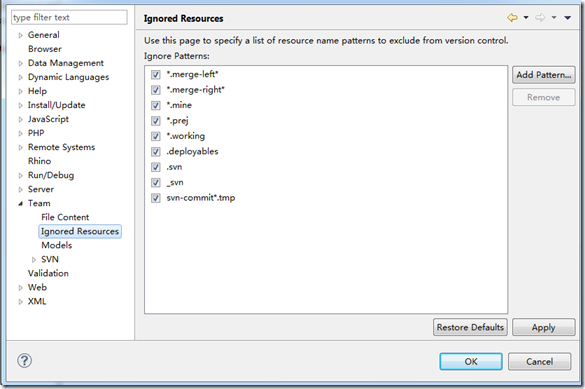
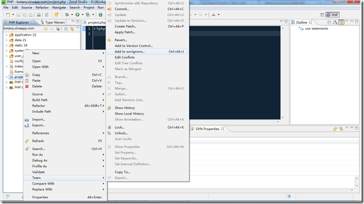
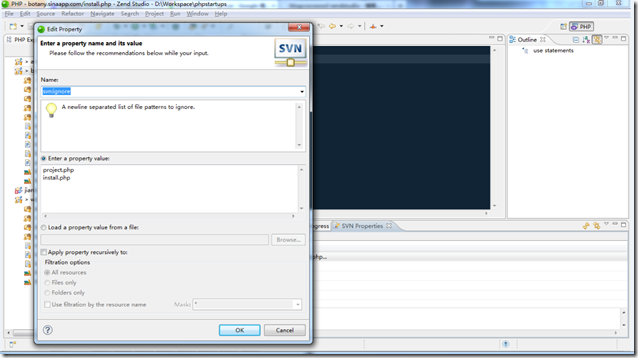

使用ZendStudio开发SVN中的代码时，经常容易将 .project、.settings、.buildpath 这类的zend的工程文件提交上去，非常麻烦，有几种方法可以去掉这个麻烦。

1、在ZendStudio的全局设置中设置
在Window -> Preferences 中找到 Team -> Ignored Resources，然后将需要屏蔽的项目添加进去，应用就可以了。

2、在项目中单独设置特定文件
选中不希望加入到SVN中的文件后，点击右键，按下图所示，就可以设置 svn:ignore

3、利用 SetProperty 设置项目的属性
在工程中点击右键，选择Team->Show Properties 或者 Set Properties ，在出现的 Properties 面板中，点击右键，选择 Add，然后按照下图所示，添加自己需要忽略的文件

参考资料：
1、[Hide .project files from svn in zend studio](http://lenss.nl/2008/06/hide-project-files-from-svn-in-zend-studio-for-eclipse/)
2、[Windows下Zendstudio Add to svn：ignore](http://blog.hexu.org/archives/435.shtml)