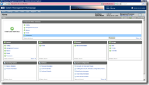
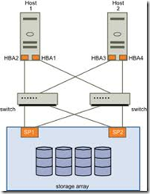

HP-UX操作系统全称为Hewlett Packard UniX，是惠普服务器上所有的操作系统。其发源自 AT & T SRV4系统，可以支持HP的PA-RISC处理器、Intel的Itanium处理器。因为PA-RISC的停产（RISC机器现在越来越没落了），今后的主流就是只支持Intel的处理器了。
HP-UX操作系统版本包括：11.11（11iv1）、11.23（11iv2）、11.31（11iv3）。其中11i第一次发布时间是2000年。s
培训中使用的环境是11.31，进入系统后，查看环境的办法：
查看系统：uname -a
查看软件版本：swlist | grep QPK
查看文件系统的使用情况：bdf
**SMH工具**：
SMH（System Management Homepage）是一个系统管理工具，之前有一个名为SAM的工具。SMH是一个升级版本，提供了利用Web方式进行系统管理的方式。
SAM支持HP-UX11iV1、V2,SMH支持 HP-UX 11iv1、v2、v3。

这两个管理工具的特点包括：提供了图形化的管理界面、可以向非Root用户提供配置管理功能、方便的帮助信息、配置灵活可扩展性强、使用标准的HP-UX命令完成所有操作（每个操作都可以看到对应的命令行指令）、整合了HP的SIM（Systems Insight Manager）、提供了Windows、Linux支持（也就是说可以用来管理Windows和Linux）。
SMH的启动有两种方式：autostart和start-on-boot。可以使用smhstartconfig这个命令查看当前的状态并进行启动方式的改变。autostart方式时，我们通过ip:2301端口进行访问。如果是start-on-boot，通过ip:2381进行访问。
SMH菜单包括：Home、Settings、Tools、Task、Log等。
可以说，系统中所有的操作命令都可以在SMH中来实现，这就为那些对于命令行不够熟悉的用户提供了管理系统的新途径。貌似这也是现在的一个趋势，大家都在尽力的推出专业、简单、易用的Web操作界面，降低管理的门槛。另一方面，也是让人们能够将精力更加的集中在系统资源的管理、分配上，而不必过分纠结于命令行指令。但是，很多时候，命令行还是无可替代的。
**HP-UX服务器的硬件**
服务器的产品序列：入门级（rx66,rx56...）、中端（rx76、rx86）、高端（Superdome）
服务器中的硬件包括：CPU（PA-RISC或者Itanium）、Cell boards或者MIO Controller（单元板或者）、System/Local Bus Adapter（系统/本地总线适配）、Memory Managment Processor Cards（MP管理卡）、Core I/O Cards、Interface Adapter Cards（OL*）
CPU：HP-UX支持两种CPU架构，一种是HP自己的PA-RISC的CPU（2008年停产，2013年终止支持）、一种是Intel的Itanium。
相关命令：machinfo
Cell Boards（单元板）、Crossbars、MIO Controllers（）：HP-UX服务器分为两种，一种是Cell-Based System，一般是中端或者高端的服务器，CPU和内存插在一个个的单元板上，一个机器有多个单元板，多个单元板可以通过Crossbar连接在一起，这样可以提供强大的计算能力和硬件的容错能力，最多可以支持128个CPU、512个内存插槽；另外一种是MIO-Based System，这种架构用在HP的低端和刀片机上，最多支持8个CPU。这个系统通过单一的Memory、I/O（MIO）控制芯片同CPU、Memory和IO设备交互，也就是和我们普通的PC服务器差不多。
System/Local Bus Adapter 提供了到IO扩展总线的连接，IO扩展总线可以支持一个或者多个槽位安装不同的扩展卡，HP提供了PCI、PCI-X、PCI-E三种总线类型，槽位速度达到2GB/sec。
MP管理卡插在PCI插槽上，提供了串口的Console接入、远程访问（Telnet、SSH、HTTPS方式）、硬件检测和日志记录功能、电源管理功能等。
Core I/O Cards 在不同机器上的变化比较大，主要是为服务器提供基础的连接接口，例如一个或多个SCSI接口用来连接磁盘、磁带机、DVD等，还有SAS接口连接本地磁盘，一个或多个LAN口、串口、打印机口、USB口、VGA口、Audio等。同时，大多数的机器还提供磁盘阵列控制器。
除了Core I/O Cards之外，服务器还提供了其他的Interface Adapter Cards可以用来连接光线卡（Fiber Channel Host Bus Adapter）、ATM、X.25 Adapter等接口，如果支持OL*技术，还可以支持硬件的热插拔。
相关命令：
olrad -q
硬件的外观（型号）
**Disk Arrays and LUNs、SANs and Multipathing**
当今的服务器，很多是将内置的磁盘做为Boot Disk，但是数据多数存放在Disk Arrays上。Disk Array 包含数十甚至数以百计、千计的磁盘。为了方便，利用一些管理软件，经常将一定数量的磁盘划分为一个LUN（Logical Units）。磁盘阵列管理软件会自动为每一个LUN分配一个独立的64位标识符WWID，管理员也可以为每个LUN分配一个比较容易记忆的LUN ID。操作系统将一个LUN看作一个磁盘设备，而不关心其到底由多少物理磁盘组成。
SANs（Storage Area Network）的Multipathing的原理如下图所示，这样的做法带来了很大的灵活性，同时提供了高可用（High Availability）的环境以及应对高负载的能力。下图是最简单的一种SANs网络连接，依据网络的复杂性，到达一个LUN的通路可能有2、4、8甚至更多。在HP-UX的11iV1、V2版本中，对于通路的识别还需要依赖于LVM、VxVM等软件的外部支持，在V3版本中，这一特性已经被整合到内核中。

分区连续体技术，包括nPar、vPar、VM、SRP（Secure Resource Partitions）。这种技术的出发点在于之前独立CPU的机器存在高峰瓶颈和利用率低估，通过加入更多的计算和内存单元，来达到资源的动态划分，一方面提高资源利用率，一方面提高高可用性。我觉得这种思路和云计算有些相似，只不过划分的物理逻辑单元不一样。
相关命令：
scsimgr：scsimgr get_attr -a wwid -H 64000/0xfa00/0x4     获取LUN信息
**硬件的编址（路径）**
HP-UX 11iV1、V2采用传统（Legacy）的方式来为硬件编址，在V3版本中，采用了灵活编址（Agile View）来进行编址，同时仍支持传统方式。新的编址方式增强了系统的扩展性，Max LUN从原来的2TB到2TB以上，到单个LUN的通路从最多8个到最多32个。增强了适应性，在对SAN存储硬件进行更新替换时，不需要修改服务器的配置。
传统（Legacy）视图
传统硬件编址（HBA Hardware）：Cell/SBA/LBA/device/function
卡的地址：cell/sba/lba/device/function.target.lan.port.
传统SCSI盘：卡的地指.target.lunid
SAN：卡的地址.domain.area.port.厂商编号.lun.lun.lun，使用的是交换机上的信息，如果端口发生变化，地址会发生变化
灵活视图（agile）
HBA Hardware Address：cell/SBA/LBA/device/function
SCSI Address：HBA.target.lunid。使用16进制而不是十进制，例如：1/0/0/2/0.0xa.0x0
FC Lunpath，卡的地址：阵列的wwpn号.oxlun，采用这种编址，连接方式仍然是多路径的，但是地址却可以唯一表示。
Virtual FC Lunpath（虚拟地址）：HBA.virtual bus.virtual LUN ID，例如64000/0xfa00/0xlun     lun映射到阵列上这个lun的wwid号
相关命令：
ioscan -fuNC disk/fc/tape/lan
ioscan -m
ioscan -m hwpath     查看三个地之间的映射关系
scsimgr get_attr -a wwid -H 64000/oxfa00/ox#
Slot Addressing 基于物理位置的地址（中高端机器支持）
cabinet - bay -chassis - slot
相关命令：
olrad
efi硬件编址，只是在itanium引导的时候使用，地址很长，实际映射的是逻辑地址
如何插拔设备卡：兼容性、驱动
**设备文件的管理**
传统（legacy）命名的设备文件存放位置：     /dev/dsk     /dev/rdsk
持久设备（虚拟地址，不会发生变化）文件存放位置：     /dev/disk     /dev/rdisk
设备文件没有大小、设备类型（块设备、字符设备）、主号（驱动程序）和次号（内核中的地址）
相关命令：
ioscan -funC disk
ioscan -m dsf
lsdev
ll查看/dev下的文件
insf（物理设备）：添加物理设备
mksf：按照指定方式添加物里设备
mknod（逻辑设备）：设备文件路径  类型 主号 次号。主要用来生成逻辑设备文件的
rmsf：删除设备文件
**磁盘设备的管理**
磁盘的使用方式：整盘管理、逻辑卷管理LVM、VxVM
物理卷 pv：有lvm结构数据的disk，数据包括pvra和vgra
逻辑卷组 vg：一些物理pv的组合，是lvm中的最大空间池。/dev/vgname/group
逻辑卷 lv：磁盘上的一个逻辑空间，在逻辑上是连续的，但是物理上不一定连续。/dev/vgname/lvname     /dev/vgname/rlvname
一个物理卷对应一个磁盘、多个磁盘组成卷组、逻辑卷对应分区（Size、VG name）
最大的单位是卷组。
物理卷：pvcreate
卷组：
逻辑卷：可以跨越磁盘，但是不能跨越卷组。默认顺序取第一可用空间（物理磁盘的加载顺序）。
默认Extent(Physical Extent)的大小是4MB.
建立连续的逻辑空间到离散的物理空间的映射。
对于结构数据的操作一般使用字符设备文件。
根盘一般有八个设备文件。
相关命令：
pvcreate：创建物理卷，后面跟字符设备文件。pvcraete [-f] /dev/rdisk/disk#
mknod：
vgcreate：创建卷组，指定卷组名。
lvcreate：创建逻辑卷，-n 指定名称，-L 指定大小，vgname
vgextend：
**文件系统管理**
JFS。
文件系统在逻辑卷中创建。逻辑卷的数据信息在磁盘顶部的VGA中。
文件系统的数据分为两类：结构数据（Meta Data）和用户数据。
结构数据的内容：
超级块（Super Block）：文件系统的大小、文件系统的类型、文件系统的Block映射表、到其他系统的指针等。超级块有多个，主超级块等。fsck指令。
iNode：ll执行后看到的信息中，除了文件名之外都存放在iNode中，另外还包括数据区的指针。
目录（Dir）：本身是一个特殊的iNode。/是2号iNode。访问目录时，IO次数是路径深度的两倍。但不一定都是真实的物理IO，因为有缓存等的存在。目录中存放了该目录中的文件名。保存该目录下的目录和文件的inode号。
相关命令：
newfs：newfs /dev/vg01/rdatavol，然后创建挂在点，mount命令进行挂载（可以修改fstab配置文件以在重启后继续生效）。
mkdir：创建挂载点
mount：挂载文件系统
**
**
**逻辑卷和文件系统的维护**
性能的维护、磁盘修复、空间的维护
随着使用时间的增加，文件系统中的碎片逐渐增多，可以使用fsadm进行维护。-D 参数表述对目录进行重组：1、对于小目录来说，将目录数据文件移动到inode的数据区；2、对于大目录来说，将经常访问的目录和文件移动到inode的数据区。
碎片整理：fsadm -eD，对目录和文件进行整理
磁盘修复：fsck /dev/vg01/rdatavol
空间的维护：卷组扩容、逻辑卷扩容、文件系统扩容、文件系统减容、逻辑卷减容、移除逻辑卷、卷组减容等。
相关命令：
bdf：查看空间使用情况
lvextend：扩充逻辑卷，lvextend -L size /dev/vgname/lvname
fsadm：fsadm -b size，只能在JFS online的系统中使用（需要单独授权），可以扩充或者缩减文件系统。如果不是，可以使用extendfs命令，需要首先卸载文件系统。
fsextend：
vgextend：扩充卷组
lvreduce：缩逻辑卷
vgreduce：缩卷组
lvremove：移除逻辑卷
vgremove：移除卷组
vgchange：
vgexport：
pvmove：数据转移
**交换区**
交换区的目的在于缓解内存压力。
设备交换分区（Device Swap）
文件交换分区（File Swap）
相关命令：
swapon：
swapinfo：-tm
swapoff：
**灾难恢复**
这里灾难恢复主要针对根盘发生意外损坏的情况，我们有三种方法可以在灾难发生时提供恢复机制：Boot Disk Mirroring（根盘镜像）、Dynamic Root Disk（动态根磁盘）、Ignite-UX Recovery Tools（系统恢复带）。三种方法的恢复代价依次增加，在考虑容灾方案是应当考虑配合使用。
Boot Disk Mirroring（根盘镜像）是指利用LVM、VxVM、阵列控制器或者SAN网络制作启动磁盘的镜像，在启动磁盘损坏时，我们仍可以通过镜像启动系统。镜像在安装系统的时候在Ignite选项中选择，主要应对非人为的磁盘损坏。无法避免人为的损坏 rm -rf /。
DRD（Dynamic Root Disk）提供了一组工具，可以创建一个bootable的克隆镜像，根磁盘受损后，可以使用克隆镜像，但是这种方式必须要求系统重启。这种方式是为了避免人为的造成系统损坏，例如内核的不当修改、文件误删等场景（这个时候镜像盘中的系统也会损坏）。使用DRD，可以帮我们合理的减少非机划停机时间和计划停机时间。
相关命令：
swlist DynRootDisk     查看是否安装了DRD工具包
drd status         显示DRD镜像的信息
drd clone          创建drd克隆镜像
drd runcmd       在DRD克隆镜像上执行系统命令
drd mount         挂载DRD克隆镜像到当前的文件系统中
drd umount       卸载DRD克隆镜像
drd active         将DRD镜像置为下次启动时的默认启动盘
drd deactive      恢复当前的启动盘为默认启动盘
drd rehost         将DRD镜像做为另外一台服务器的启动磁盘
drd unrehost      撤销上面的操作
drd命令还有一些公共的属性
drd mode -?
drd mode -x ?
drd mode -p       启动预览模式
drd mode [-x verbosity=3]
DRD镜像创建成功后，默认情况下没有挂载到当前系统中，我们没有办法对上面的文件进行操作。如果此时希望为镜像系统打patch，可以使用drd runcmd模式，下面是一些在drd下安全的系统操作命令：
swinstall        安装软件
swremove     卸载软件
swlist            查看软件列表
swmodify
swverify
swjob
kctune
update-ux
view
除此之外还有一种办法可以修改镜像上的文件，可以通过drd mount命令将镜像挂载到当前的文件系统中，然后就可以修改镜像上的文件了。命令执行后，系统会在/var/opt/drd/mnts/sysimage_001下创建挂载点，之后我们就可以使用diff或者chsum命令来对当前系统和镜像系统中的文件进行比较。
如果要备份用户数据和应用数据，可以使用tai、cpio、dd、dump、restore等命令。
**MP（Management Processor card）卡**
所有的HP服务器都提供MP卡支持，通过MP卡我们可以通过多种途径连接到远程终端。MP卡有串口和网口两种端口，支持的连接方式：物理终端、telnet、ssh、web。早期的HP服务器提供一种GSP（Guardian Service Processor）的进入方式，HP的下一代替代产品就是MP。在最新的入门级服务器上，还提供了Integrated Lights Out Management Processor(iLo 2 Mp).
co：console，系统控制台（单用户管理、忘记了root用户密码、管理系统的引导）
vfp：查看背板闪灯
cl：查看console的日志
cm：MP的管理命令
网络管理：
账户管理：uc
电源管理：
**系统启动**
有些情况下需要进入到单用户模式。
引导相关的组件：固件（EFI boot 马nager，NVRAM）、引导盘（引导区的内核vmunix和auto文件）
Itanium有三个字盘：第一个放引导信息（FAT32）、第二个是vg00、第三个是诊断分区（FAT32）
引导过程：自检、EFI boot manager 读取引导路径、调用系统引导区的内核加载器HPUX、读取auto文件决定加载的内核以及模式、OS启动。
内核的加载模式：
boot -is，单用户模式
boot -lq，
boot -tm，
**服务的启动**
系统启动后，使用init完成系统的初试化，其中服务的启动由rc完成。
1、系统通过/sbin/rc*.d决定不同运行级别启动的服务。
2、系统通过/sbin/rc*.d/文件夹下的文件名决定启动的顺序。文件的命名规范：S##Service、K##Service。顺序号越小启动顺序越高，关闭时，应当先关闭最后启动的服务。通过使用一个固定数值减去启动顺序的方式来决定。
3、/sbin/init.d下实际存储所有的启动脚本，/sbin/rc*.d中只是建立一些软连接。启动脚本启动时，读取/etc/rc.config.d下的启动控制变量，来决定是否启动服务。脚本具有四个选项：start_msg、stop_msg、start、stop。
**内核管理**
内核中包含了驱动和参数。可以有不止一个内核，内核以子目录的形式存在。
相关命令：
kconfig：将内核作为一个整体进行管理
kcmodule：调整内核中的模块
kctune：调整内核中的参数
内核失败时的处理办法。
1、看内核日志：/var/adm/kc.log，或者kclog命令。
2、根据情况选择不同的解决方案。
**网络的管理**
网络的连通性、网络的服务。
相关命令：
三层
ifconfig：如果需要永久生效，修改/etc/rc.config.d/netconf
route：管理系统路由，如果需要永久生效，配置文件同上，启动脚本是/sbin/init.d/net
hostname：修改主机名，配置文件/etc/rc.config.d/netconf，启动脚本是/sbin/init.d/hostname
/etc/hosts，本地的主机名解析文件
/etc/resolv.conf，DNS服务器的地址
故障定位常用命令：
lanscan
lanadmin
linkloop
arp
ping
traceroute
nslookup
dig
nsquery
nwmgr
参考资料：
1、[www.junipercorp.com.cn](http://www.junipercorp.com.cn/)
2、[百度百科 HP-UX](http://baike.baidu.com/view/58963.htm)
3、[百度百科 Superblock](http://baike.baidu.com/view/1102790.htm)
4、[Wiki File System](http://en.wikipedia.org/wiki/File_system)
5、[HP-UX常用命令](http://blog.itpub.net/post/40024/488870)
6、[百度百科 Itanium](http://baike.baidu.com/view/413760.htm)
7、[HP-UX LVM卷组学习笔记](http://wenku.baidu.com/view/ba0fe41fa300a6c30c229f6e.html)

