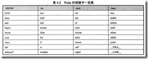
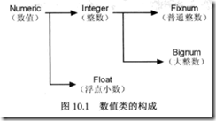

Ruby语言中，以对象为基本单位，可以说所有的元素都是对象。按照之前对于面向对象程序的理解，对象是指包含了特定属性和方法集合的一组程序。对象由类来定义，具体的表现为对象实例。也就是说，对象是类的实例化[[2](http://baike.baidu.com/view/2387.htm)]。

## **Ruby语言的基础元素**

对象：数值对象、字符串对象、正则表达式对象、时间对象、文件对象、目录对象、数组、哈希、例外对象等

### **数值对象**

由于Ruby中一切数据都是对象，所以我们处理的数字实际上也是对象。

a = 10，这样一个简单的赋值语句，实际上应当理解为 a = Numeric.new(10) 这样的一种实例化形式。
变量：局部变量（小写字母或_开头）、全局变量（$）、实例变量（@）、类变量（@@）、虚拟变量。
Ruby中的变量在声明时，也不需要指定类型，这有点类似于弱类型语言的PHP。但是在变量被使用时，他的类型就会被确定。

### 常量

以大写字母开头的变量就是常量
Ruby 中的保留字



Ruby中一般以换行来做为语句分割，也可以使用;来作为语义的分割符。在程序的书写过程中，我们要注意保持良好的书写风格。

### **运算符**

操作运算符
+、-、*、/、%、**

比较运算符
`>=、<=、==、<>、===`
== 运算符只能进行两个对象值的比较，如果要对对象进行比较，则需要使用特定的方法 obj1.eql?(obj2)，obj1.equal?(obj2)

对于数值对象，比较方法做了自定义，所以结果会有些不同。
Ruby中，对于返回True或False这种方法，命名上一般以？结尾，例如 def AreUSure?()。

逻辑运算符
`&&、||、and、or`

位运算符
`&、|、~、^、>>、<<`

**Ruby中的真值与假值**

Ruby中，在进行判断时，false 和 nil 都为假，除此以外的所有值为真。nil 是一个特殊值，用于在正则表达式中表示没有找到匹配的内容。也就是说，0 在ruby中也是真值。

**Ruby中的Symbol**
在Ruby中Symbol表示“名字”，比如字符串的名字、标识符的名字，创建一个Symbol对象的方法是在名字或者字符串之前加上":"。Ruby中每一个对象都有唯一的对象标识符（Object Identifier），可以用object_id方法（Getter）获得。

**Ruby中的Block**
代码块 Code Block 是Ruby的一个很强大的功能，同时又不是很容易理解其设计原理的一个元素。在《Programing Ruby》这本书中指出，block的存在可以用来实现Ruby中的一些Iterator，例如：
Array.each { |index|  print Array[index] }
Block的定义方式有两种，一种是{}，另外一种是do/end。前一种比较适合编写单行程序时使用，后一种比较适合多行程序的情况。具体例子如下：
```ruby
def greet(name)
	print "Hello #{name} "
	yield
	end
	greet("Wang") do
	print "Hi"
end
```

Blcok必须跟在方法调用的后面，通过方法中的yield出发Block的执行。

### **控制语句**

**条件判断语句**
在condition为真值时，执行对应区块的内容。
```ruby
if  condition then
	block 1
else
	block 2
end
```

还可以有多个分支
```ruby
if condition then
	block 1
elsif condition then
	block 2
else
	block 3
end
```

Ruby中提供了一个与if相反的条件判断语句 unless
```ruby
unless condition then
	block 1
else
	block 2
end
```

分支判断语句
```ruby
case condition
when value1 then
	block 1
when value2 then
	block 2
else
	block 3
end
```

值得一提的是，case语句中的判断不仅仅只是变量数值的判断，也可以使对象类型的判断，也可以使正则表达式的判断，所以Ruby的Case语句使用起来，功能可以非常的强大。

### **循环控制语句**

循环控制语句用在我们希望重复执行一些动作时，使用循环控制语句，需要注意两个要点：一个是循环的条件、一个是循环的次数。

Ruby中提供了for、while、until三个循环控制语句，each、times、loop三个循环控制方法，我们可以根据需要选择不同的方式。

```ruby
while condition do
	block 1
end

for variable in object do
	block
end

until condition do
	block
end

object.each{|variable|
	block
}

Number.times { | index variable |
	block
}

loop {
	block
}
```

Ruby同时提供了三个循环控制的语句，包括：break、next、redo。

## **Ruby中的类、方法与模块**
**Ruby中的类**
类是对对象行为和属性的描述。做为一门面向对象的脚本语言，Ruby中支持类的概念，支持类的定义、继承（不允许继承多个父类）、限定方法的访问范围、Setter和Getter的设置等。
类的定义
```ruby
class ClassName
Version = "1.0"
attr_accessor     :name
def initialize(parameter)
	end
	
public
	def publicMethod1
		block
	end
	def publicMethod2
		block
	end

private
	def privateMethod1
		block
	end
	def privateMethod2
		block
	end
end
```

类的访问限定符
Ruby中提供了 public、private、protected 三个方法访问限定符，可以对单个或批量的方法制定访问的限制条件。可以单独对单个方法进行访问限定，也可以使用批量的方式对多个方法使用访问限定。
默认情况下，所有的方法都是 public ，除了 initialize 之外，它始终是一个 private 的方法。
类的继承
```ruby
class People
end
class Male < People
end
```

## **Ruby中的模块**
命名空间的概念？
模块的定义
```ruby
module moduleName
end
```

在其他文件中使用模块时，首先需要使用require将模块文件包含进来，AutoLoad？。模块可以在类中引入，这样模块的方法就会成为类的方法。可以使用这个小技巧来实现Ruby的多重继承。

**Ruby中的方法（函数）**
Ruby中的方法区分为实例的方法、类的方法、函数性方法。其区分的依据为方法接收者的不同。
实例方法的使用方式，实例方法的定义实际上是在类中完成的。
`object.method( argument1, argument2, argument3 )`

类方法的使用方式
`f = File.open( filename )`

函数性方法的定义
```ruby
def functionName( parameter1, parameter2 = "default value")
	block
	return
end
```

函数性方法可以省略 return 语句，这时函数的返回值就是方法中最后一个语句的值，就像 Perl 的处理一样。省略 Return 语句可以为代码书写带来一些方便，但我们需要谨慎对待。
Ruby的函数可以返回多个值，例如：
a, b, c = funca()

## **错误与例外处理**

编写任何程序都可能会发生错误，包括语法错误、逻辑错误。也可能会发生一些意外，比如说硬件的意外损坏。所以我们在编写程序时，要多所有可能发生的意外情况进行考虑。在没有例外处理的语言中，我们需要对每种可能发生错误的情况进行判断。幸好，Ruby中提供了例外处理机制，它使我们的工作量大大的减轻了。

错误处理的一般形式
```ruby
begine
	block
rescue=> ex
	print ex.message
	block
ensure
	block
retry
end
```

Ruby中提供了 resuce 来在遇到例外时进行错误处理，ensure 确保不管在什么情况下它下面的代码部分都会执行，retry 重新尝试从 begin 开始的代码。默认情况下 $! 返回例外对象，$@ 返回例外信息。
Ruby 提供了 catch throw 的语法，但是这个和其他语言貌似区别很大。
Ruby提供了一个标准的例外类，其下有众多的子类来表示不同的例外情况。

## **Ruby中常用的类**
### **Numeric 类**
Numeric类下包括了Integer、Fixnum、Bignum、Float四个子类，关系如下图所示。



为了方便数学运算，Ruby提供了Math模块，可以方便的进行三角函数等方面的公式运算。

### **Array类**

数组在任何语言中都是非常重要的一个元素，数组提供了一个数据的容器，让我们可以通过索引快速的遍历和访问需要的数据元素。

Ruby中的数组可以扮演三种角色：普通的索引数组、集合、队列。借由这三种不同的使用方式，我们可以利用数组来实现FIFO、LILO等多种数据结构。

数组的创建有多种方式：
1、使用 []。
2、使用 Array.new
3、类似于Perl的数组创建方式，使用%w进行创建。
4、使用 obj.to_a 方法，将对象转换为数组。
5、使用split方法，将字符串分割为数组。

Array类中提供了大量的函数方便进行数组的操作，包括：arr.at(index)、arr.pop()、arr.push(value)、arr.shift()、arr.unshift(value)、arr.last()、arr.first()、arr.next()、
、arr.slice()、arr.values_at()、arr.concat()、a.compact()、a.compact!()、a.delete()、a.delete_at()、a.delete_if{|item| ... }、a.reject(|item|)、a.reject!(|item|)、a.slice!()、a.uniq()、a.uniq!()、a.collect{|item| ... }、a.collect!{|item| ... }、a.map{|item| ... }、a.map!{|item| ... }、a.fill()、a.fill(value,begin)、a.fill(value,begin,len)、a.fill(value, n..m)、a.flattern()、a.flattern!()、a.reverse()、a.reverse!()、a.sort()、a.sort!()、a.sort{|i,j| ... }、a.sort!{|i,j| ... }、a.sort_by(|i| ...)、等。

对于数组的遍历，我们可以采用循环配合索引的方式，也可以采用Array提供的一些函数来实现。Array提供的函数中，有一类不会改变数组本身的内容，这种方法称为非破坏性方法，有一些方法会使数组的内容发生改变，这类方法称为破坏性方法。对于两种方式都提供的函数，一般在破坏性方法后加上！来进行区分。我们在使用时，应当特别注意。

### **String类**
字符串，是程序开发中非常常见的一种数据类型。Ruby中，新建字符串的方式有：
1、直接使用"或者'新建
2、String.new新建
3、使用%Q和%q的方式新建

因为都是继承自Object类，所以和Array一样，有一些公共的方法可以调用，比如is_a、delete、size、slice等方法（真的么？有点怀疑）。

字符串中，应当注意内嵌表达式，例如 "a string is #{value}"，和 内嵌文档 Here Document。这两个方法，在PHP等脚本语言中也非常常见，能够为处理变量和多行的文本输出带来很大的方便。
另外一个需要关心的问题，就是字符串的编码问题。对于西欧文字，如果使用ASCII编码，那么我们就可以认为字符串的长度，就等于存储字符串的字节的长度。但是在处理中文或其他类似文字时，往往不能够使用一个字节来存储文字，所以字符串的长度会同字节的长度有不一致。

在程序开发中，字符串处理常见的操作包括：去掉前后的空格（chomp）、去掉行尾的换行（strip）、查找字符串、替换字符串（sub、gsub、tr、正则等）、截取字符串（索引方式、函数方式）、计算字符串的长度等。

### **Hash类**

Hash做为一种数据结构，具有较快的存取速度，在处理一些Key-Value的场景中发挥重大的作用。
Ruby中的hash对象，创建方式包括：{}、Hash.new两种。Hash的key理论上可以是任何对象，但是实际当中，我们一般选择Numberic、String、Date等做为key值，因为这样的key值在比较中更为准确，而其他的对象是否一致的比较则相对复杂。

Ruby中提供了获取key、value的批量及迭代方式，方便我们获取对象中的内容。

### **正则表达式类（Regexp）**

正则表达式的历史可以追溯到科学家对人类神经系统工作原理的早期研究。美国新泽西州的Warren McCulloch和出生在美国底特律的Walter Pitts这两位神经生理方面的科学家，研究出了一种用数学方式来描述神经网络的新方法，他们创新地将神经系统中的神经元描述成了小而简单的自动控制元，从而作出了一项伟大的工作革新。

> The origins of regular expressions lie in automata theory and formal language theory, both of which are part of theoretical computer science. These fields study models of computation (automata) and ways to describe and classify formal languages. In the 1950s, mathematician[Stephen Cole Kleene](http://en.wikipedia.org/wiki/Stephen_Cole_Kleene)described these models using his mathematical notation called regular sets.[1] The SNOBOL language was an early implementation of pattern matching, but not identical to regular expressions. Ken Thompson built Kleene's notation into the editor QED as a means to match patterns in text files. He later added this capability to the Unix editor ed, which eventually led to the popular search tool grep's use of regular expressions ("grep" is a word derived from the command for regular expression searching in the ed editor: g/re/p where re stands for regular expression[2]). Since that time, many variations of Thompson's original adaptation of regular expressions have been widely used in Unix and Unix-like utilities including expr, AWK, Emacs, vi, and lex.

正则表达式是为了进行较为复杂的字符串匹配而出现的。
Ruby中，创建正则表达式对象有几种方法：//、Regexp.new()、%r等。
Ruby中正则表达式的元字符与其他语言中的正则表达式保持一致。
String类提供了sub、gsub、scan三个方法可以接收正则表达式对象。

### **IO类**

IO是每个程序语言必不可少的部分，通常IO有三个，标准输入、标准输出、错误输出。
对于Console来说，Ruby中使用$stdin、$stdout、$stderr来表示。
文件IO是我们平时编程中最常用到的一种。Ruby和其他语言一样，提供了open、close、seek、popen、gets、readline、read等函数来帮助我们完成文件的读取、修改、保存操作。

### **File和Dir类**

IO类为我们提供了操作输入、输出的标准方法，但是对于我们平时经常遇到的文件系统来说，对于文件和目录的操作是我们经常要进行的，所以Ruby提供了File和Dir类，同时还提供了FileTest、fileutils等辅助类，来帮助我们更方便的进行程序的编写。

### **Time、Date、DateTime类**

如果不熟悉的人，看到这三个类，一定会问为什么要这么多关于时间处理的类？

## **Ruby中的进程与线程**

Fiber、Thread、Process。

Fibers提供了挂起程序的一部分，然后执行另外一部分程序的能力。实际上Fiber并不是完整意义上的多线程，因为程序的执行会产生中断，仍然是单条线索在执行。基本形式如下：
```ruby
fiber = Fiber.new do
  Fiber.yield 1
  2
end
puts fiber.resume
```

Firber创建后，并不自动运行，而是等到Fiber#resume方法调用后，开始执行block内的语句。遇到Fiber.yield后，暂停程序的执行，直到下一次调用Fiber#resume或者程序执行结束。
Thread。

在1.9之前，Ruby的多线程由解释器实现，在1.9之后，多线程开始由系统来实现。但是由此带来了一个问题，很多Ruby的扩展并不是Thread Safe的，所以有时候会遇到问题，这个需要比较注意。Thread的创建方法。
```ruby
threads = []
10.times{
  threads << Thread.new(parameter) do |p|
  end
}
threads.each{ |thr| thr.join  }
```

### **Ruby中的工具**
ri 文档查看利器。通过 ri options names 的方式，可以查看ruby的文档，真是非常方便啊！
irb 使用irb进行交互式的编程。

参考资料：
1、Ruby Programming 高桥征义
2、[百度百科-对象的定义](http://baike.baidu.com/view/2387.htm)
3、[百度百科-Ruby on rails](http://baike.baidu.com/view/27065.htm)
4、[Ruby Doc](http://www.ruby-doc.org/)
5、[百度百科-正则表达式](http://baike.baidu.com/view/94238.htm)
6、[Stephen Cole Kleene](http://en.wikipedia.org/wiki/Stephen_Cole_Kleene)
7、Programming Ruby by Dave Thomas
8、[Ruby中的Symbol](http://www.cnblogs.com/leon19870907/articles/2014904.html)
9、[Ruby之Symbol研究](http://www.kuqin.com/language/20071201/2748.html)