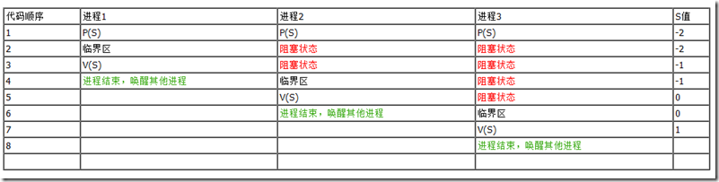
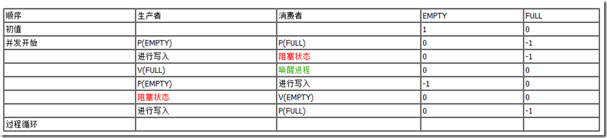
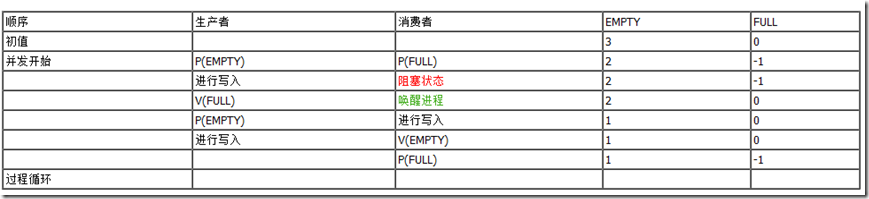
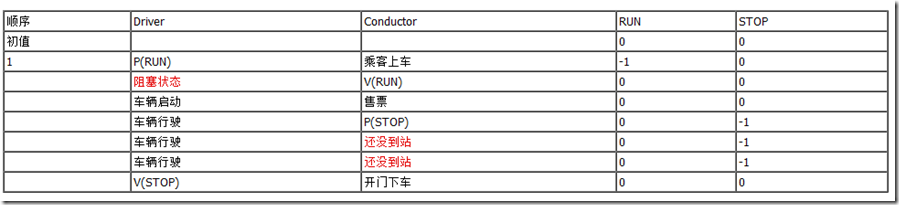
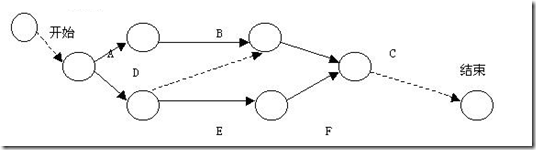

在处理进程间的同步与互斥问题时，我们离不开信号量和PV原语，使用这两个工具的目的在于打造一段不可分割不可中断的程序。应当注意的是，信号量和PV原语是解决进程间同步与互斥问题的一种机制，但并不是唯一的机制。
**信号量：**
信号量的概念1965年由著名的荷兰计算机科学家 Edsger Wybe Dijkstra 艾兹格·迪科斯彻 提出。
其核心思想是用一种新的变量类型（Semaphore）来记录可用资源的数量。有两种实现方式：
1、Semaphore的取值必须大于或等于0。0表示当前已经没有空闲资源，而正数表示当前空闲资源的数量；
2、Semaphore的取值可正可负，负数的绝对值表示正在等待进入临界区的进程个数；
信号量是一个二元组（S，Q）。S是一个具有非负初值的整型变量，Q是一个初始状态为空的队列。
**PV原语**
P原语：P是荷兰语Proberen（测试）的首字母。为阻塞原语，负责把当前进程由运行状态转换为阻塞状态，直到另一个进程唤醒它。具体操作为：申请一个空闲资源（把信号量减1），若成功，则退出；若失败，则该进程被阻塞。
V原语：V是荷兰语Verhogen（增加）的首字母。为唤醒原语，负责把一个被阻塞的进程唤醒，他有一个参数表，存放着等待被唤醒的进程信息。具体操作为：释放一个被占用的资源（把信号量加1），如果发现有被阻塞的进程，则选择一个唤醒。
**表示方法**
P(S)：表示将信号量S的值减一，即S=S-1；如果S>=0，则该进程继续执行，否则该进程置为等待状态，排入等待队列（队列Q）。
V(S)：表示将信号量S的值加一，即S=S+1；如果S>0，则该进程继续执行，否则释放队列（Q）中第一个等待信号量的进程。
**实现互斥模型**
在互斥模型中，多个进程对可用资源进行争用，使用信号量S表示可用资源的数量。一般来说，信号量S>=0时，S表示可用资源的数量。执行一次P操作意味着请求分配一个单位资源，因此S的值减1；当S<0时，表示已经没有可用资源，请求者必须等待别的进程释放该类资源，它才能运行下去。而执行一个V操作意味着释放一个单位资源，因此S的值加1；若S<=0，表示有某些进程正在等待该资源，因此要唤醒一个等待状态的进程，使之运行下去。
进程互斥是进程之间发生的一种间接性作用，一般是程序不希望的。
如下表所示，我们使用S=1做为初值，表示当前系统资源只有一个，多个进程需要轮流使用这个资源。

在互斥模型的问题中，关键的问题在于使用PV操作来保证有限的系统资源被正常的使用和释放，而不是多人争抢谁都抢不到，或者某人独占而不释放的情况。有点类似于北京现在的摇号制度，实际上资源就是两万个号牌，每个申请的人都执行了一次P操作，表示自己想要使用资源，在摇号结果出来之前没有资源可用，大家都进入Q队列等候，放号之时，获得资格的用户执行V操作，释放一个等待位置，其他人可以进入下一次的排号等候队列。
**实现同步模型**
所谓同步，是指多个相互合作的进程，在一些关键点上可能需要相互等待或相互交换信息，这种互相制约的关系称为进程同步。例如系统中有两个合作的进程，他们共用一个单缓冲区。这两个进程一个是计算进程，负责对数据进行计算；另一个为打印进程，负责对计算结果进行打印。当计算进程没有计算完毕，计算结果没有送到缓冲区的时候，打印进程就不能打印。一旦计算进程把计算结果送入缓冲区，就应该给打印进程发送一个信号，打印进程收到信号后就可以从缓冲区中取出计算结果进行打印。
之前我在想这个同步模型的时候，考虑可以使用定时轮询的方式，计算进程定时查询缓冲区，可用即开始写入；打印进程定时查询缓冲区，有内容即开始打印。但是这种没有相互合作沟通的方式，非常容易出现问题，比如计算进程内容还没有写完，打印进程就开始读取打印，造成分页的不正确或者数据的不完整。实际上，一般我们都会有多个计算进程，这种情况下就会同时存在资源争用的问题。
**
**
进程同步是进程之间直接的相互作用，是合做进程间有意识的行为。与互斥模型不同，进程同步时的信号量只与制约进程、被制约进程有关而不是与所有的同类并发进程有关，所以同步模型中的信号量为私有信号量。
生产者-消费者模型是同步模型的典型代表，其也存在多种情况，分别叙述如下：
1、一个生产者，一个消费者，共用一个缓冲区。
定义两个同步信号量，生产者需要一个EMPTY信号量来判断当前是否能够写入，设置初值为1，消费者需要一个FULL信号量，来判断当前是否能够读取，设置初值为0。

2、一个生产者，一个消费者，共用N个缓冲区。
与上面的例子不同的是，EMPTY的初值为N，则生产者的阻塞时间会减少很多。

3、多个生产者，多个消费者，共用N个缓冲区。
在这种场景下，除了同步之外，还需要在生产者之间、消费者之间进行互斥的访问缓冲区，所以需要设置四个信号量，分别是EMPTY、FULL、生产者之间的互斥信号量Mutex1、消费者之间的互斥信号量Mutex2。
非生产者、消费者模型的例子有一个司机和售票员的。设置RUN信号量供司机判断是否应该开车，初始值为0；设置STOP信号量供售票员判断是否可以开门，初始值为0。描述如下：

前驱图（Precedence Graph）是一种有向无循环图，记为DAG（Directed Acyclic Graph），用于描述进程间执行的前后关系。如下图：

图中的每个结点可用于描述一个进程段或进程，乃至一条语句；结点间的有向边则用于表示两个结点之间存在的偏序（Partial Order）或前驱关系。可以使用PV原语，来描述前驱图。
PS：互斥的问题可以用硬件方法解决，如何解决，不太清楚。
参考资料：
1、[Process Synchronization PV](http://blog.csdn.net/navorse/article/details/5108650)
2、[Linux死锁浅谈](http://wenku.baidu.com/view/322fa727ccbff121dd368389.html)
3、[Linux的多线程编程的高效开发经验](http://www.ibm.com/developerworks/cn/linux/l-cn-mthreadps/index.html)
4、[百度百科PV原语](http://baike.baidu.com/view/809762.htm)
5、[PV原语](http://wenku.baidu.com/view/d75cd2294b73f242336c5f26.html)
6、[PV原语解释](http://blog.csdn.net/ljob2006/article/details/4735098)
7、[PV原语实现进程的同步与互斥](http://www.doc88.com/p-90893801430.html)

